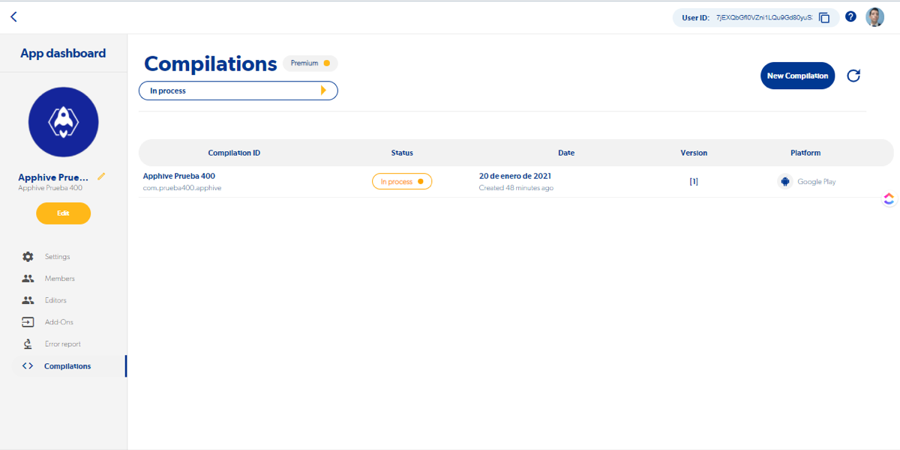
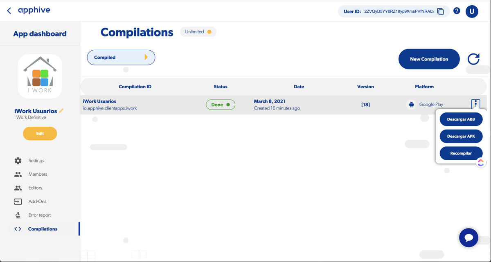
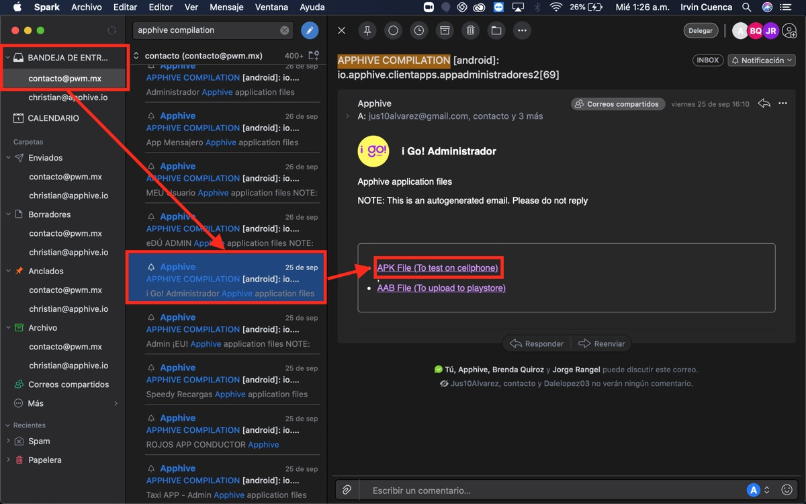
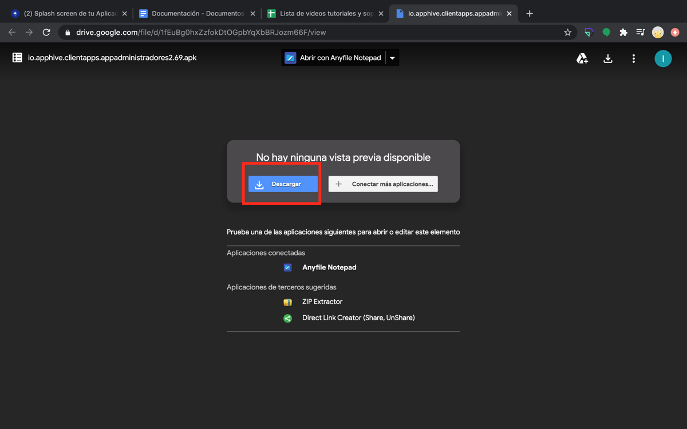
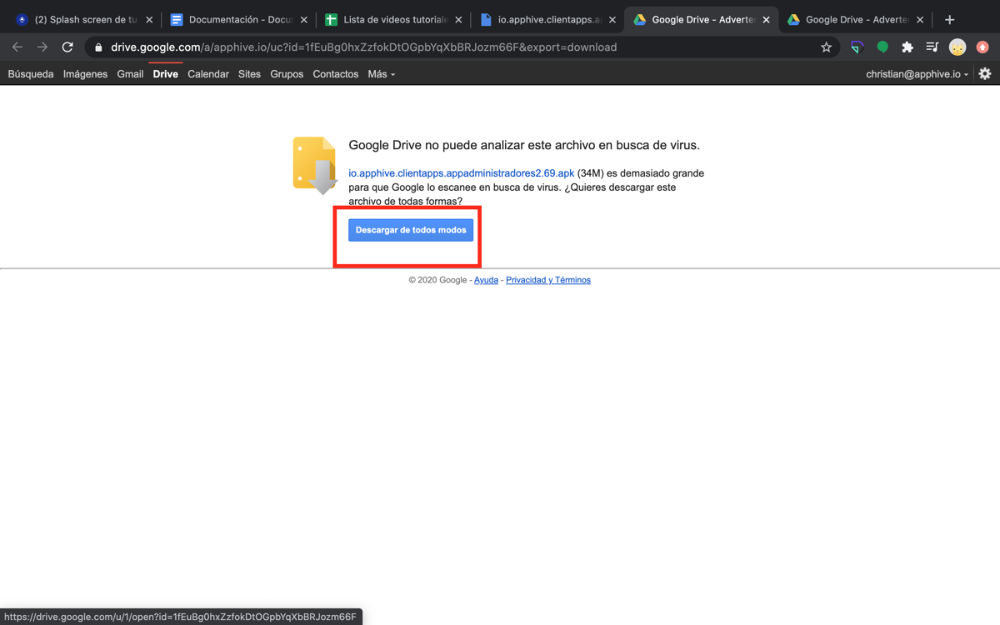
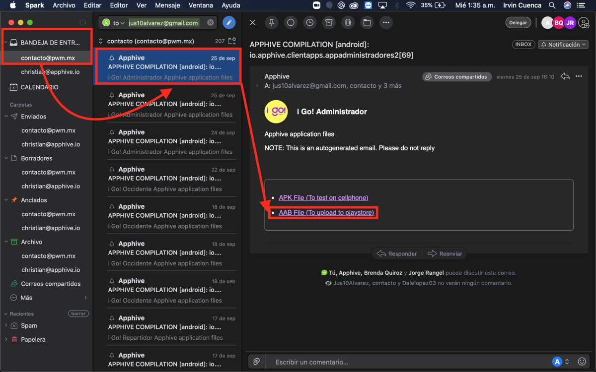
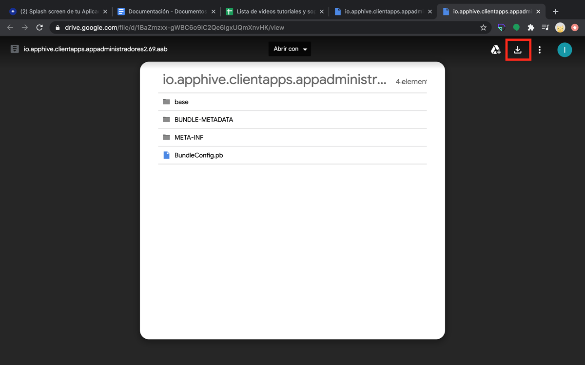

# Descargar los archivos APK y AAB

Cuando tu compilación de Android termina, puedes descargar los archivos **APK** y **AAB** desde la plataforma (en la lista de compilaciones, cuando el estatus cambia a **Compiled**) o desde el correo que te llega al terminar. El **APK** sirve para instalar y probar la app en un teléfono Android; el **AAB** es el que subes a Google Play.

## Desde la plataforma de Apphive

1. Entra a **Compilations**. Verás una lista con el *Compilation ID*, *Status*, *Date*, *Version* y *Platform* de cada compilación.
2. Espera a que el estatus cambie a **Compiled**.

    

3. Abre el menú de tres puntos al final de la fila: ahí están los botones para descargar cada archivo.

    

## Desde el correo electrónico

Al terminar la compilación recibes un correo de **APPHIVE COMPILATION**. Si no lo encuentras, revisa tu bandeja de spam.

### Archivo APK

1. Abre el último correo de APPHIVE COMPILATION y da clic en **APK File (To test on cellphone)**.

    

2. Da clic en **Descargar**.

    

3. Si el navegador te advierte sobre el archivo, da clic en **Descargar de todos modos**.

    

### Archivo AAB

1. Abre el último correo de APPHIVE COMPILATION y da clic en **AAB File (To upload to playstore)**.

    

2. Da clic en el ícono de descargar.

    

3. Da clic en **Descargar de todos modos**.

    

## Qué hacer con cada archivo

| Archivo | Para qué sirve |
| --- | --- |
| **APK** | Instalar la app directamente en un teléfono Android para probarla antes de subirla a la tienda, o para apps de uso interno. |
| **AAB** | Subirlo a tu cuenta de desarrollador de Google Play para publicar la app. |

Para publicar en Google Play necesitas:

- Una **cuenta de desarrollador de Google Play**. Se paga una sola vez a Google y es independiente de tu suscripción de Apphive.
- Los recursos gráficos que pide la ficha de Google Play.
- Una URL con la política de privacidad de tu app.
- El nombre de la aplicación, una descripción breve (hasta 80 caracteres) y una descripción completa (hasta 4000 caracteres).

!!! warning "Inicio de sesión con Google o Facebook"
    Si tu app usa inicio de sesión con Google o Facebook, debes registrar las huellas **SHA** de tu APK para que funcione al probarla. Cuando ya lanzaste la app en Google Play, también tienes que registrar las firmas SHA-1 que te muestra Google Play. Son dos ajustes independientes: hacer uno no sustituye al otro.

Para probar la app con otras personas antes de publicarla, Google Play permite [pruebas abiertas, cerradas o internas](https://support.google.com/googleplay/android-developer/answer/3131213?hl=es-419).
