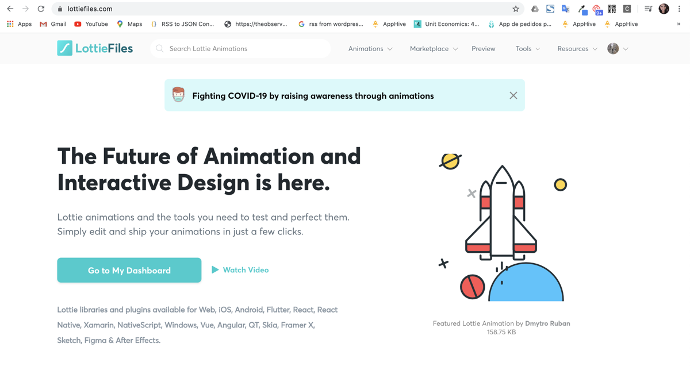
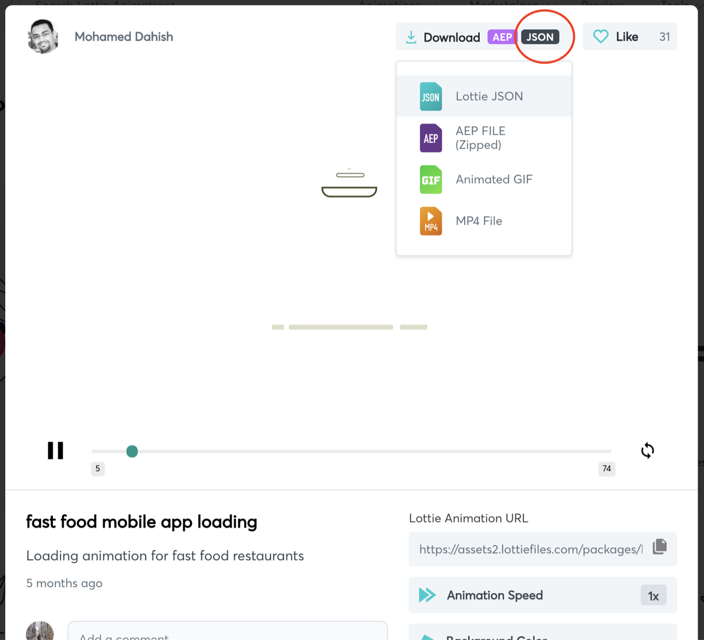
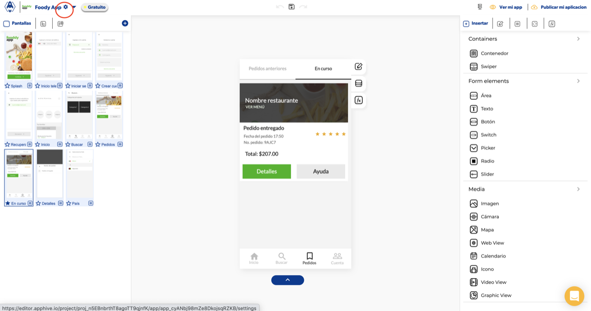
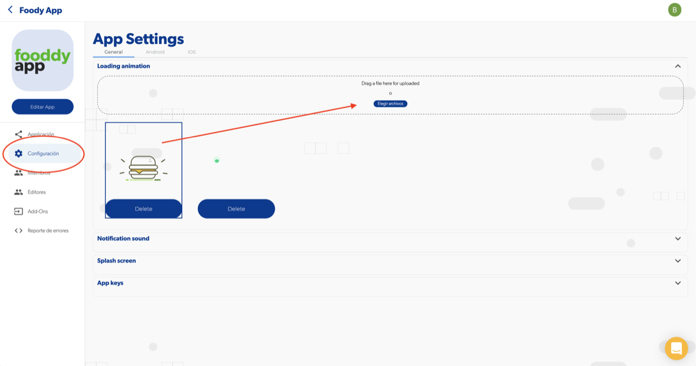

# Diseño de aplicación: loading personalizado con Lottie

Puedes reemplazar la animación de carga (loading) de tu app por una animación de **Lottie**: descárgala en formato `.json` desde LottieFiles y cárgala en la configuración de tu app.

## Pasos

1. Entra a [lottiefiles.com](https://lottiefiles.com/) y elige una animación.

    

2. Descarga el archivo en formato **.json**.

    

    !!! warning
        Carga solo archivos `.json`. Si cargas otro formato, tu app tendrá un error.

3. Entra a la configuración de tu app desde el engrane que aparece junto a su nombre.

    

4. En **Configuración**, carga el archivo `.json` y elige el loader que quieras usar.

    

Video tutorial: [https://www.youtube.com/watch?v=O5MxpUyhUaI](https://www.youtube.com/watch?v=O5MxpUyhUaI)

!!! tip "Crea tu propia animación"
    Puedes crear una animación con tu logo en After Effects y exportarla a Lottie con el [plugin de LottieFiles](https://lottiefiles.com/plugins/after-effects). Luego úsala como loader al abrir la app.

## Problemas comunes

**Todos los loaders se ven igual que el predeterminado:** elimina los loaders que agregaste, borra la caché del navegador y vuelve a subirlos.
