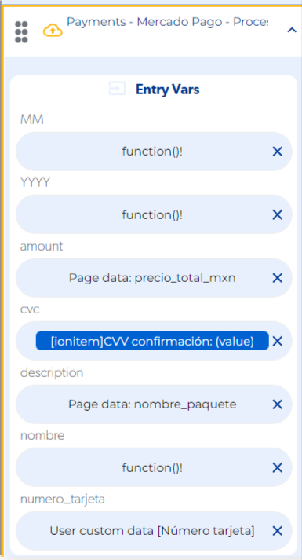

# Error null en Mercado Pago V2

Si al crear un pago con la API v2 de Mercado Pago la función falla y el callback de error devuelve `null` (sin más detalle), revisa dos cosas: que envíes **todos los datos de la tarjeta** al realizar la compra y que el **comprador y el vendedor sean cuentas distintas**.

## Cómo solucionarlo

1. **Envía todos los datos de la tarjeta** en la función que crea el pago. Si falta alguno, Mercado Pago rechaza la operación sin un mensaje claro. Estos son los datos que debes enviar:

    

2. **Usa cuentas distintas para comprador y vendedor.** Al probar con credenciales y tarjetas de prueba, la cuenta que compra no puede ser la misma que la que vende.

!!! tip
    Usa el modo de depuración del editor para ver en qué función se detiene el flujo antes de revisar los datos.
