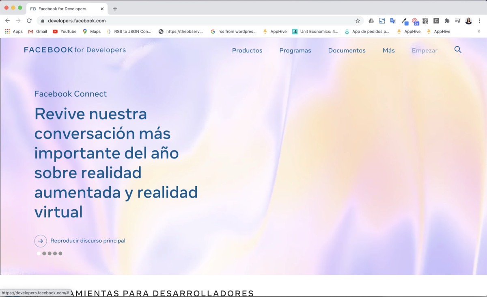
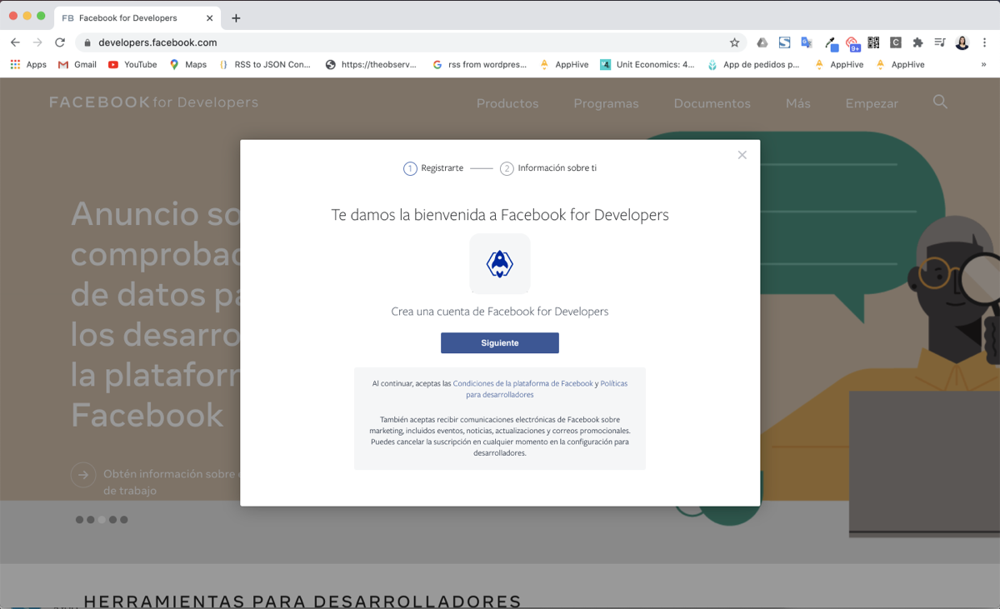
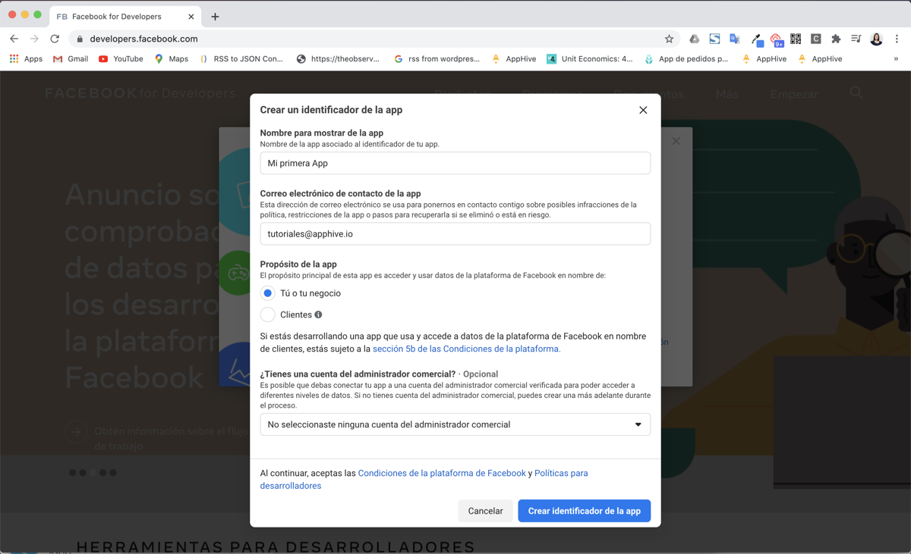
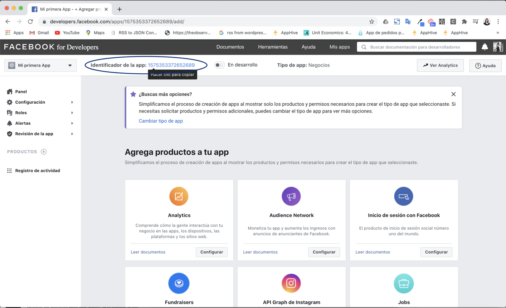
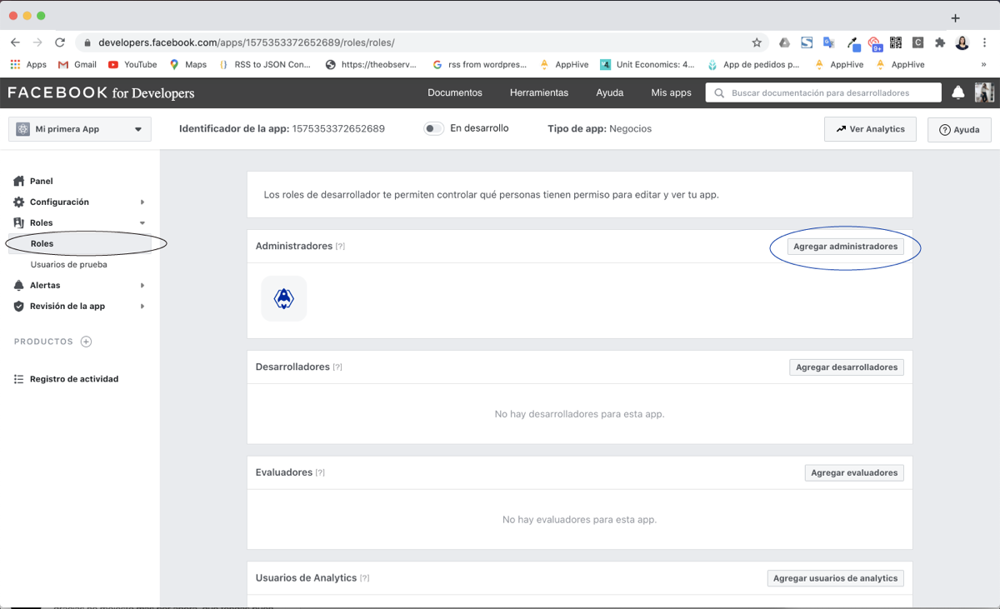

# Facebook config: cómo obtener mi Facebook ID

Si tu app tiene inicio de sesión con Facebook, debes dar de alta tu app en **Facebook Developers**. Al terminar obtendrás el **Facebook App ID** (identificador de la app), que necesitarás al compilar tu aplicación.

## Antes de empezar

Ten a la mano:

- El logotipo de tu aplicación en 1024 x 1024 px.
- La URL de la política de privacidad de tu app. Si aún no la tienes, consulta [Políticas de privacidad para tu app](politicas-de-privacidad-para-tu-app.md).

## Pasos

1. Entra a [developers.facebook.com](https://developers.facebook.com/) y da clic en **Empezar**.

    

2. Completa el registro de tu cuenta: tu perfil, crea tu primera app y elige su categoría.

    

3. Agrega la información restante y genera el identificador de la app.

    

4. Copia el **Facebook App ID** que se genera. Lo necesitarás al compilar tu app.

    

!!! note
    Para el proceso completo (clave secreta, Firebase y compilación) consulta [Facebook for Developers: obtener el Facebook App ID](opcional-facebook-for-developers-si-cualquiera-de-tus-apps-utiliza-inicio-de-sesion-con-facebook.md).

## Agregar administradores

Para dar acceso a otra persona, ve a **Roles > Agregar administradores** y agrega el ID de Facebook de esa persona.

