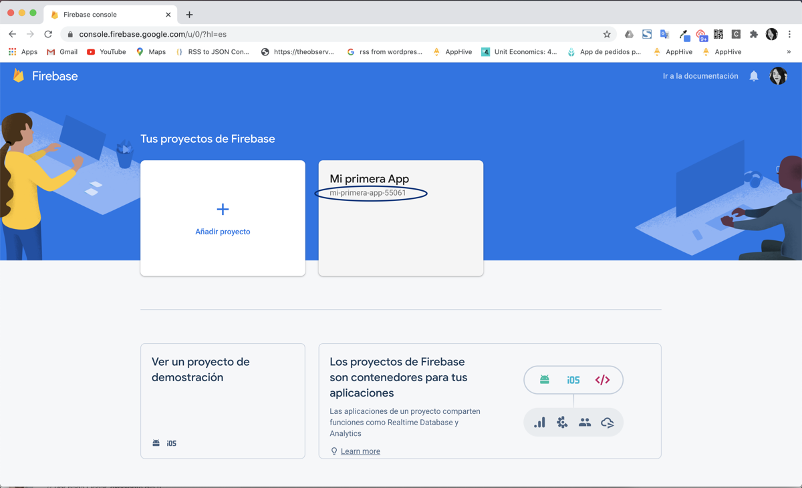
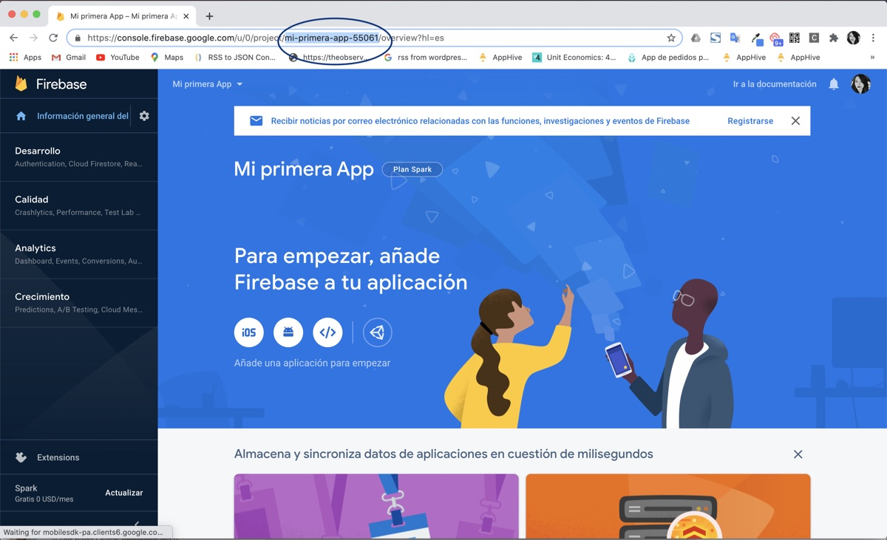

# Firebase config: cómo obtener tu Firebase Project ID

El **Project ID** de Firebase aparece en la consola de Firebase, en la lista de tus proyectos, debajo del nombre de cada proyecto. También puedes leerlo en la URL cuando tienes el proyecto abierto.

## Desde la lista de proyectos

1. Entra a [console.firebase.google.com](https://console.firebase.google.com/) con la cuenta de Google con la que creaste tu proyecto de Firebase.
2. En **Tus proyectos de Firebase**, busca el nombre de tu proyecto. Debajo aparece su **Project ID**.

## Desde la URL

Abre tu proyecto en la consola de Firebase: el Project ID aparece en la URL del navegador, como se marca en la imagen.

Video tutorial: [ver en Google Drive](https://drive.google.com/file/d/1eiZx1pZyJ1FzpSOaLoHnJuS20DejkfcP/view)
