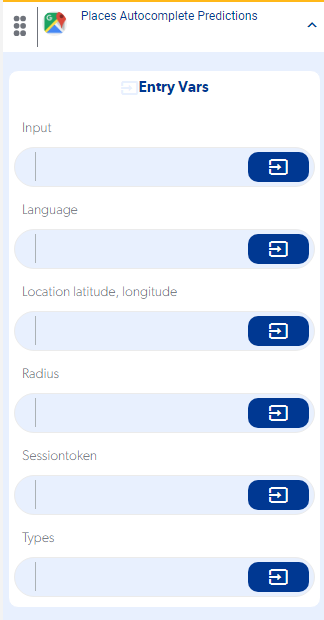

# Función Places Autocomplete Predictions

La función **Places Autocomplete Predictions** devuelve sugerencias de lugares de Google mientras el usuario escribe. Está disponible cuando activas la API de Google Maps en **Add-Ons** dentro de tu proyecto.

## Configuración

1. Activa la API de Google Maps en **Add-Ons** de tu proyecto.
2. Agrega la función **Places Autocomplete Predictions** al proceso que quieras.
3. En el campo **Types** escribe exactamente:

    ```
    geocode|establishment
    ```

    Así la función devuelve tanto direcciones como establecimientos.



Video de la configuración: [ver grabación](https://sharing.clickup.com/clip/p/t8583554/eda00639-a9e6-4e8a-87c9-71c14f05d1b5/screen-recording-2023-11-16-14%3A06.webm)

!!! note
    Si las sugerencias no llegan, revisa primero tu API key, la facturación y las APIs habilitadas en Google Cloud: [API de Google Maps: no carga el autocompletado de direcciones](api-google-maps-no-carga-el-autocomplete-de-direcciones.md).
