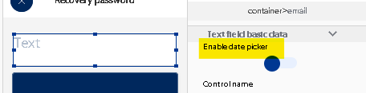

# Función Regex Test: ejemplos de expresiones regulares

La función **Regex Test** compara un texto con una expresión regular para saber si tiene la estructura que esperas: un correo, una URL, un nombre, una contraseña, etc. Sirve para no dejar que el usuario ingrese cualquier cosa en tus formularios. Las expresiones dependen de lo que necesites; aquí tienes algunas para empezar.

## Expresiones de ejemplo

**Nombre** (letras, acentos y espacios, de 3 a 80 caracteres):

```
^[A-Za-záéíóú\s]{3,80}$
```

**Contraseña** (letras y números, de 6 a 10 caracteres):

```
^[a-zA-Z0-9]{6,10}
```

**URL:**

```
^https?:\/\/[\w\-]+(\.[\w\-]+)+[/#?]?.*$
```

**Correo electrónico:**

```
^[^@\s]+@[^@\s]+\.[^@\s]+$
```

Para contraseñas con reglas más estrictas (mayúsculas, números, caracteres especiales), consulta [5 tipos de validación de contraseñas](5-tipos-de-validacion-de-contrasenas.md).

## Longitud exacta o por rango

El número entre llaves define la longitud de la cadena:

| Escribe | Significa |
| :--- | :--- |
| `{3,10}` | Entre 3 y 10 caracteres |
| `{20}` | Exactamente 20 caracteres |

## Validar fechas

Para fechas no necesitas una expresión regular: selecciona el **Field**, ve a la sección **Data** y activa el switch **enable date picker**. Así el usuario elige la fecha en un calendario.



## Validar números de teléfono

Hay dos tipos de validación:

1. **Que el número tenga la estructura correcta:** usa Regex Test (en **Basic regex** hay opciones para teléfonos de 10 dígitos y con código de país).
2. **Que el número exista:** necesitas un servicio externo de verificación por SMS, como Twilio.

!!! tip
    Prueba tus expresiones en [regexr.com](https://regexr.com/) antes de usarlas. Recuerda que, para que se use tu **Custom regex**, el **Basic regex** debe estar en **None**. Más detalles en la referencia de [Regex Test](../reference/funciones/logic-e/regex-test/README.md).
