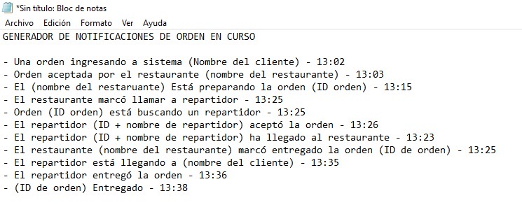

# Generador de notificaciones: historial del estado de una orden

Sí se puede tener un historial que muestre cada estado de una orden, desde que entra al sistema hasta que se entrega. Agrega una función de **push** en cada acción que cambia el estado, guarda cada notificación en la base de datos con el **id del pedido** como uno de sus campos y muéstralas en una lista filtrada por ese id.

## Pasos

1. En cada acción que cambia el estado de la orden (aceptada, en preparación, en camino, entregada…), agrega la función para **enviar el push**.
2. **Concatena** la información que quieres comunicar (estado, hora, etc.) y mándala en el cuerpo (body) del mensaje.
3. Además del push, **guarda** cada notificación en una colección de la base de datos. Uno de sus campos debe ser el **id del pedido**.
4. En la pantalla de detalle de la orden (en la app del restaurante y del administrador), consulta esa colección **filtrando por el id del pedido**.
5. Muestra el resultado en una **lista**: así ves la hora de cada cambio y detectas las órdenes que se retrasan.

Video con el ejemplo completo: [ver video](https://www.loom.com/share/3cc4d56111d34885b62754e1e1cc73c2).

Consulta también [Send push](../reference/funciones/push-notifications/send-push/README.md).
