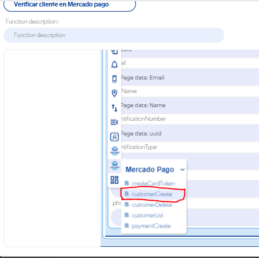
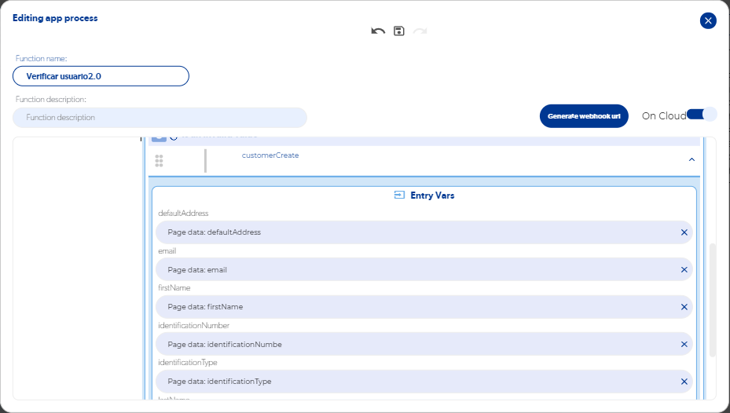
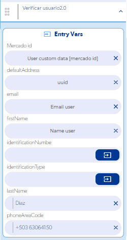

# Guía definitiva para integrar Mercado Pago

Para cobrar con Mercado Pago en tu app hay dos pasos esenciales: **crear el cliente (Customer id)** y **crear su método de pago**. El cliente se crea con la función de Mercado Pago **CustomerCreated** dentro de un **App Process On Cloud**, usando tu Access Token.

## Videos

1. Crear el cliente (Customer id): [ver video](https://www.loom.com/share/236ce17c16964312a31cd59558f84c8f)
2. Crear el método de pago: [ver video](https://www.loom.com/share/fde7c0fff2654874b7385f1134486673)
3. Resto de las funciones de Mercado Pago: [ver lista de videos](https://youtu.be/EjigINZtFYI?list=PLQd-X722uODZznvv7jAFSqwUQgclBlnFK&t=1674)

## Crear el cliente con el SDK

1. Crea un **App Process** y, dentro, agrega la función **CustomerCreated** de Mercado Pago.
   
2. Pasa los datos del cliente (por ejemplo, correo y nombre) como **variables de entrada** del App Process y activa la opción **On Cloud**.
   
3. Desde la pantalla, llama al App Process y mándale esos datos.
   
4. Dentro del App Process, en los callbacks de éxito y de error, retorna lo que devuelve la función.
5. Donde llamas al App Process (por ejemplo, en el **OnLoad**), agrega un **Alert** en sus callbacks de éxito y de error para ver la respuesta mientras pruebas.

!!! note "¿El Access Token es el mismo que el del SDK?"

    Sí. El SDK sólo complementa la parte de la solicitud del token.

## Problemas comunes

- **Al crear el cliente devuelve `null`**: si ya creaste un cliente con ese correo, volver a crearlo falla. Para cada prueba usa un usuario nuevo con un correo distinto.
- **Error `null` al crear un pago**: consulta [Error null en Mercado Pago V2](error-null-en-mercado-pago-v2.md).
- **No sé dónde está el error**: muestra en un Alert la salida de cada función (éxito y error) para ver exactamente qué responde Mercado Pago.
