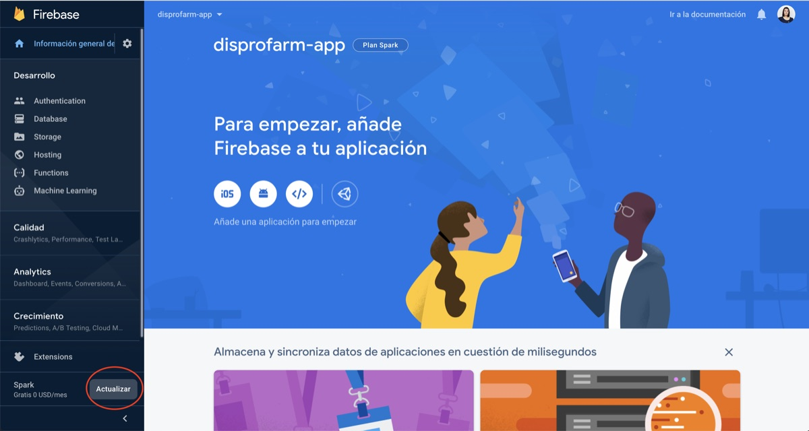
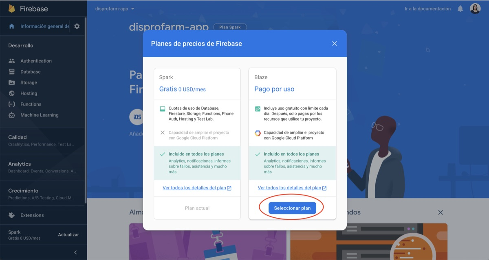
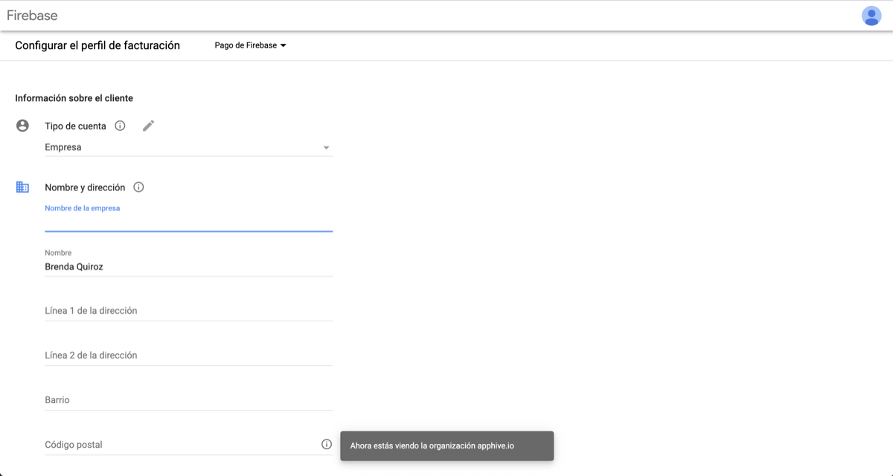
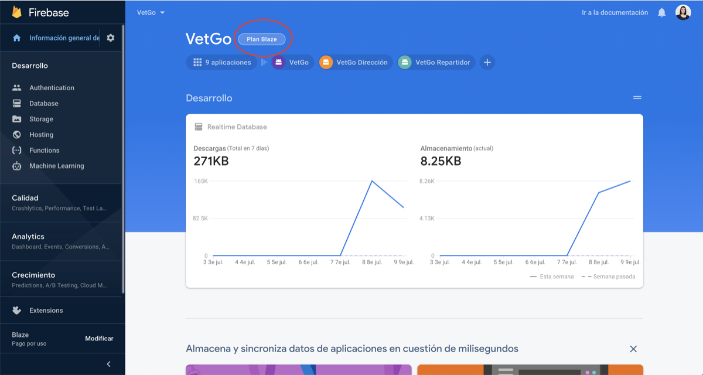

# Actualización de Google Firebase de plan gratuito (Spark) a plan Blaze

Para compilar tu app, el proyecto de Firebase conectado a ella debe estar en el **plan Blaze**. Firebase limita las Cloud Functions en el plan gratuito, y sin este ajuste no podrás compilar tu app, aunque ya la hayas compilado antes.

Consulta los precios de Firebase en [firebase.google.com/pricing](https://firebase.google.com/pricing?hl=es).

## Pasos

1. Entra a tu cuenta de Firebase, abre tu proyecto y da clic en **Actualizar**.

    

2. Elige **Seleccionar plan** para actualizar a Blaze.

    

3. Llena la información y agrega un método de pago.

    

4. Verifica que en la sección del plan diga **Blaze**.

    

!!! warning
    Sin el plan Blaze en tu proyecto de Firebase no se podrá compilar tu app.
