# Inicio de sesión con Facebook (SHA en APK)

Si ya compilaste tu app y al probar el APK no inicia sesión con Facebook, tienes que dar de alta tu app Android en Facebook developers: el nombre del paquete, la clase `MainActivity` y el **hash de clave** que se obtiene de la huella SHA1 de tu proyecto de Firebase. Después debes pasar tu app de Facebook de *En desarrollo* a *Publicada*.

!!! warning "Antes de empezar"

    El inicio de sesión con Facebook debe estar activado en tu proyecto de Firebase (**Authentication > Sign-in method**).

## 1. Registrar tu app Android en Facebook

1. Ve a [https://developers.facebook.com/apps/](https://developers.facebook.com/apps/) y elige tu app.
   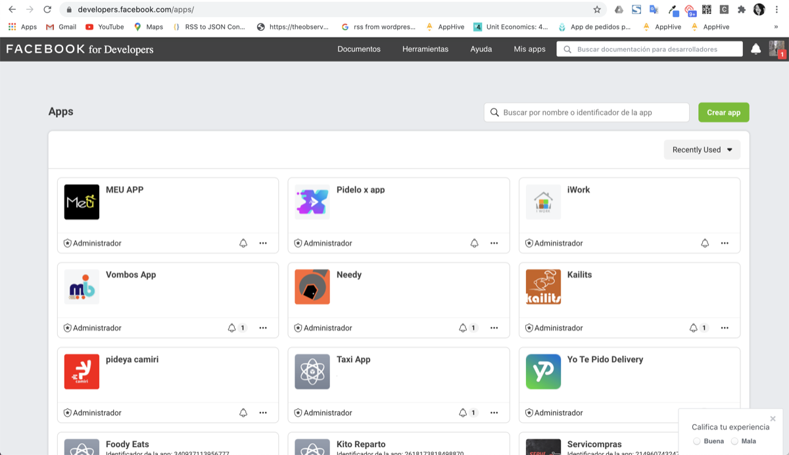
2. Da clic en **Inicio rápido > Android**.
   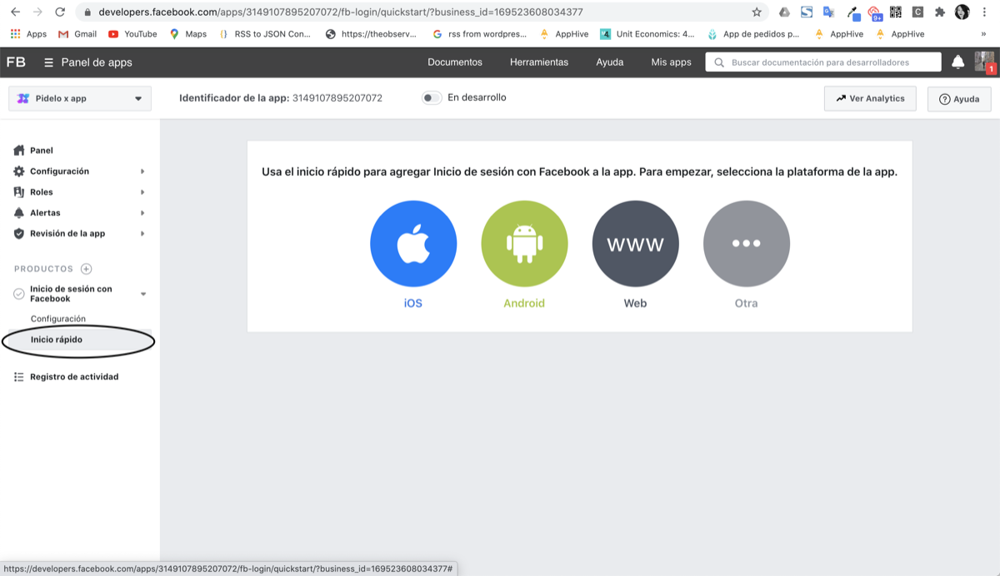
3. Da clic en **Siguiente** hasta la opción 3: *Infórmanos sobre tu proyecto de Android*.
   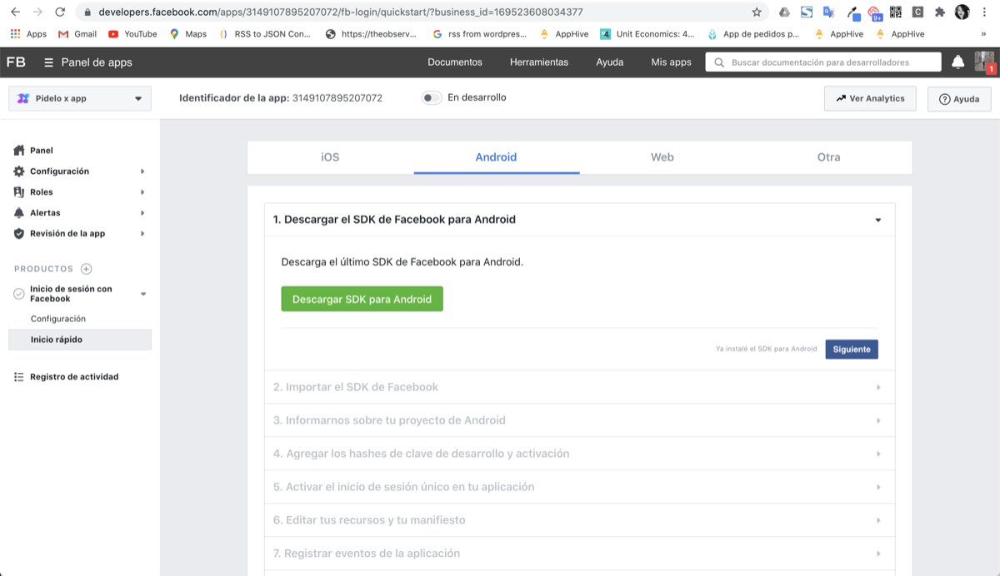
4. En otra pestaña, abre tu consola de Firebase: **Configuración > General > Tus aplicaciones** y copia el **nombre del paquete**.
   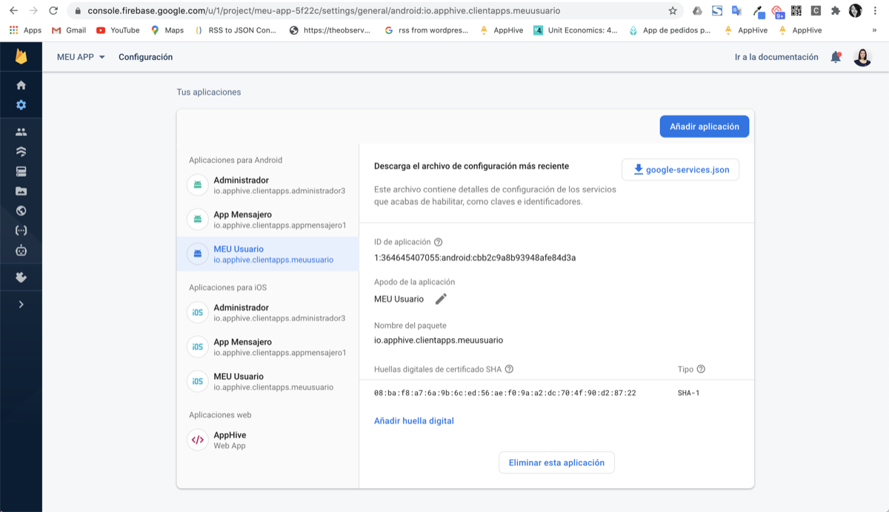
   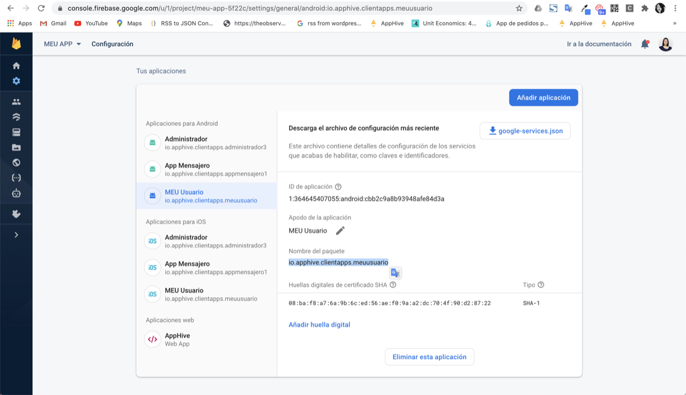
5. En Facebook, pega el nombre del paquete. En **Nombre de clase de actividad predeterminado** escribe `MainActivity`, guarda y da clic en **Continuar**.
   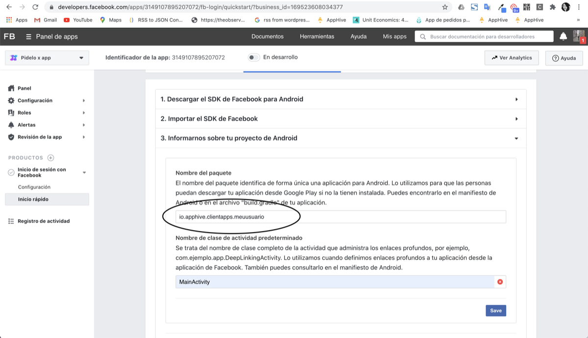

## 2. Obtener y agregar el hash de clave

1. En Firebase (**Configuración > General > Tus aplicaciones**) copia la clave **SHA1** (huellas digitales de certificado SHA).
   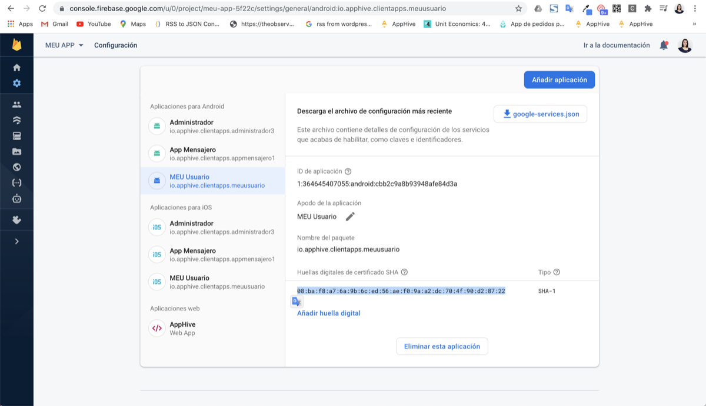
2. Entra a [https://hash-facebook.apphive.io/](https://hash-facebook.apphive.io/), pega la SHA1 y da clic en **Enviar**. Copia la clave que te devuelve.
   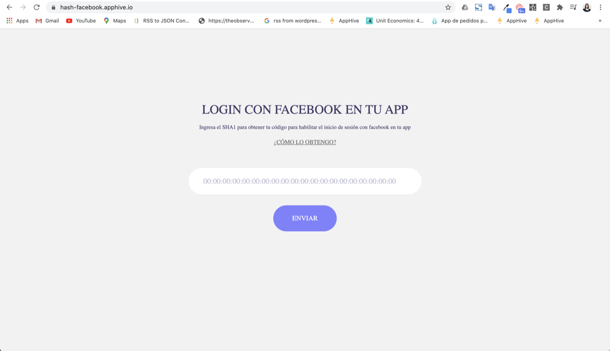
3. Regresa a Facebook y, en la opción 4 (*Agregar los hashes de clave de desarrollo y activación*), agrega ese hash.
   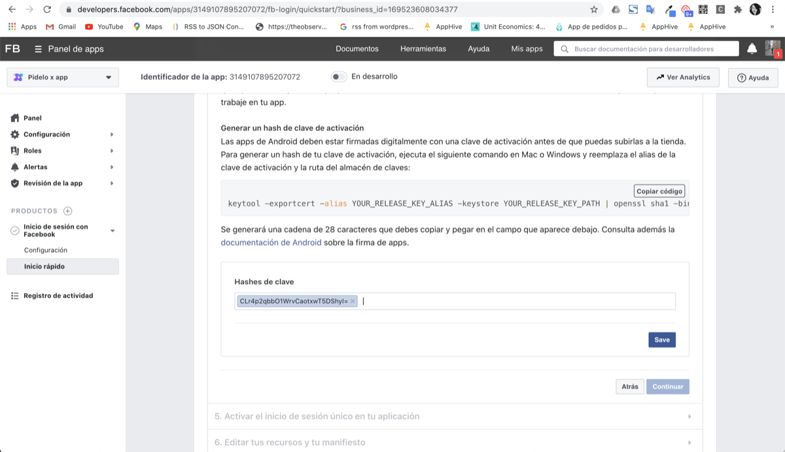
4. Salta los pasos restantes del inicio rápido.

## 3. Publicar la app de Facebook

1. Ve a **Configuración > Básica** y completa toda la información que te pide; sobre todo la **URL de la Política de privacidad**, las **Condiciones del servicio** y tu logotipo de 1024 x 1024.
2. Cambia el switch de **En desarrollo** a **Publicada**. Con esto el inicio de sesión con Facebook queda habilitado en tu APK.
   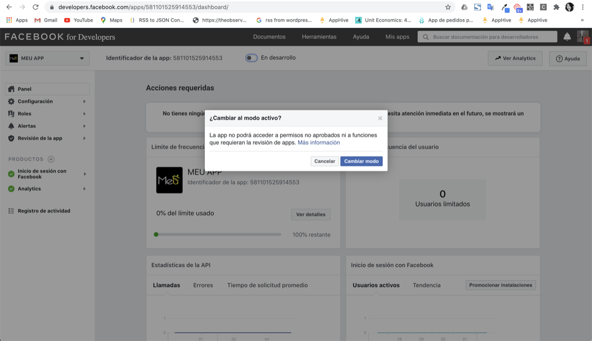

## 4. Pegar la URL de redirección de OAuth

1. En Firebase ve a **Authentication > Sign-in method**, abre el proveedor de Facebook y copia la URL de redirección.
   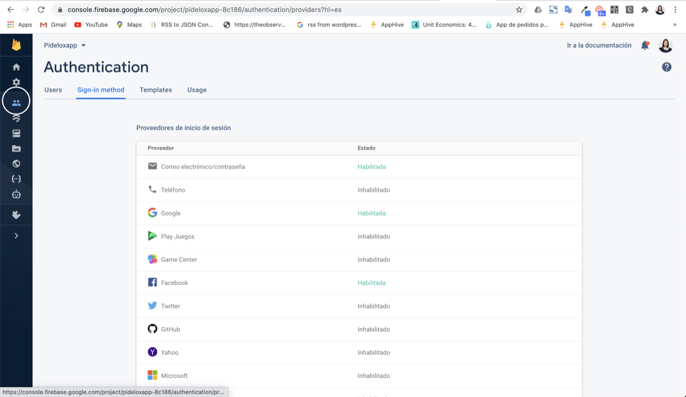
   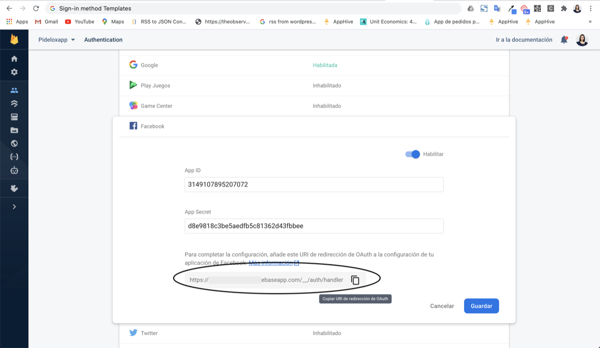
2. En Facebook developers ve a **Configuración del cliente de OAuth**, pega la URL en la sección indicada y guarda.
   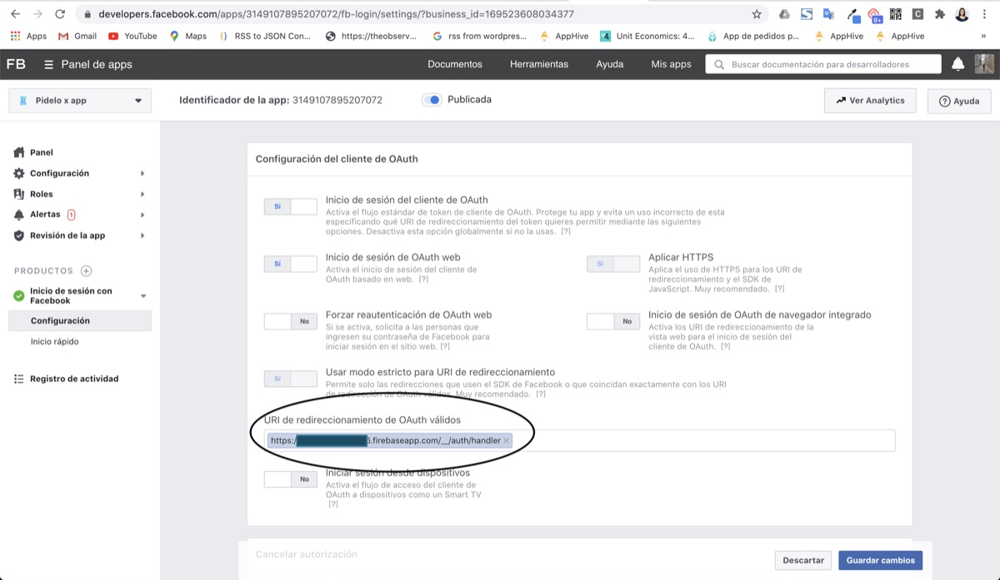

## ¿Cómo cargar otra aplicación en la misma cuenta?

Si tu proyecto tiene varias apps con inicio de sesión con Facebook, todas se cargan en la misma app de Facebook: **es un ID de Facebook por proyecto**, no uno por app.

1. En tu dashboard de Facebook developers entra a **Configuración > Básica**.
   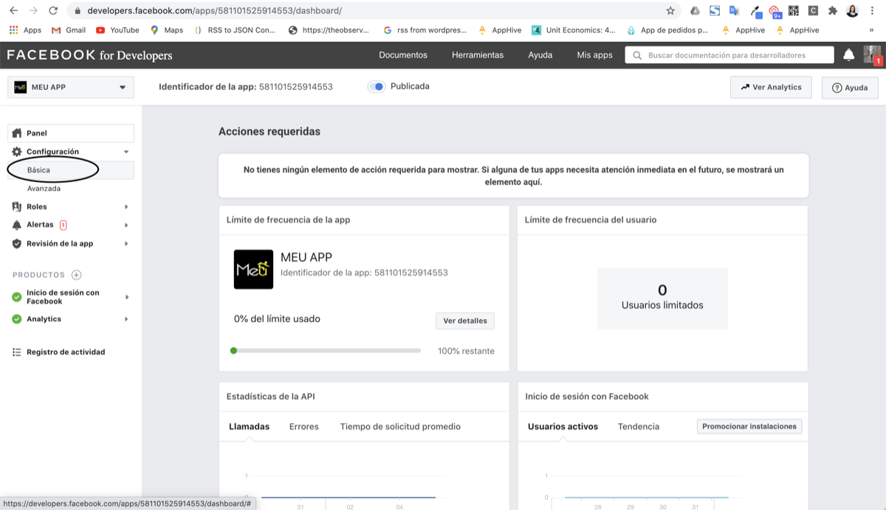
2. Abajo, en la sección **Android**, agrega el **Nombre del paquete de Google Play** y los **Hashes de clave** de la nueva app y guarda los cambios.
   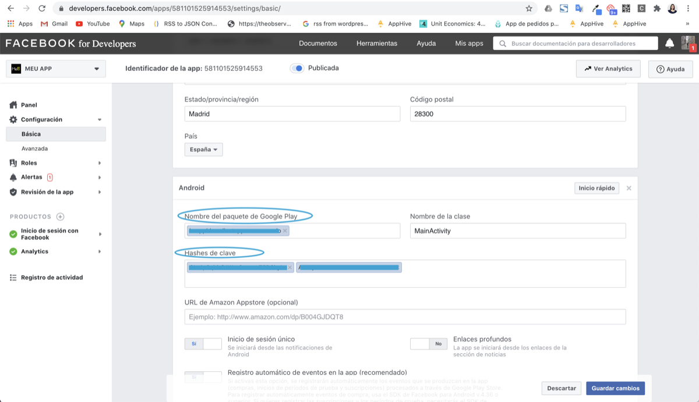

!!! note "Cuando tu app ya está en Google Play"

    Al publicar en Google Play la firma de la app cambia, así que el hash que registraste para el APK deja de servir. Sigue los ajustes posteriores a la publicación descritos en [Paso a paso para publicar tu app en Play Store](paso-a-paso-para-publicar-tu-app-en-play-store.md#ajustes-posteriores-a-la-publicacion).
