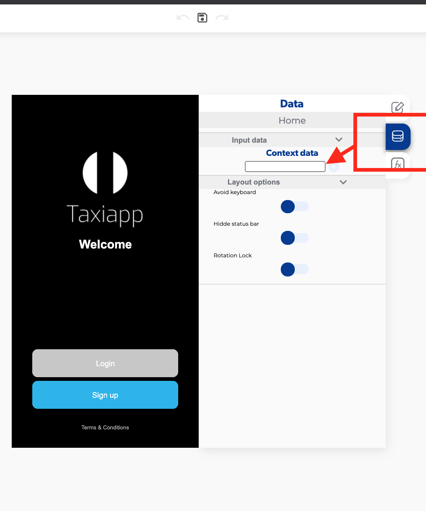
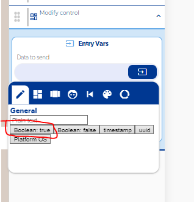

# Mostrar u ocultar la contraseña al presionar el botón del ojo

Para que la contraseña se muestre u oculte al tocar el ícono del ojo, guarda el estado (oculta o visible) en una variable de la página y, al presionar el ícono, usa un **Conditional** para decidir si activas o desactivas la propiedad **Password masking** del campo con **Modify control**.

## Pasos

1. **Crea una variable de página.** En la pestaña **Data** de la pantalla, en **Context data**, agrega una variable de tipo Page data (por ejemplo, `mostrarContrasena`).

    

2. **Activa Password masking en el campo.** En el [Text field](../reference/elementos-de-interfaz/formularios/text-field-1.md) de la contraseña, activa *Password masking* para que el texto se oculte al escribir.

3. **Agrega la lógica al presionar el ícono del ojo:**
    1. Un [Conditional](../reference/funciones/logic/conditional.md) que revise el valor de la variable de página.
    2. En cada rama, un [Modify control](../reference/funciones/controls/modify-control.md) con *Element* = el campo de la contraseña y *Property to modify* = la propiedad de ocultar contraseña, enviando `true` o `false` según la rama.

        

    3. Un [Set page value](../reference/funciones/local-storage-e/set-page-value/README.md) que guarde el nuevo estado en la variable.

## Cambiar el ícono de ojo abierto a ojo cerrado

En cada rama del Conditional agrega otro **Modify control** que cambie el ícono del botón (ojo abierto cuando la contraseña está visible, ojo cerrado cuando está oculta). En *Data to send* envía un valor que la propiedad acepte.
