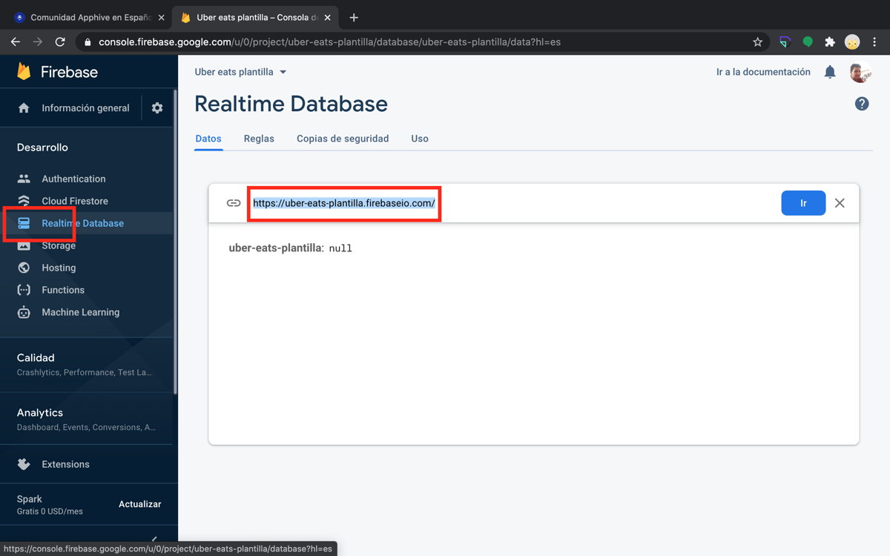

# Obtener la URL de Firebase Realtime Database

La URL de tu Realtime Database aparece en la parte superior de la sección **Realtime Database** de tu proyecto en la consola de Firebase.

## Pasos

1. Abre [firebase.google.com](https://firebase.google.com/) y da clic en **Ir a la consola**.

    

2. Da clic en tu proyecto de Firebase.

    

3. Entra a **Realtime Database** y copia la URL que aparece arriba de los datos.

    

!!! note
    Si todavía no has creado la base de datos, en la sección Realtime Database da clic en **Crear una base de datos**.
