# Obtener Firebase: crear el proyecto de Firebase de tu app

Para compilar tu app necesitas tu propio proyecto de Firebase en plan **Blaze**, con Functions, Realtime Database y Storage activados. Durante el proceso anota tres datos que te pedirá la compilación: el **nombre del proyecto**, la **URL de Realtime Database** y la **URL de Storage**.

## 1. Crea el proyecto

1. Entra a [firebase.google.com](https://firebase.google.com/) y da clic en **Comenzar**.

    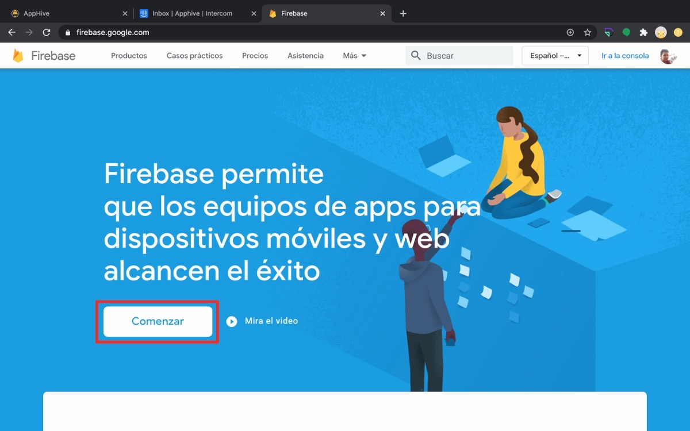

2. Da clic en **Crear un proyecto**.

    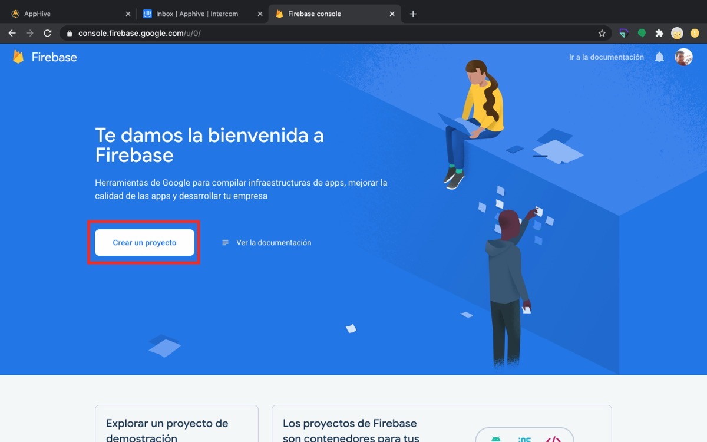

3. Escribe el nombre del proyecto (puede ser el mismo de tu proyecto en Apphive; solo sirve para que lo identifiques), acepta las condiciones de Firebase y da clic en **Continuar**.

    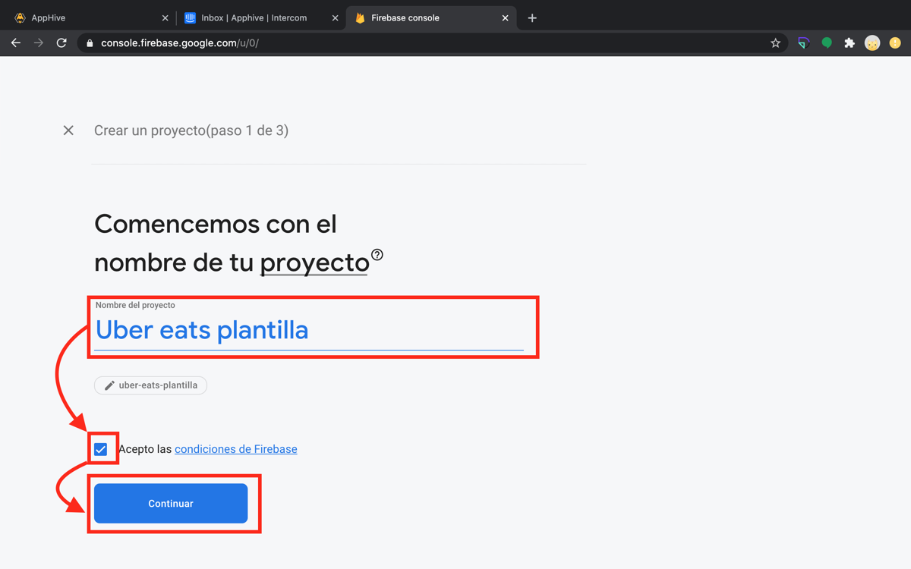

    !!! tip "Anótalo"
        Copia el nombre del proyecto de Firebase en una nota: `NOMBRE PROYECTO FIREBASE: ...`

4. Google Analytics es opcional (te da estadísticas de uso de tu base de datos y tus usuarios). Si lo activas, selecciona o crea una cuenta, elige tu país y acepta las condiciones.

    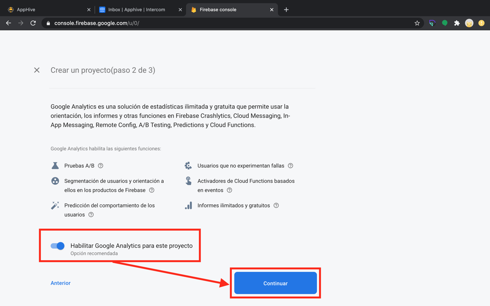

5. Espera a que se cree el proyecto y da clic en **Continuar**.

    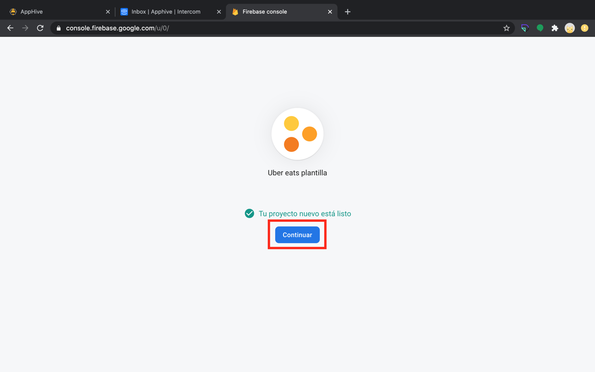

## 2. Cambia al plan Blaze

Para poder compilar, el proyecto debe estar en plan Blaze. Da clic en **Actualizar > Seleccionar plan**, revisa tus datos y agrega una tarjeta de crédito o débito. Detalle en [Actualización de Firebase a plan Blaze](importante-actualizacion-de-google-firebase-de-plan-free-a-plan-blaze.md).

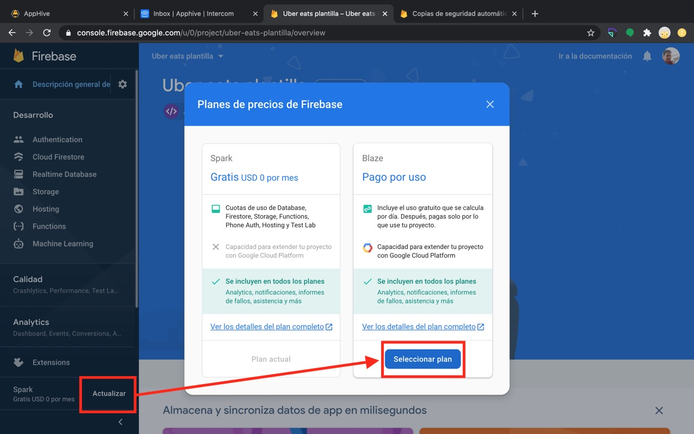

## 3. Activa Functions

Entra a **Functions**, da clic en **Comenzar**, luego en **Continuar** y en **Finalizar**.

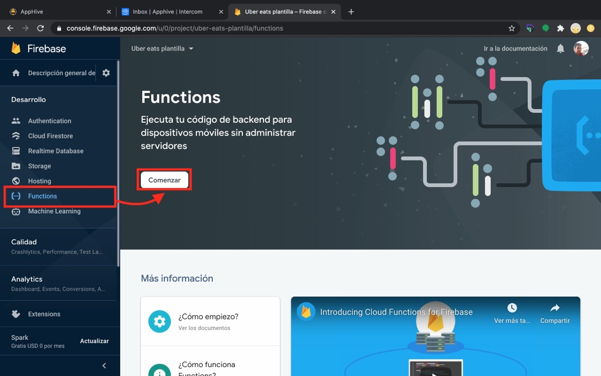

## 4. Crea la Realtime Database

1. Entra a **Realtime Database** y da clic en **Crear una base de datos**.

    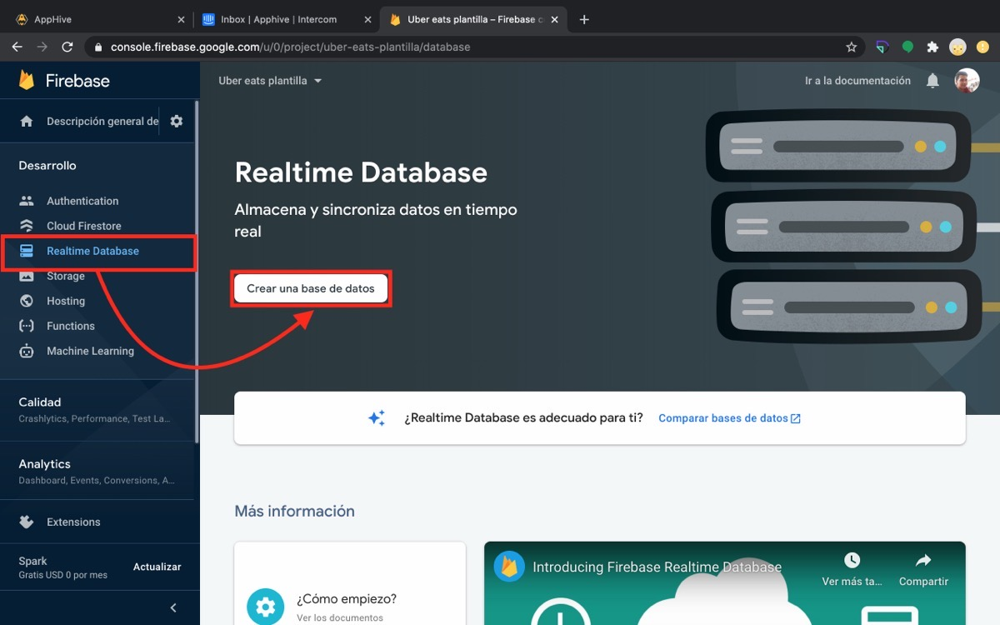

2. Selecciona **Comenzar en modo bloqueado** y da clic en **Habilitar**.

    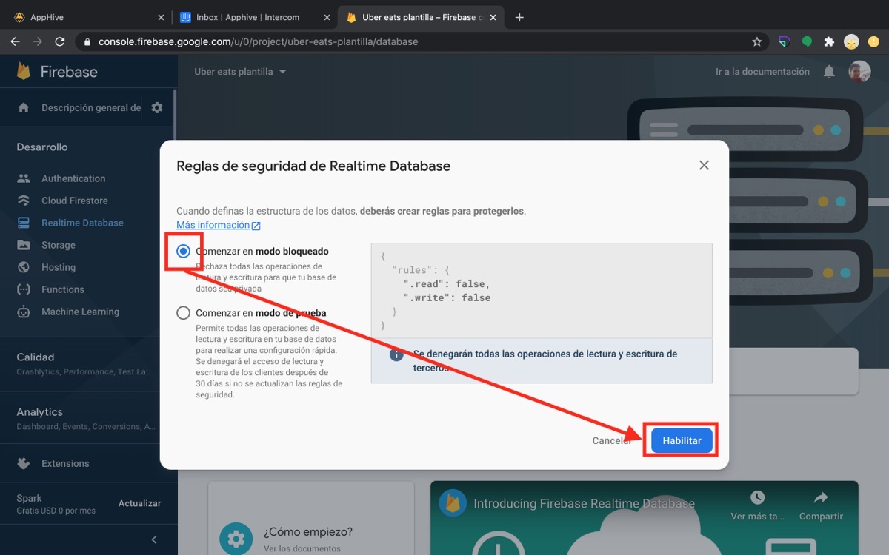

3. Copia la URL de la base de datos y anótala: `FIREBASE REALTIME DATABASE URL: https://...firebaseio.com/` (ver [Obtener la URL de Firebase Realtime Database](obtener-firebase-realtime-database-url.md)).

    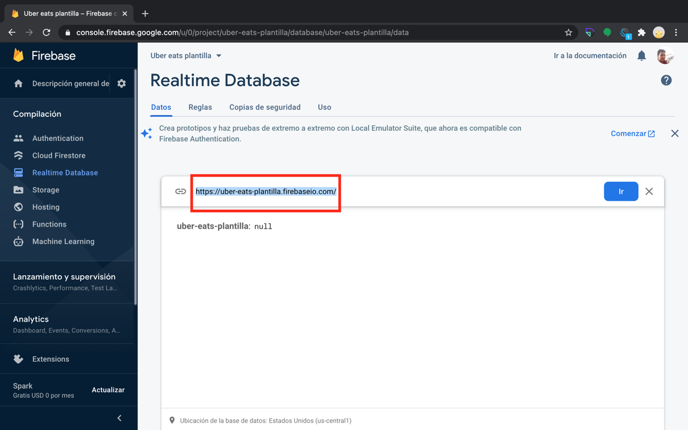

4. Opcional: en **Copias de seguridad**, da clic en **Empezar**; en **Opciones avanzadas** activa la compresión y el ciclo de vida de almacenamiento de 30 días, y guarda.

    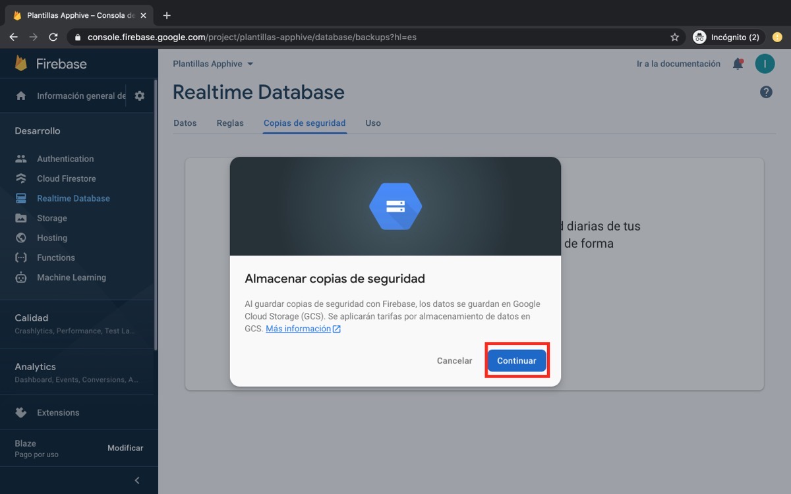

## 5. Activa Storage

1. Entra a **Storage** y da clic en **Comenzar**.

    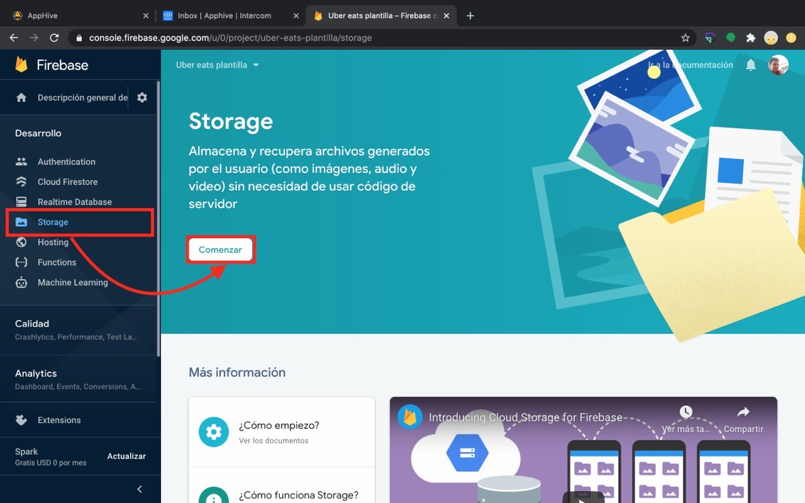

2. Da clic en **Siguiente**, verifica que la ubicación sea **nam5 (us-central)** y da clic en **Listo**.

    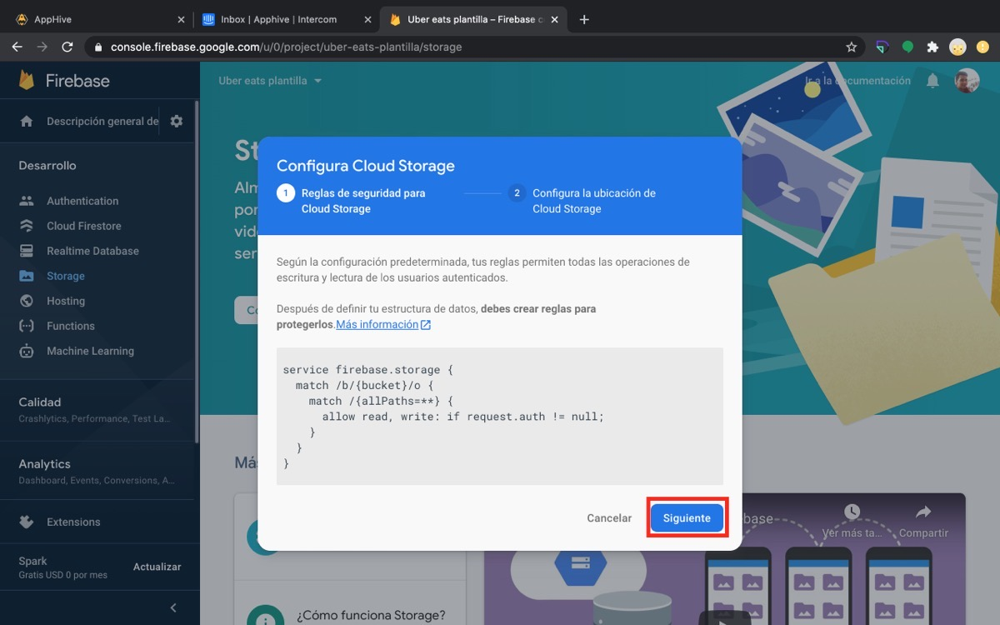

3. Copia el fragmento de la URL de Storage que se marca en la imagen y anótalo: `FIREBASE STORAGE URL: tu-proyecto.appspot.com`.

    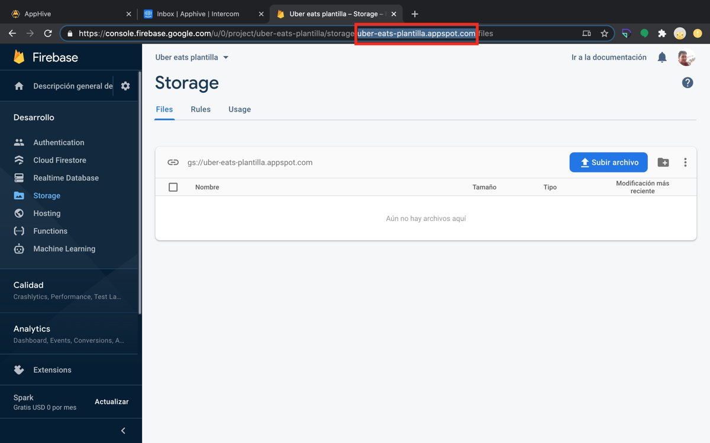

## 6. Genera la cuenta de servicio

En **Configuración del proyecto > Cuentas de servicio**, da clic en **Generar nueva clave privada** y luego en **Generar clave**. Se descargará un archivo `.json`: guárdalo en una carpeta de tu computadora. Detalle en [Obtener el service account file](obtener-service-account-file.md).

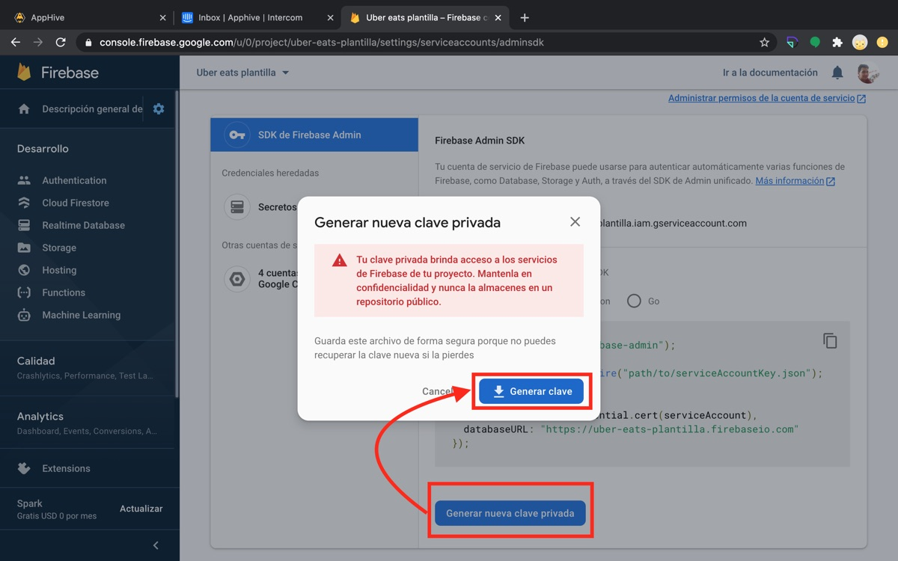
