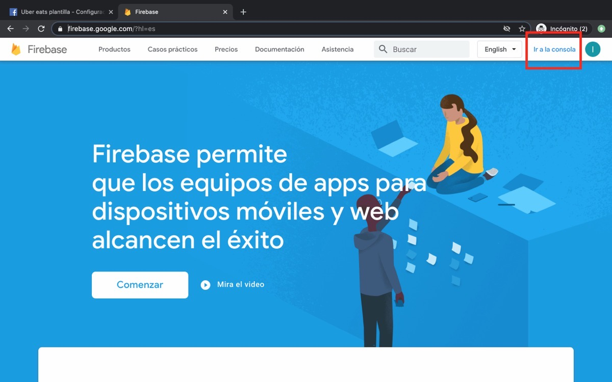
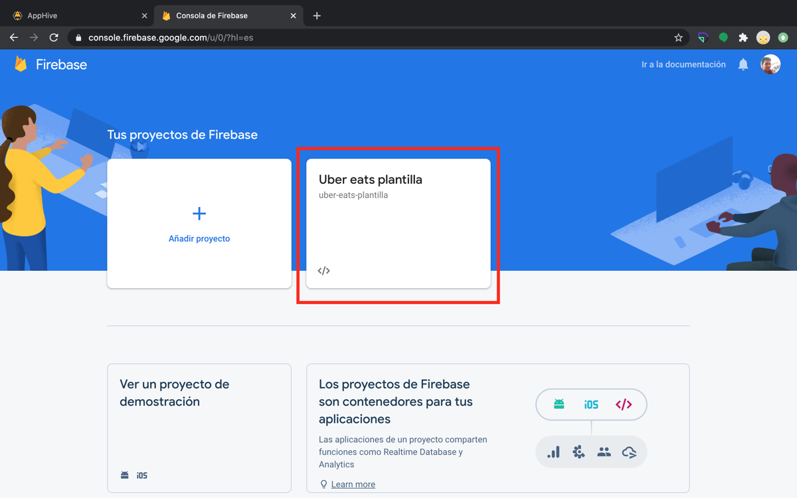
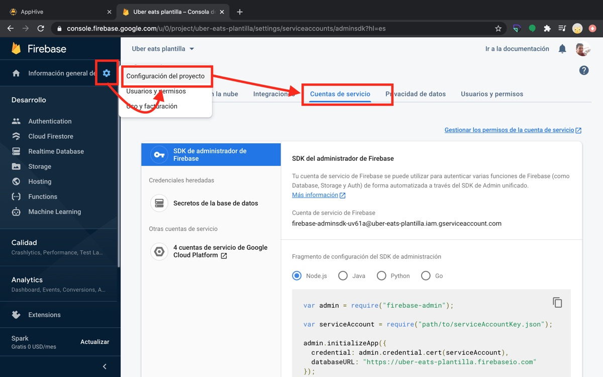
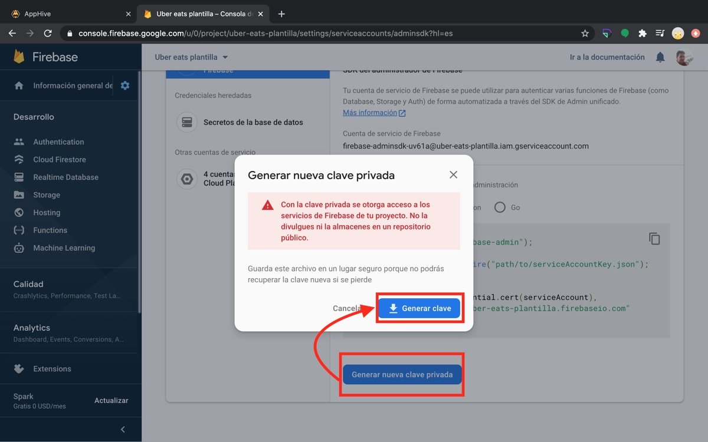

# Obtener el service account file de Firebase

El archivo de cuenta de servicio (*service account file*) se genera en la consola de Firebase, en **Configuración del proyecto → Cuentas de servicio → Generar nueva clave privada**.
## Pasos

1. Entra a [firebase.google.com](https://firebase.google.com/) y da clic en **Ir a la consola**.

    

2. Da clic en tu proyecto de Firebase.

    

3. Da clic en el ícono de configuración, selecciona **Configuración del proyecto** y abre la pestaña **Cuentas de servicio**.

    

4. Da clic en **Generar nueva clave privada** y confirma con **Generar clave**. El navegador descargará el archivo.

    
