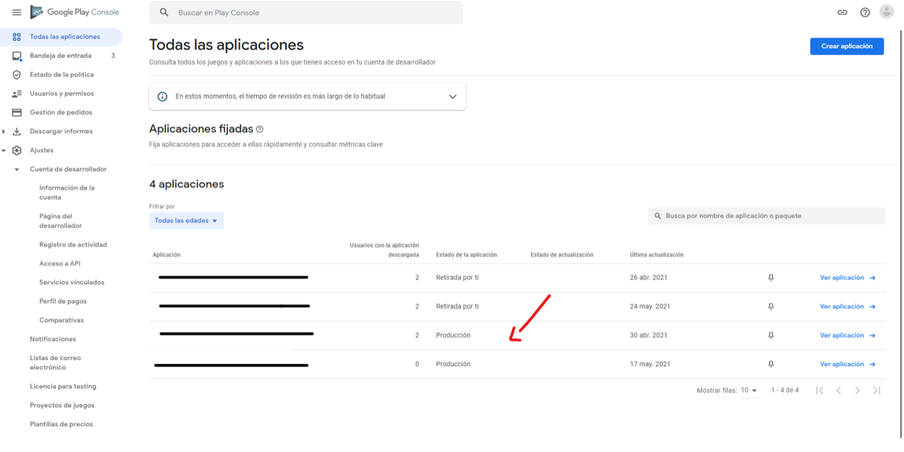
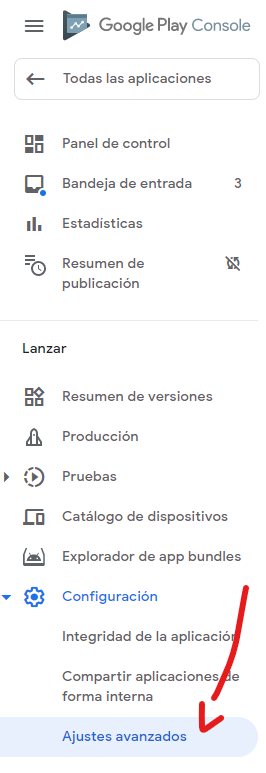
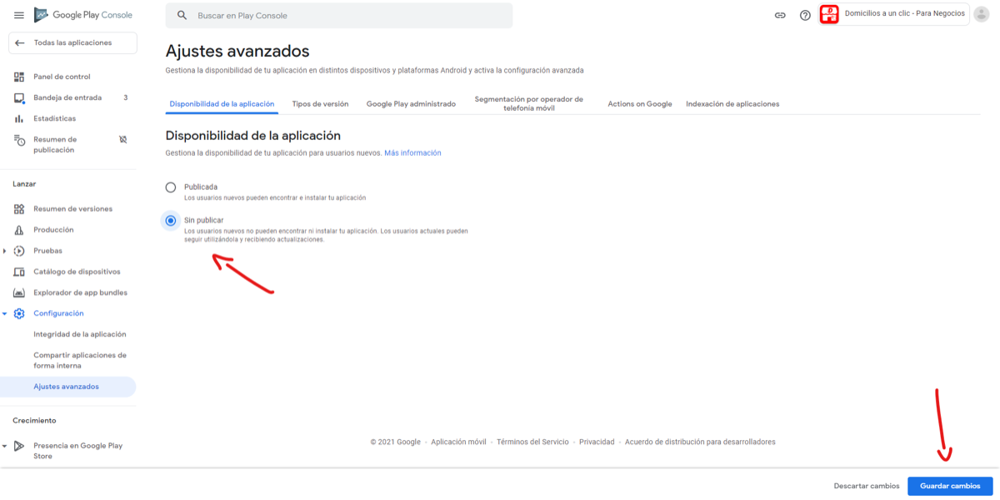
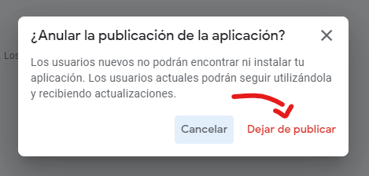

# Ocultar/Mostrar mi app en Google Play (Android)

Para ocultar una app que ya está en Google Play, entra a **Play Console**, abre la app, ve a **Ajustes avanzados**, elige **Sin publicar** y guarda los cambios. Para volver a mostrarla haz lo mismo y elige **Publicada**.

!!! note "Qué pasa al ocultarla"

    Los usuarios nuevos ya no podrán encontrarla ni instalarla. Quienes ya la tienen instalada podrán seguir usándola y recibiendo actualizaciones.

## Pasos

1. Entra a tu [Google Play Console](https://play.google.com/console/developers) y selecciona la app que quieres ocultar.
   
2. En el menú de la izquierda selecciona **Ajustes avanzados**.
   
3. Selecciona **Sin publicar** y da clic en **Guardar cambios**.
   
4. Confirma el cambio.
   

Para **mostrar** la app de nuevo sigue los mismos pasos y en el paso 3 selecciona **Publicada**.
