# Facebook for Developers: obtener el Facebook App ID (si tus apps usan inicio de sesión con Facebook)

Este paso sólo es necesario si alguna de tus apps usa inicio de sesión con Facebook. Tienes que crear una app en Facebook for Developers, copiar su **identificador de la app** (Facebook App ID) y su **clave secreta**, habilitar Facebook como método de acceso en Firebase y pegar esos dos datos al compilar tu app en Apphive.

## 1. Crear la app en Facebook for Developers

1. Entra a [https://developers.facebook.com/](https://developers.facebook.com/) y haz clic en **Iniciar sesión**.

    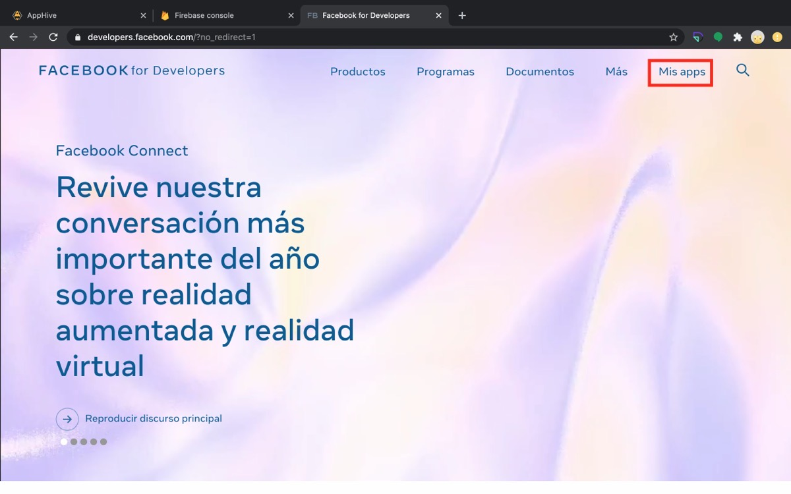

2. Inicia sesión con tu usuario y contraseña de Facebook.

    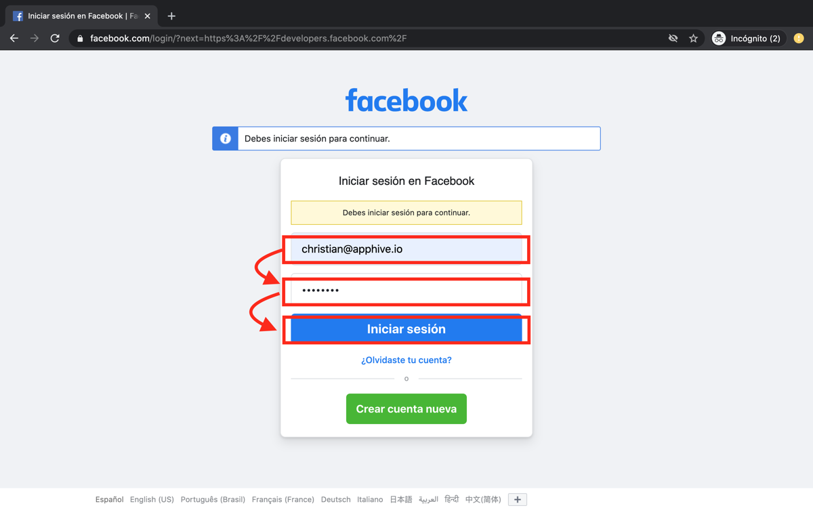

3. Haz clic en **Mis apps**.

    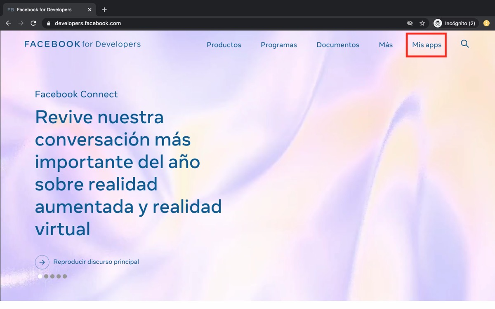

4. Haz clic en **Crear app** y selecciona la opción **Para todo lo demás**. Si no aparece, selecciona **Crear experiencias conectadas**.

    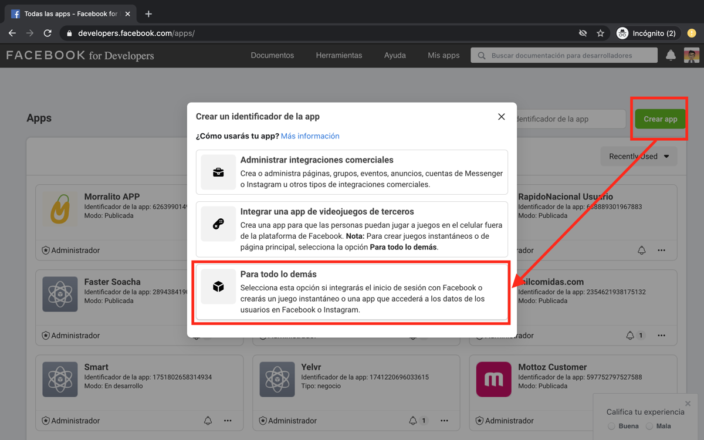

5. En **Nombre para mostrar de la app** escribe el mismo nombre de tu proyecto de Firebase, y como correo usa el mismo con el que creaste tu proyecto de Firebase (ahí te avisarán si hay algún problema con tu app de Facebook). Haz clic en **Crear identificador de la app**.

    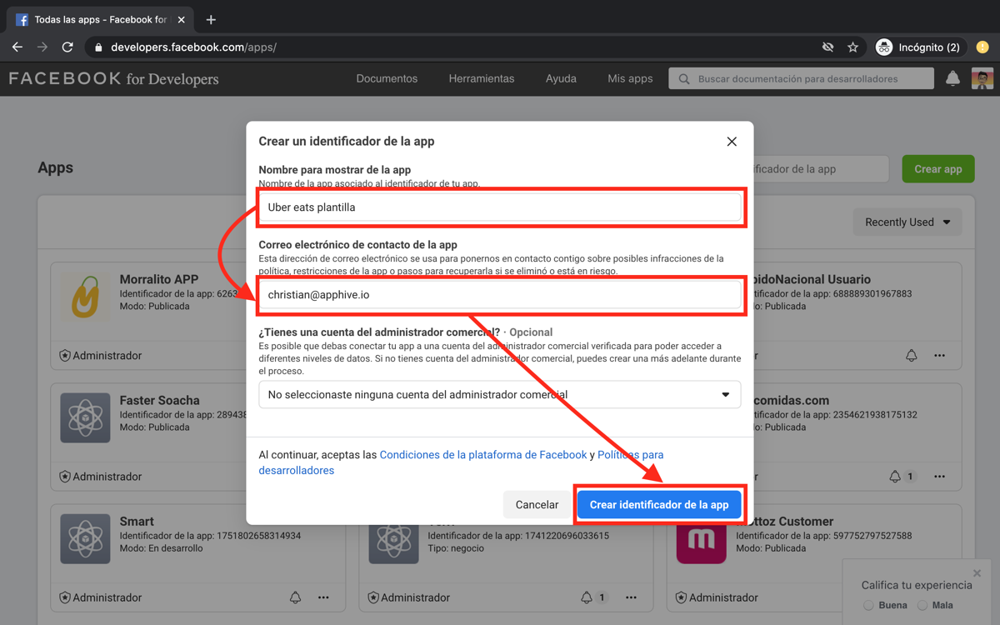

6. Marca la casilla **No soy un robot** y haz clic en **Enviar**.

    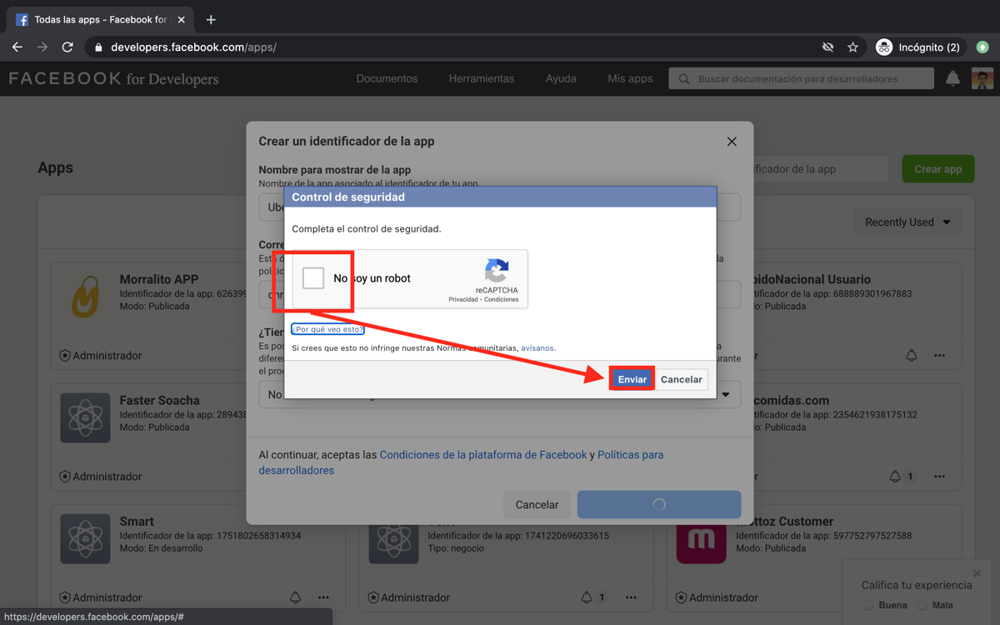

## 2. Copiar el Facebook App ID y la clave secreta

1. Copia el **Identificador de la app** y guárdalo en una nota, por ejemplo:

    ```
    FACEBOOK APP ID: <tu identificador>
    ```

2. Haz clic en **Configuración** y selecciona **Básica**.

    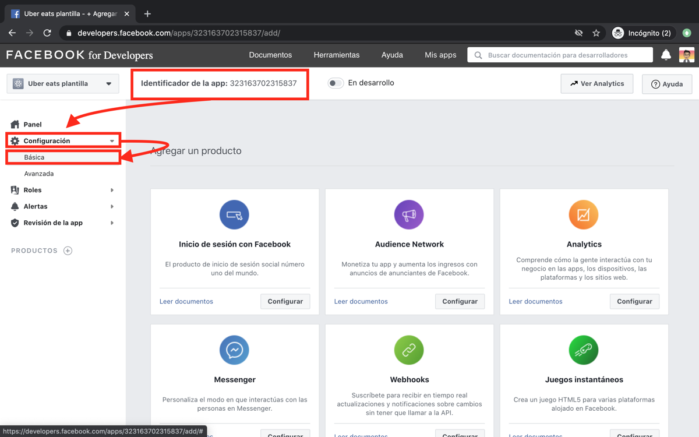

3. Junto a la **Clave secreta de la app**, haz clic en **Mostrar** y escribe la contraseña de tu cuenta de Facebook.

    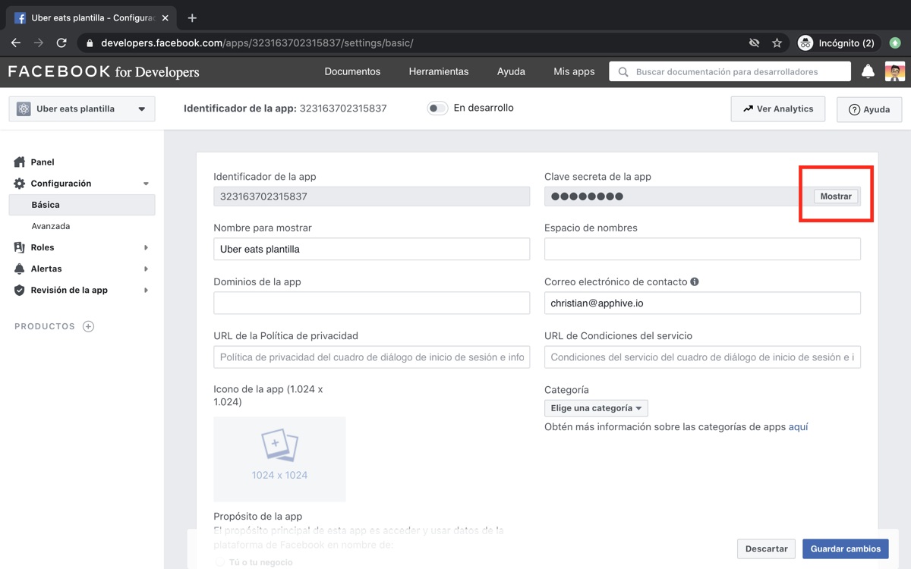

4. Copia la clave secreta y guárdala en la misma nota:

    ```
    FACEBOOK SECRET KEY: <tu clave secreta>
    ```

    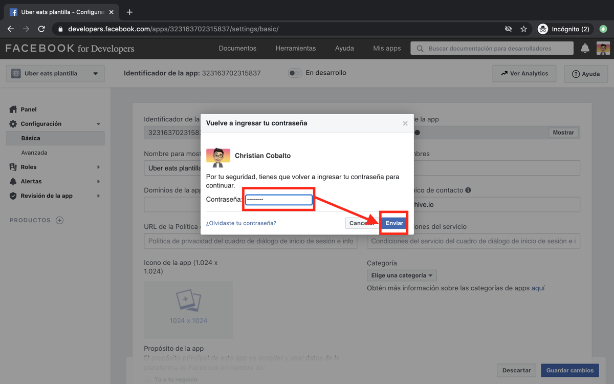

!!! warning
    La clave secreta es privada: no la compartas ni la publiques.

## 3. Habilitar Facebook en Firebase

1. Abre [Firebase](https://firebase.google.com/) y haz clic en **Ir a la consola**.

    

2. Haz clic en tu proyecto de Firebase.

    

3. Selecciona **Authentication** y haz clic en **Sign-in method**.

    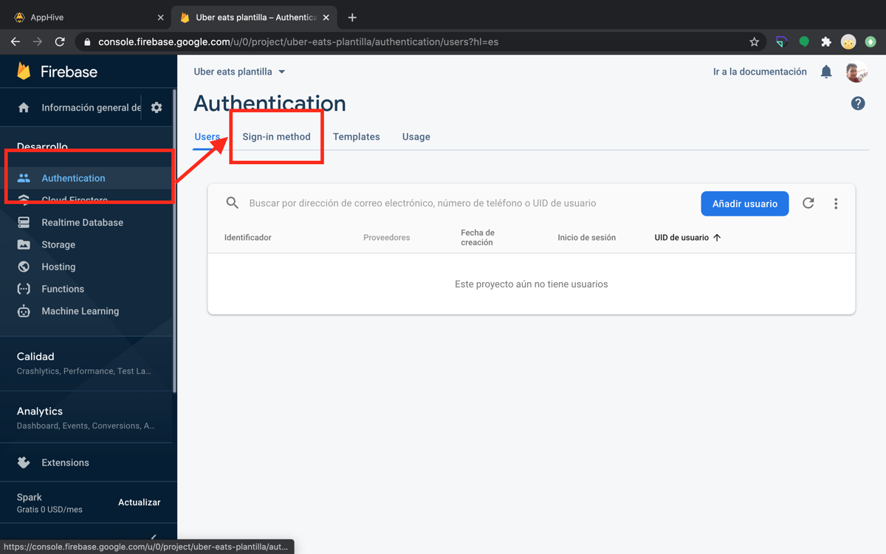

4. Selecciona **Facebook** y haz clic en **Habilitar**. Pega el Facebook App ID en **App ID** y la clave secreta en **App Secret**. Haz clic en **Guardar**.

    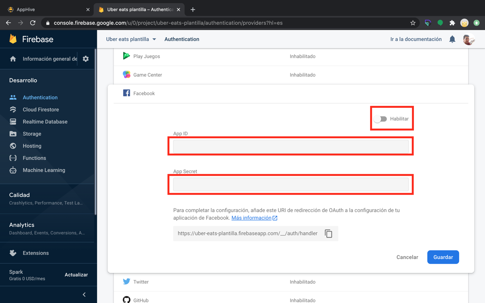

    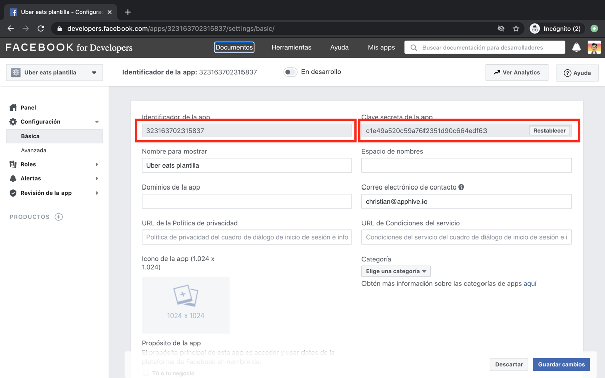

    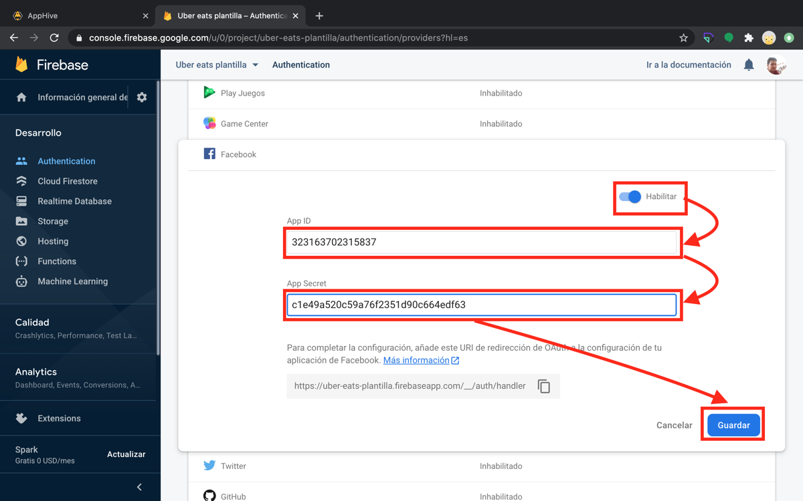

## 4. Agregar los datos en la compilación de Apphive

Cuando compiles tu app, Apphive te pedirá estos dos datos:

1. Pega el identificador de la app en **Facebook app ID** y la clave secreta en **Facebook app secret key**.
2. Haz clic en **Set Facebook app ID**.

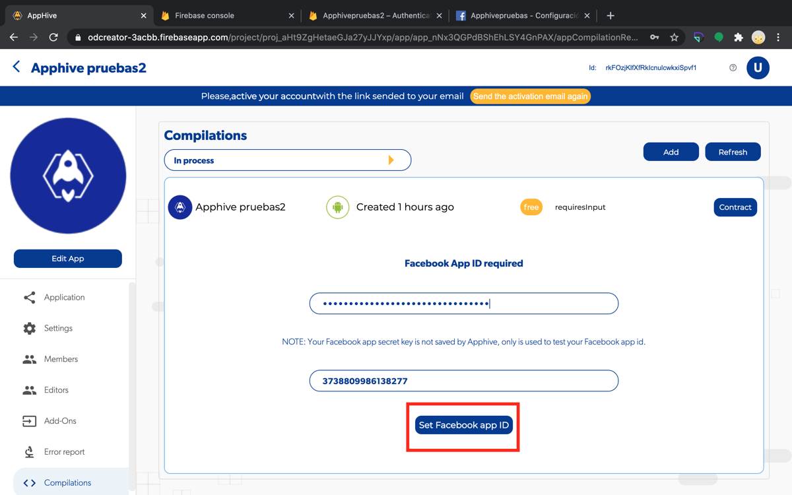

## Si tienes más de una app con inicio de sesión con Facebook

Si varias apps de tu proyecto usan inicio de sesión con Facebook y cada una tiene un nombre de paquete distinto, en **Configuración** > **Básica**, al final de la página, agrega la clave de cada app en el mismo campo donde pegaste la primera.

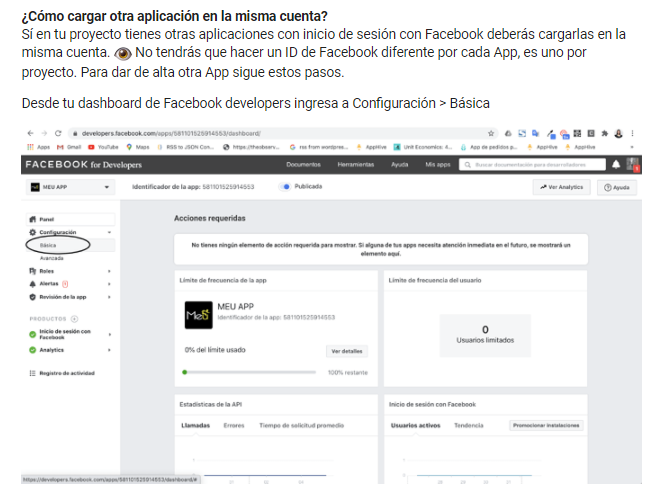

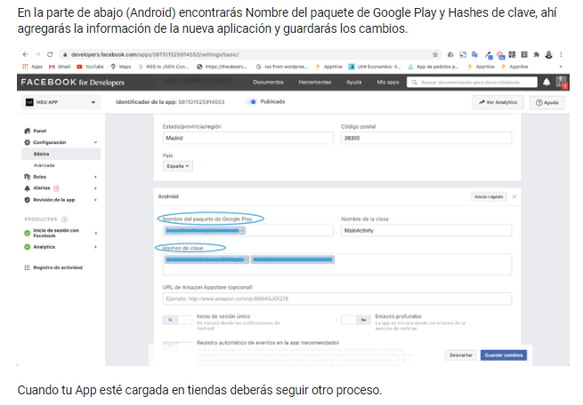

Más detalles en [Inicio de sesión con Facebook: SHA en APK](inicio-de-sesion-con-facebook-sha-en-apk.md).

Para el proceso completo de publicación, consulta [Publicar en Play Store](../publish/publish-to-play-store-android/README.md).
