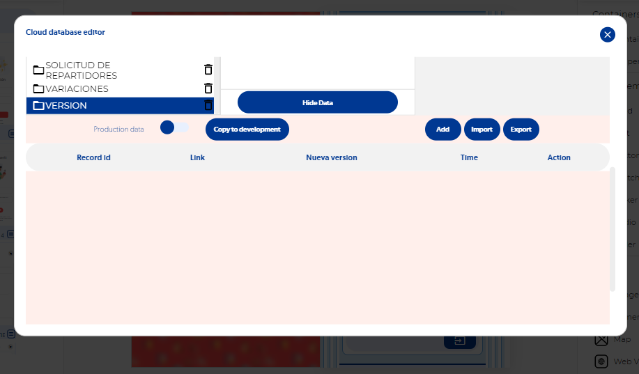
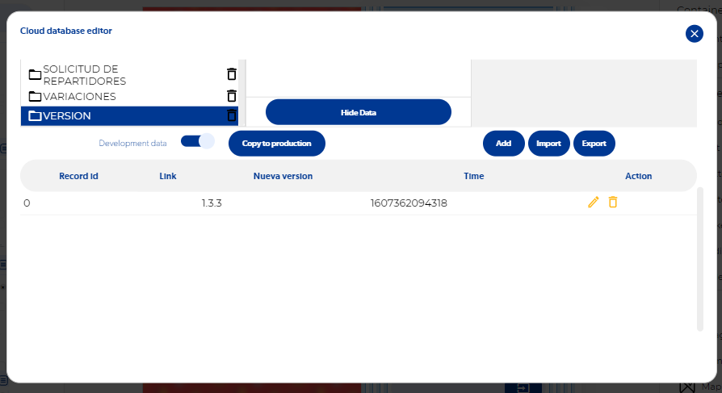

# Problema en el splash screen: la app se queda pegada

Si en el previsualizador tu app funciona pero el APK compilado se queda en el splash screen, casi siempre es porque la lógica del splash lee datos que **no existen en la base de datos de producción**. La función **Get database data** se va por el callback **Empty**, ese callback no tiene ninguna acción y la app se queda detenida.

## Causa típica

Un caso común: en el splash se lee el número de versión de la app para decidir si mostrar una pantalla de "actualiza tu app". Ese dato existe en la base de datos de **prueba**, pero no en la de **producción**, que es la que usa la app compilada.

| Base de datos de producción | Base de datos de prueba |
| --- | --- |
|  |  |

## Solución

1. Abre el editor de base de datos y activa el switch de **producción**. Sabrás que estás en producción porque se muestra en rojo.

    

2. Agrega en producción los datos que tu splash necesita leer (los mismos que tienes en pruebas).
3. Revisa que **todos** los callbacks de las funciones del splash (Error, Empty, etc.) tengan una acción, por ejemplo llevar al usuario a la pantalla correcta. Ningún camino debe quedarse sin salida.

!!! tip "Para encontrar el punto exacto"
    Coloca un mensaje (alert) en cada callback de error y Empty de los procesos del splash y de la lógica que redirige al usuario. El último mensaje que aparezca te dirá dónde se detiene la app.

Consulta también [Splash screen de tu aplicación](splash-screen-de-tu-aplicacion.md).
