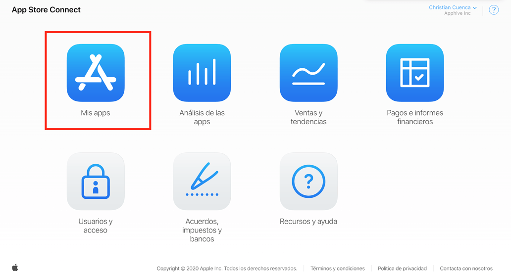
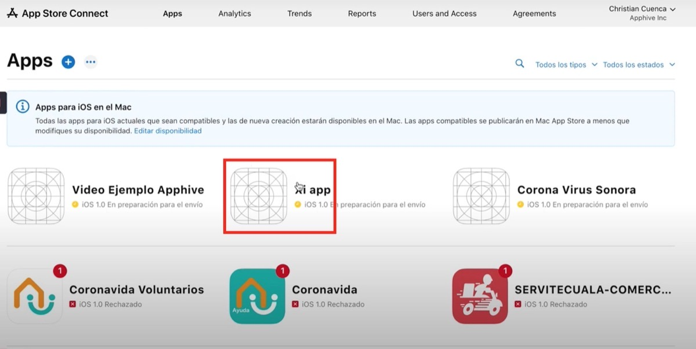
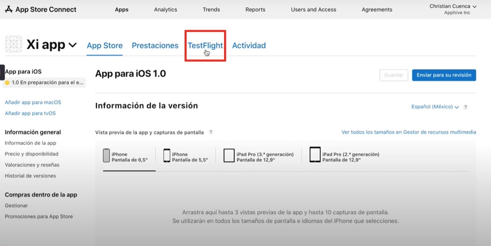
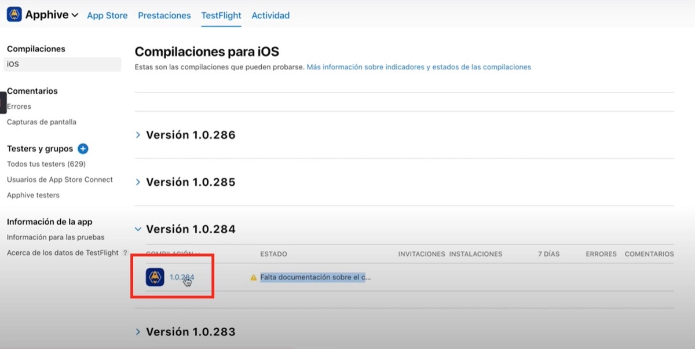
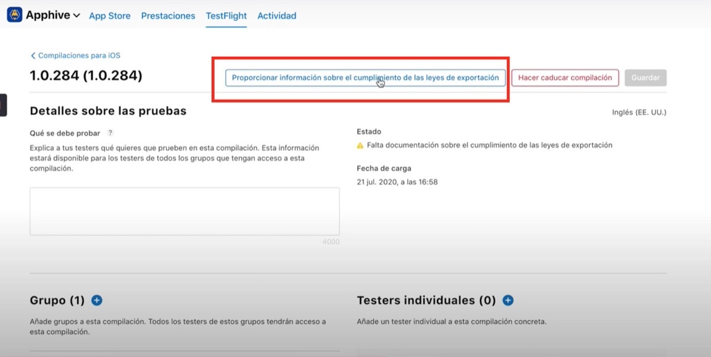
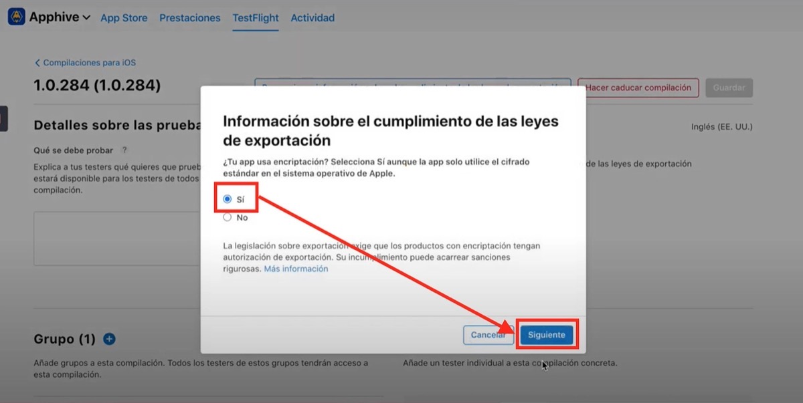
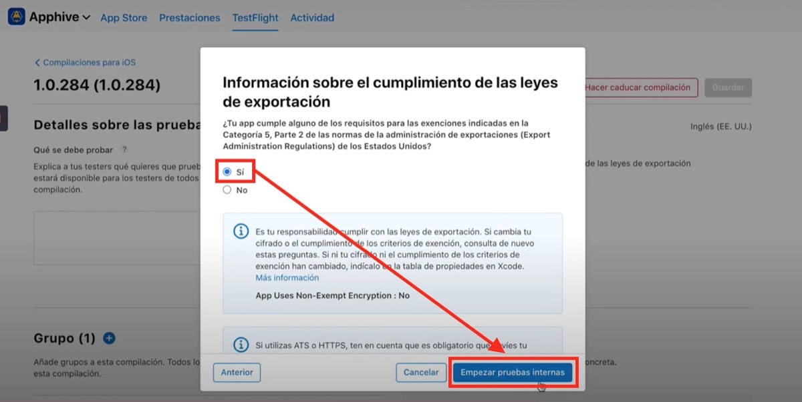
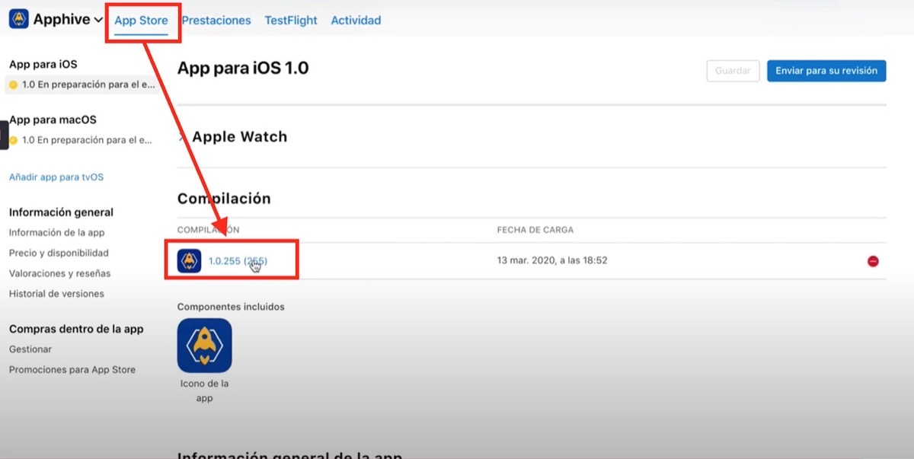
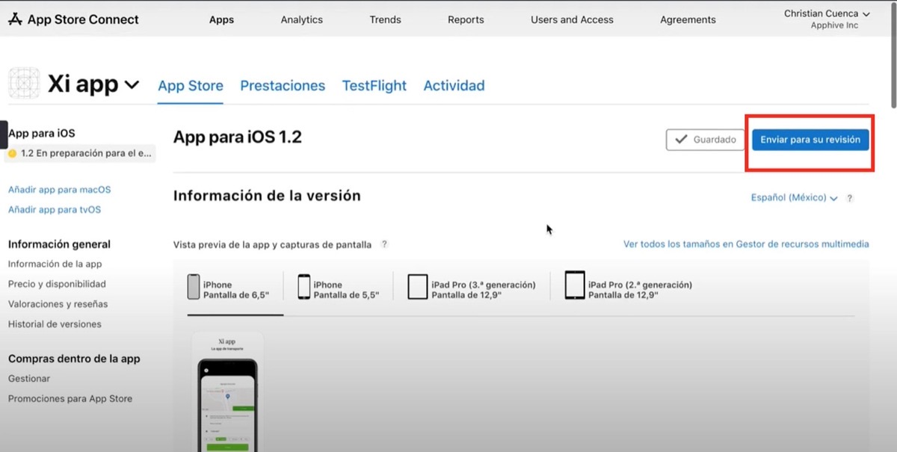

# Publicar actualización en App Store

Cada vez que generas una nueva versión de tu app para iOS, se carga en la sección **TestFlight** de App Store Connect. Para publicarla como actualización tienes que completar la información de cumplimiento de exportación, seleccionar esa compilación en la versión de App Store y enviarla a revisión.

## Pasos

1. Entra a [App Store Connect](https://appstoreconnect.apple.com/).
2. Haz clic en **Mis apps**.

    

3. Selecciona la app para entrar a su menú.

    

4. Haz clic en **TestFlight**.

    

5. Haz clic sobre la versión que quieres mandar a pruebas.

    

6. Haz clic en **Proporcionar información sobre el cumplimiento de las leyes de exportación**.

    

7. Selecciona la casilla **Sí** y haz clic en **Siguiente**.

    

8. Selecciona la casilla **Sí** y haz clic en **Empezar pruebas internas**.

    

9. Ve a la opción **App Store**; en la sección **Compilación** encontrarás la versión que seleccionaste.

    

10. Haz clic en **Guardar** y después en **Enviar para revisión**.

    

!!! warning
    En cada actualización tendrás que repetir algunos pasos del formulario de la App Store. Consulta [Cómo llenar el formulario de la App Store](../publish/publish-to-app-store-ios/como-llenar-el-formulario-de-la-app-store.md).

!!! note
    Las pantallas de App Store Connect cambian con el tiempo; si un botón tiene otro nombre, busca la opción equivalente en la misma sección.
