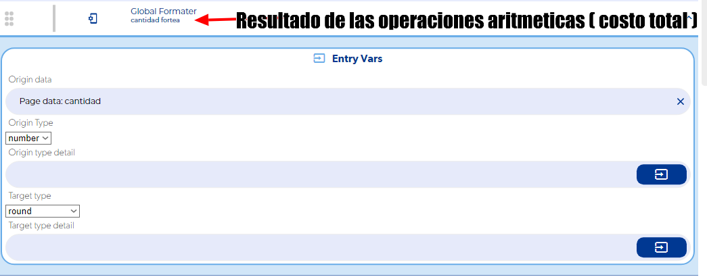
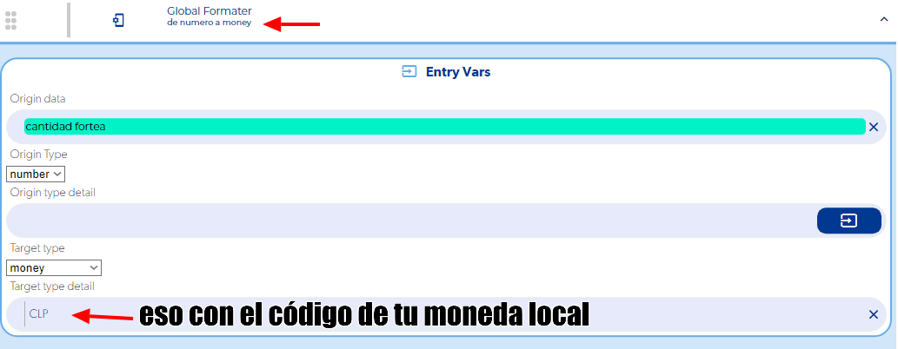
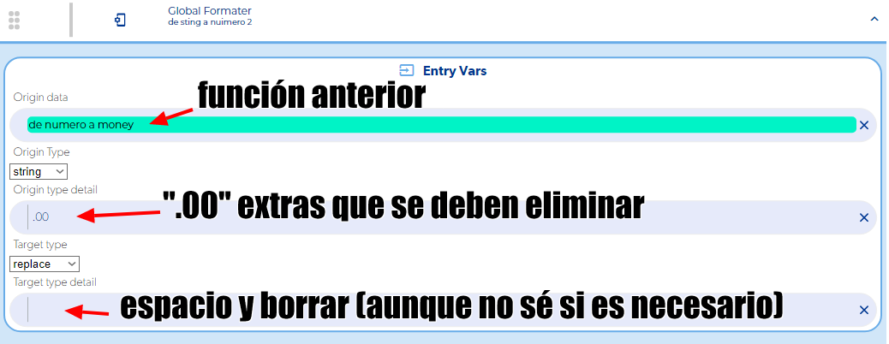

# Quitar los decimales de un precio

Para mostrar un precio sin decimales pero con separador de miles (por ejemplo `$10.000` en lugar de `$10.000.00`), encadena tres funciones **Global Formater**: primero redondeas el número, luego le das formato de moneda y al final borras el `.00` que queda.

!!! note
    Un solo `round` no basta: devuelve el número sin separador de miles (`10000`). Y si sólo usas `money`, el resultado conserva los decimales (`$10.000.00`).

## Pasos

1. **Redondea el número.** Agrega un Global Formater y en **Origin data** pon la variable que contiene el precio (el resultado numérico, antes de convertirlo a moneda). Como tipo de salida elige **round**.

    

2. **Dale formato de moneda.** Agrega otro Global Formater que reciba el resultado del paso 1 y conviértelo a **money**. El valor ya llega redondeado.

    

3. **Borra el `.00`.** Agrega un tercer Global Formater que reciba el resultado del paso 2 como **string** y usa la opción de reemplazo: en el texto a reemplazar escribe `.00` y deja vacío el valor de reemplazo (escribe un espacio y bórralo, para que el campo quede realmente vacío).

    

4. Usa el callback de éxito del último Global Formater para mostrar el resultado en tu pantalla.

## Problemas comunes

- **Siguen apareciendo decimales como `.17`:** el reemplazo de `.00` sólo funciona si el número ya está redondeado. Asegúrate de hacer el `round` del paso 1 antes de convertirlo a `money`.

Consulta la referencia completa de la función en [Global Formater](../reference/funciones/logic-e/global-formater/README.md).
