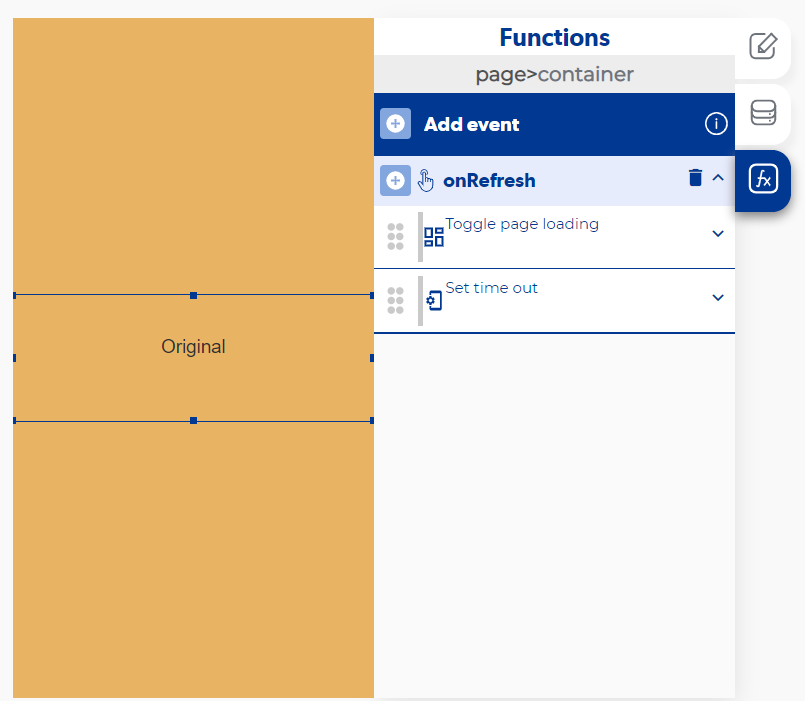

# Refresh page o reload page: cómo volver a cargar los datos de una pantalla

Apphive no tiene una función «Refresh page» o «Reload page» que vuelva a ejecutar el evento `onLoad` de una pantalla. Según lo que quieras actualizar, tienes tres caminos: leer los datos en tiempo real, usar el evento `onRefresh` de un container con una lista, o volver a disparar la lógica con un Trigger Event.

## 1. Leer los datos en tiempo real

Si lo que quieres es que la pantalla muestre los cambios hechos en la base de datos, activa el switch **real time** en la función que lee los datos (por ejemplo, **Get Database Data**). Así la información que muestras se actualiza sola cada vez que cambia en la base de datos, sin salir de la pantalla.

## 2. Deslizar hacia abajo para actualizar una lista (onRefresh)

El evento **onRefresh** del container funciona junto con la función **Add collection to UI**: sólo se activa cuando hay una lista de por medio. Se dispara cuando el usuario está al inicio de la lista y aun así sigue deslizando hacia abajo, como cuando actualizas las publicaciones en una red social.

Consulta el evento en la referencia del [Container](../reference/controles/container/README.md) y de [Add collection to UI](../reference/funciones/controls/add-collection-to-ui/README.md).

En el video de la app de inmobiliaria se hace un ejercicio con este evento (alrededor del minuto 49:43): [https://www.youtube.com/watch?v=D2pAygxznkY&t=3161s](https://www.youtube.com/watch?v=D2pAygxznkY&t=3161s)

## 3. Volver a ejecutar una lógica con Trigger Event

Si la lógica que quieres repetir puede ir en un evento propio, dispárala de nuevo con la función [Trigger Event](../reference/funciones/controls/trigger-event/README.md) en lugar de duplicarla en un botón.

!!! note
    Si la lógica está directamente en el `onLoad` y no dentro de una lectura con tiempo real activado, la única forma de que se vuelva a ejecutar es salir de la pantalla y volver a entrar.
