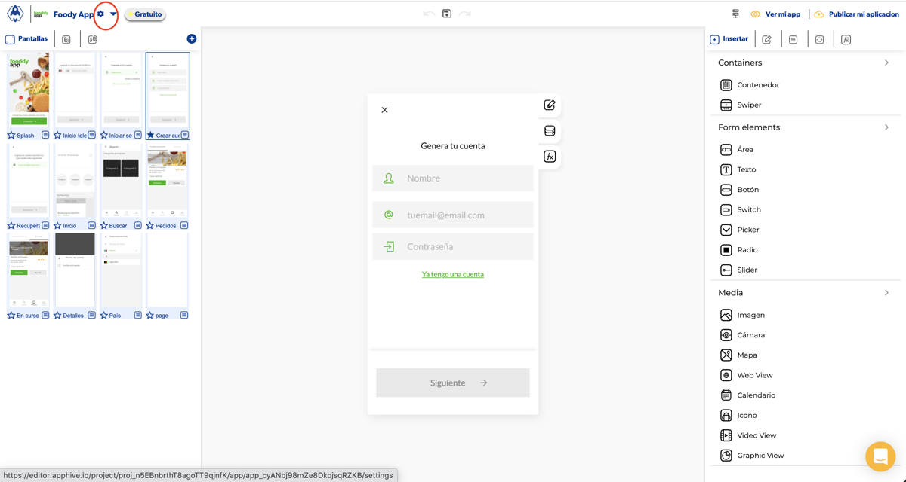
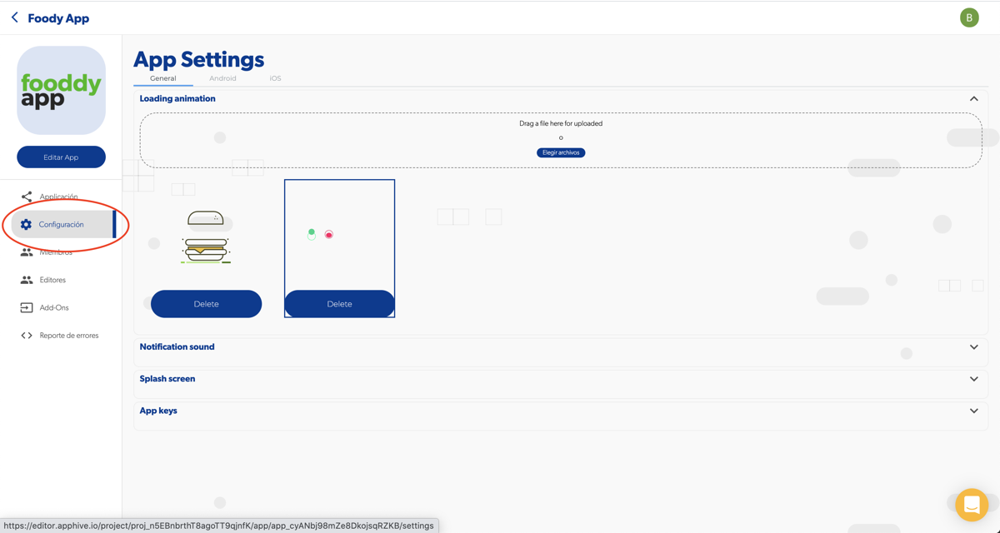

# Splash screen de tu aplicación

El splash screen es la primera pantalla de carga de tu aplicación. Debes sustituirlo **antes** de compilar tu app para cargarla a las tiendas: si lo cambias después de compilar, seguirás viendo el anterior hasta que vuelvas a compilar.

## Cómo cambiarlo

1. Abre el dashboard de la aplicación desde el engrane dentro de tu app.

    

2. Ve al menú **Configuración > Splash screen** y carga tu imagen.

    

## Formato y tamaño

| Requisito | Valor |
| --- | --- |
| Formato | Solo **PNG** (otro formato, como GIF, da error en esa pantalla) |
| Tamaño recomendado | 1080 x 2160 px (vertical) |

El sistema ajusta automáticamente la imagen a la pantalla. Lo que más importa es la **relación de aspecto**: una imagen con proporción distinta a la de la pantalla se amplía para cubrirla y se ve pixelada.

## Problemas comunes

- **Veo el splash de Apphive en lugar del mío:** el splash solo es visible en la app compilada o publicada. En el previsualizador verás el de Apphive. Si cambiaste el splash después de compilar, compila de nuevo.
- **Mi splash se ve pixelado:** revisa que la imagen sea vertical y con la proporción recomendada.
- **La app se queda en el splash:** consulta [Problema en el splash screen](problema-en-el-splash-screen.md).

!!! note
    Si quieres una animación al abrir la app, puedes usar un loader animado con Lottie: [Loading personalizado](diseno-de-aplicacion-loading-personalizado.md).
