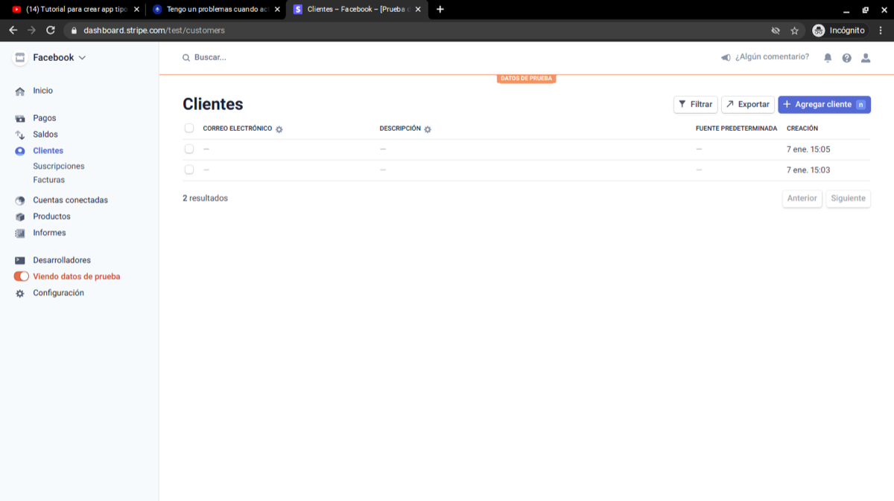

# Stripe: error «No such customer: 'undefined'»

El error `No such customer: 'undefined'` significa que **Stripe no recibe un id de cliente válido desde tu app**: lo que le envías está vacío (indefinido). Casi siempre ocurre porque pruebas la app **sin una sesión iniciada**, así que los datos del usuario (correo, nombre, id de Stripe) no tienen valor.

```json
{
  "error": {
    "code": "resource_missing",
    "message": "No such customer: 'undefined'",
    "param": "customer",
    "type": "invalid_request_error"
  }
}
```

## Cómo identificarlo

- El campo `param` del error dice `customer`: el problema está en el id del cliente. Si fuera la fecha de la tarjeta, diría `exp_month` o `exp_year`.
- En tu panel de Stripe aparecen clientes creados **con todos los campos en blanco**. Eso indica que la función que crea el cliente recibió el correo y el nombre vacíos.



## Cómo solucionarlo

1. **Inicia sesión en tu app antes de probar** (con correo, Google o Facebook). Si no hay sesión, los datos del usuario que envías a Stripe llegan vacíos.
2. Si usas inicio de sesión con Facebook, verifica que funcione: un fallo ahí también deja vacíos los datos del usuario.
3. Revisa la función que provoca el error y confirma que el **id de Stripe** del usuario (el que guardaste, por ejemplo con *Set user custom data*) llegue con valor a la función.
4. Para comprobar que la función de crear cliente sí envía datos, prueba escribiendo valores fijos en sus campos. Si el cliente aparece con esos datos en tu panel de Stripe, el problema está en las variables que le pasas.

!!! note
    Un registro con respuesta `200 OK` en el panel de Stripe significa que esa llamada salió bien. Busca el error en la llamada que falla dentro de tus funciones, no en las que ya tuvieron éxito.

Consulta también las funciones de [Stripe](../reference/funciones/stripe/README.md).
