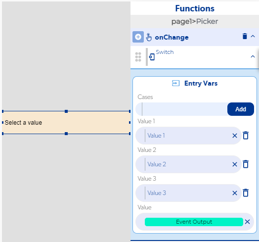
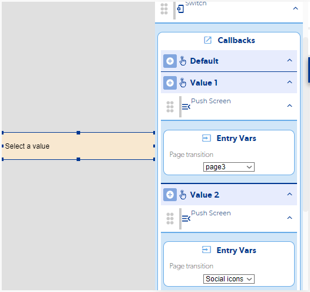
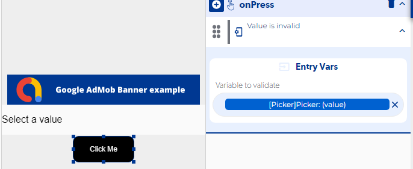

# Todo sobre el Picker

El **Picker** es una lista desplegable de opciones. Para hacer algo distinto según la opción elegida usa la función **Switch**; para comprobar que el usuario sí eligió algo usa **Value is invalid** con el valor del Picker.

Video con el funcionamiento completo del Picker: [ver video](https://www.loom.com/share/fe2e5f00b58d4ebc8b131a09c1d193ab).

## Ir a otra pantalla según la opción elegida

Tienes dos formas, según cuándo quieres que ocurra la acción.

### Al momento de elegir la opción

1. En el evento del Picker que se dispara al cambiar el valor, agrega la función **Switch** y usa como valor el del Picker.
   
2. En los callbacks del Switch coloca la acción para cada valor (por ejemplo, un **Push screen** a la pantalla que corresponde).
   

### Al presionar un botón

1. Cuando cambie el Picker, guarda el valor seleccionado en una **variable de página**.
2. En el botón, agrega el mismo **Switch**, pero con la variable de página como valor.

## Validar que se eligió una opción

En el botón de acción agrega la función **Value is invalid** y, en su variable de entrada, pon el control del Picker con la propiedad **value**. Si el valor no es válido, muestra un aviso y detén el proceso.

Consulta también la referencia del control [Picker](../reference/controles/picker/README.md) y de [Value is invalid](../reference/funciones/logic-e/value-is-invalid/README.md).
