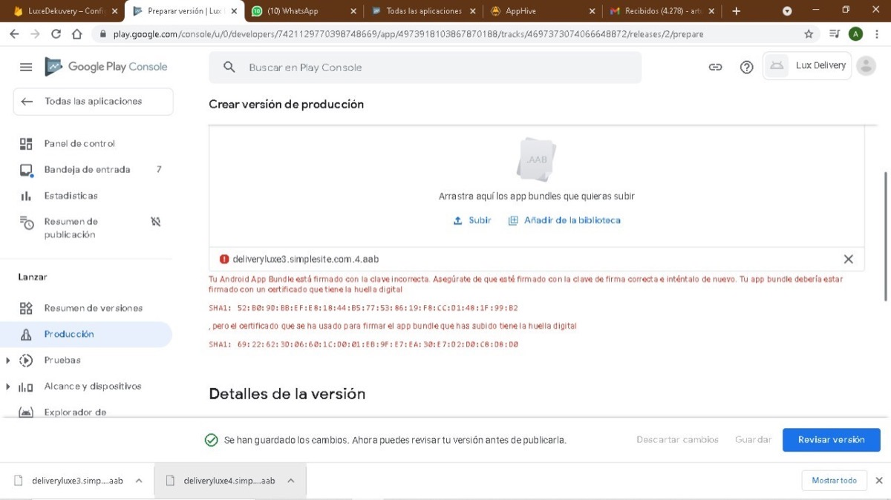

# Tu Android App Bundle está firmado con la clave incorrecta

Google Play muestra esta alerta al subir una nueva versión cuando la app que estás cargando no es exactamente la misma que subiste la primera vez. Revisa que estés compilando la misma app de Apphive y con el mismo **Compilation ID**.

## Por qué pasa

Cuando generas una compilación, Apphive te pide un identificador de la app llamado **Compilation ID** (el identificador del paquete), por ejemplo `com.miappnueva.usuarios`. La primera vez que subes el AAB a Google Play, ese identificador queda registrado, y desde entonces sólo puedes subir actualizaciones que tengan exactamente el mismo Compilation ID.

## Qué revisar

1. Que estás compilando la misma app de Apphive que publicaste la primera vez (no un duplicado ni otra app del proyecto).
2. Que el **Compilation ID** sea idéntico al de la versión publicada en Google Play.
3. Vuelve a compilar y sube el nuevo AAB.
