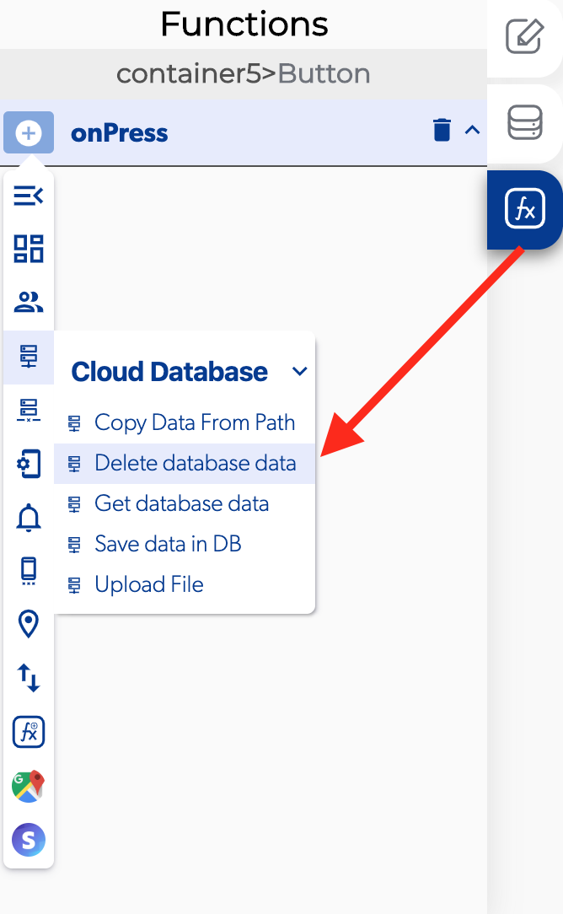
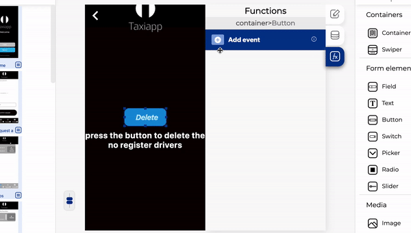

# Eliminar datos de la base de datos \(Delete Database Data\)

La eliminación de datos de la base de datos es una función en las funciones de la base de datos en la nube que le permite al usuario eliminar registros [\(delete registers\)](https://docs.apphive.io/reference/base-de-datos/database/delete-data)en la base de datos en la nube presionando un elemento o cargando una pantalla, esta es la función más útil para las aplicaciones de administrador porque el administrador puede eliminar un usuario o todos usuarios y su información.

### 📥 Entry vars \(variables de entrada\) 

* **Debería actualizar la caché de la base de datos:** puede activar esta función para actualizar los datos del caché de la base de datos.
* Actualizaciones para realizar en la base de datos: puede abrir la ruta de la base de datos para ver y [modificar la base de datos](https://docs.apphive.io/reference/base-de-datos/database-editor/edit-data)
* Ruta de la base de datos: puede abrir la [ruta de la base de datos](https://docs.apphive.io/reference/base-de-datos/database-editor/open-database-editor) para ver y modificar la base de datos

### \*\*\*\*↗ **Callbacks**

* **Error al eliminar datos:** puede configurar funciones después de que la base de datos no se pueda eliminar 
* **Datos eliminados:** puede configurar funciones después de que se pueda eliminar la base de datos.

1. Seleccione el botón
2. Agregue un en prensa.
3. Activar la función de borrar datos de la base de datos
4. Abra la[ ruta de la base de datos](https://docs.apphive.io/reference/base-de-datos/database-editor/open-database-editor) y seleccione qué [colección](https://docs.apphive.io/reference/base-de-datos) se eliminará.
5. Agregue un [nuevo registro](https://docs.apphive.io/reference/base-de-datos/database-editor/add-data) en los datos de la base de datos en la nube.
6. Active la función de debería actualizar la caché de la base de datos.
7. Agregue una alerta de envío \([send alert](../notifications/send-alert.md)\) sobre el error al eliminar datos.
8. Active una [alerta de envío](https://docs.apphive.io/reference/funciones/notifications/send-alert) en la sección de datos eliminados.

