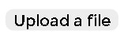

# Background image

## Opciones de Background image

Se muestra un panel en donde podemos cargar la imagen de nuestra preferencia o elegir algunas de las cargadas previamente

1.  Upload a file
2.  My images
3.  Gallery
4.   From URL

### Upload a file

Desde este control se cargan las imágenes que se encuentran en nuestro dispositivo, al hacer la carga se guardan en la base de datos de firebase retornando una dirección de destino desde donde podemos consultar la imagen en cualquier momento.

Al dar click en Choose a file abre el explorado de archivos en donde podemos hacer la elección de la imagen de nuestro agrado 

Al seleccionar la imagen y dar click en abrir nos anda al apartado **My image** en donde muestra la información general de la imagen

1. Nombre de la imagen
2. Fecha de cargado
3. Dimensiones de la imagen
4. URL de la imagen desde la firebase
5. Botón seleccionar imagen
6. Botón eliminar imagen

### My images

Muestra toda la colección de imágenes que hemos cargado hasta el momento de la consulta. Se puede realizar la búsqueda por nombre de la imagen por si el numero de imágenes es demasiado grande, de esta manera puedes reutilizar las imágenes que hayas manejado con anterioridad

### Gallery

Es una sección de imagenes precargadas desde la pagina [Unsplash](https://unsplash.com/). Las puedes utilizar libremente para tus aplicaciones ya que son libres de derechos de autor.

### From URL

En esta sección puedes pegar el URL de la imagen si lo tienes desde un repositorio propio o alguna imagen de internet \(se sugiere que la imagen sea propia para evitar algún tipo de problema por el uso de la misma\)

