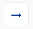
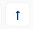
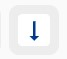

# Direction

## Opciones de Direction

Estos son los 4 tipos de direcciones que se utilizan

1.  Alineado a la izquierda
2.  Alineado a la derecha
3.  Alineado hacia arriba
4.  Alineado hacia abajo

### Alineado a la izquierda

Esta opción alinea el contenido \(container, buton, text, text field, etc.\) dentro de un componente hacia la izquierda, esta alineación es del primer al ultimo elemento integrado

|   |   |
| :---: | :---: |

### Alineado a la derecha

Esta opción alinea el contenido \(container, buton, text, text field, etc.\) dentro de un componente hacia la derecha, esta alineación es del primer al ultimo elemento integrado

|   |   |
| :---: | :---: |

### Alineado hacia arriba

Esta opción alinea el contenido \(container, buton, text, text field, etc.\) dentro de un componente hacia arriba, esta alineación es del primer al ultimo elemento integrado

|   |   |
| :---: | :---: |

### Alineado hacia abajo

Esta opción alinea el contenido \(container, buton, text, text field, etc.\) dentro de un componente hacia abajo, esta alineación es del primer al ultimo elemento integrado

|   |   |
| :---: | :---: |

### 

