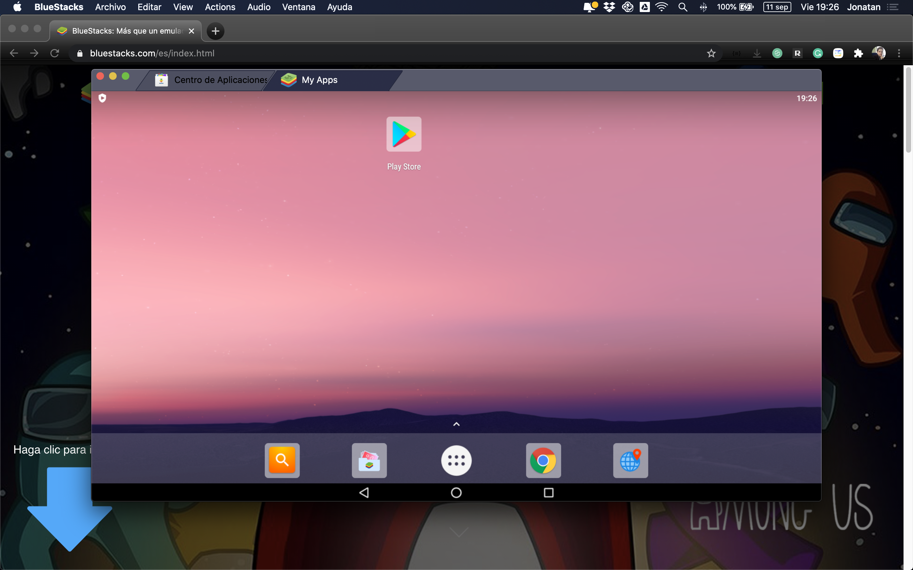

# IOS App Preview

Por el momento el previsualizaador se enncuentra sólo disponible para dispositivos Android, ya que conforme a las políticas de Apple no es posible tener un previsualizador con código ejecutable en IOS.

\([https://developer.apple.com/app-store/review/guidelines/\#2.5.2 2](https://developer.apple.com/app-store/review/guidelines/#2.5.2)\)

> **2.5.2** Apps should be self-contained in their bundles, and may not read or write data outside the designated container area, nor may they download, install, or execute code which introduces or changes features or functionality of the app, including other apps. Educational apps designed to teach, develop, or allow students to test executable code may, in limited circumstances, download code provided that such code is not used for other purposes. Such apps must make the source code provided by the Application completely viewable and editable by the user.

Sin embargo una buena alternativa es tener el previsualizador en un emulador, el cual está disponible para PC y MAC.

Para instalarlo estos son los pasos:  
  
1.- Entra a [https://www.bluestacks.com/](https://www.bluestacks.com/) y presiona en Descarga BlueStacks

Una vez descargado es necesario abrir el archivo

