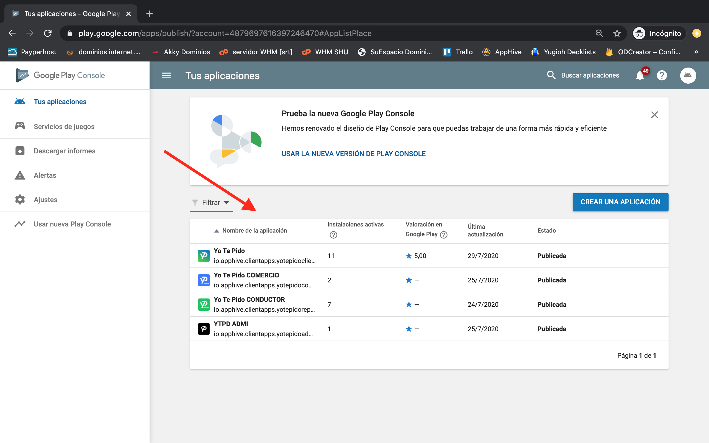

# Actualizar nueva versión en Play Store

1.- Entra a [https://play.google.com/apps/publish/](https://play.google.com/apps/publish/?authuser=1&hl=es)  
  
2.- Selecciona de la lista la app que deseas actualizar 

3.-  Selecciona la opción administrar lanzamientos.

4.- Selecciona la opción versión de la app.

5.- Da clic en administrar.

6.- Da clic en el botón crear versión.

7.- Da clic en explorar archivos y selecciona el archivo .apk o .aab de tu dispositivo para generar la nueva versión.

8.-  Puedes llenar la sección de novedades de esta actualización con todos los cambios que tuvo tu app a diferencia de la versión actual, por ultimo da clic en revisar.

