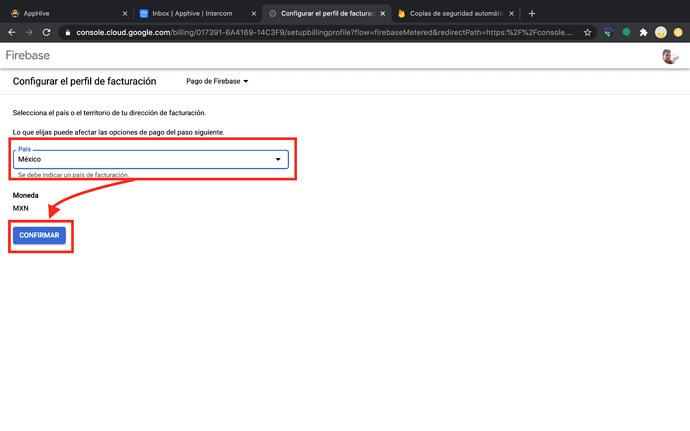

# 1. Ajustes previos a la compilación


## **Cambiar Splas Screen**


1.-  Entra a tu proyecto en [https://editor.apphive.io/](https://editor.apphive.io/) 

2.- Selecciona una app

3.- Da clic en configuraciones y clic en configuraciones de la app que quieres modificar.

4.- Da clic en configuración, en el menú de general selecciona splash screen y clic en el icono editar.

5.- En la sección subir archivo da clic en elegir archivo.

**La imagen del splash screen debe ser en formato PNG con un ancho de 640 Pixeles X 1136 Píxeles de Alto.**


## **Obtener una suscripción Premium o Unlimited**


Sigue estos pasos para adquirir tu suscripción:

6.- Entra en el editor [https://editor.apphive.io ](https://editor.apphive.io/)y da clic sobre tu proyecto

7.- Da clic en suscripciones

 8.- Selecciona el plan de tu interés, para poder compilar. **Para sistema operativo Android y publicar en Play Store necesitas un plan Premium o Unlimited**

9.- Da clic sobre el recuadro de número de tarjeta

10.- Agrega los datos de tu tarjeta y clic en el botón Pay


## Obtener cuenta de Firebase


 11.- Entra en [https://firebase.google.com/](https://firebase.google.com/) y da clic en comenzar.

12.- Da clic en crear un proyecto.

13.- Escribe el nombre de tu proyecto, clic en la casilla para aceptar las condiciones de Firebase y clic en continuar.

\***Puedes escribir el mismo nombre que le colocaste a tu proyecto en Apphive, este nombre solo servirá para que tu puedas identificar tu proyecto en Firebase.**

**MUY IMPORTANTE** Copia el nombre de tu proyecto en Firebase y pegalo en una nota o un documento de word de la siguiente manera:

NOMBRE PROYECTO FIREBASE: Uber eats plantillas

14.- Da clic en continuar

Puedes realizar los pasos de **Opcional activación de Google Analytics**\(este te permitirá tener estadísticas de comportamiento de tu base de datos y usuarios.\) o saltar al paso número 5 de Firebase

Opcional activación de Google Analytics 1: habilita Google Analytics

Opcional activación de Google Analytics 2: Selecciona o crea una cuenta

Opcional activación de Google Analytics 3: Escribe el nombre de tu proyecto y clic en guardar.

Opcional activación de Google Analytics 4: Selecciona tu país, clic en las 3 casillas de permisos y condiciones de servicio y clic en continuar.

15.- Esperar a que cree el proyecto y haga clic en continuar.

16.- Debes actualizar tu plan a Blaze para poder compilar, da clic en Actualizar y clic en Seleccionar plan.

17.- Da clic en Continuar.

18.- Verifica que tus datos sean correctos o da clic en el icono de editar y modifícalos

19.- Agrega el número de tarjeta de crédito o débito, la fecha de vencimiento, la clave de seguridad, el nombre del titular, verifica que la dirección antes agregada sea la misma de la tarjeta y da clic en Confirmar compra.

20.- Selecciona Functions y clic en comenzar

11.- Da clic en continuar

12.- Da clic en finalizar

