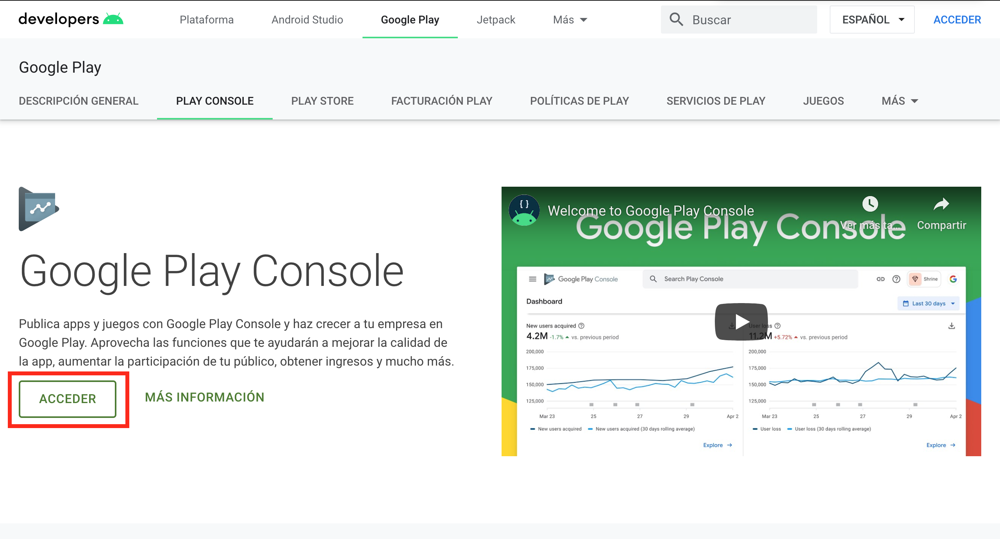
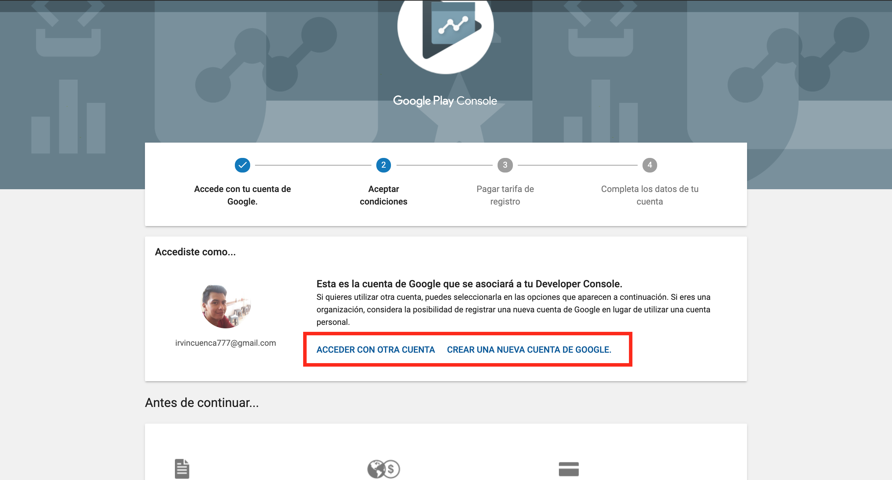
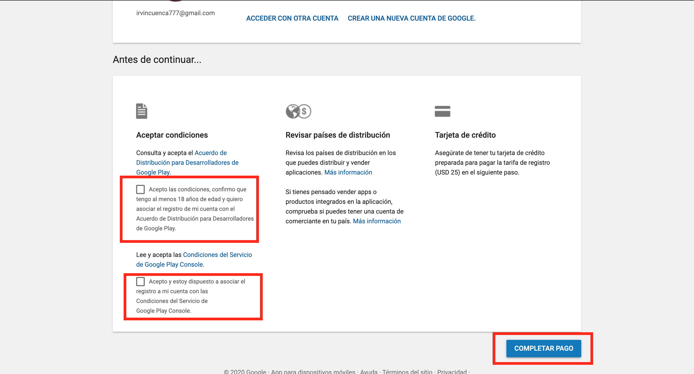
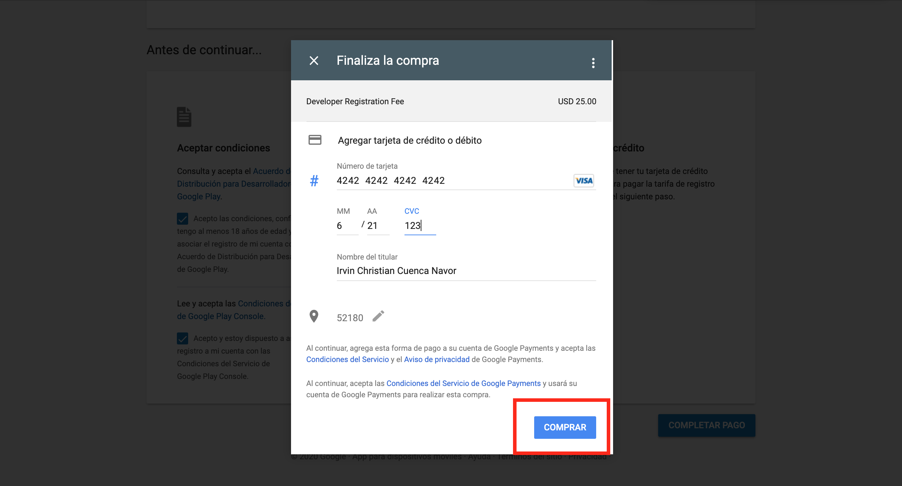

# Crear Cuenta de Desarrollador en Play Store

Google Play Store, $25 USD, pago único de por vida, puedes subir todas las apps que quieras desde Apphive o cualquier plataforma

  
1.- Crea tu cuenta de Google Developer desde [aqui](https://developer.android.com/distribute/console).  

  
2.- Verifica que hayas iniciado sesión con tu cuenta personal de gmail.

  
  
3.- Acepta los términos y condiciones dando clic en la casilla y da clic en completar pago

  
4.- Agrega tus datos de tarjeta de crédito o debito para completar el pago de tu cuenta de desarrollador en Play Store.

