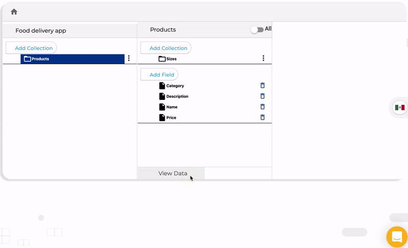

# Links to Data

Links to data allows you to create a link to a collection with all permissions to edit and delete the records without login. This is very useful if you want to give someone access to edit the app data without giving them access to edit the app. or the database structure.

To create a link to a collection you need to open the collection data and click on the "Generate Link" button:

