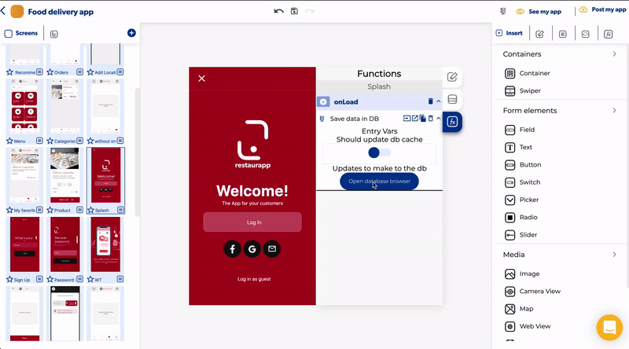

# Open database editor

### Open database editor

You can open the database editor from different places in the editor:

* Open the database editor from the project dashboard

* Open the database from the App editor

* Open the database from a function

