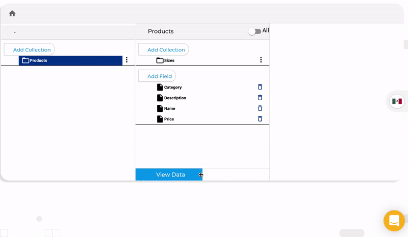

# View data nested collections

You can add collections inside collections to organize your data, for example if you need to add different product sizes you can create a collection called "sizes" inside your "products" collection.

To open a nested collection you just need to click on the column with the collection name:

