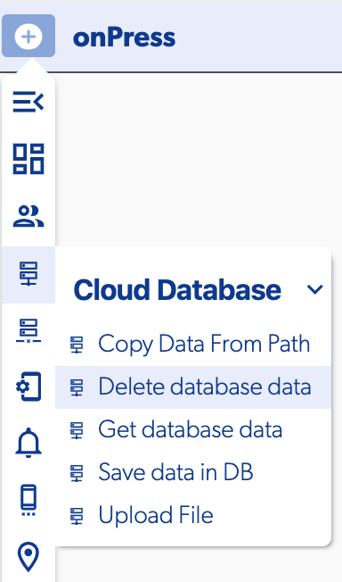
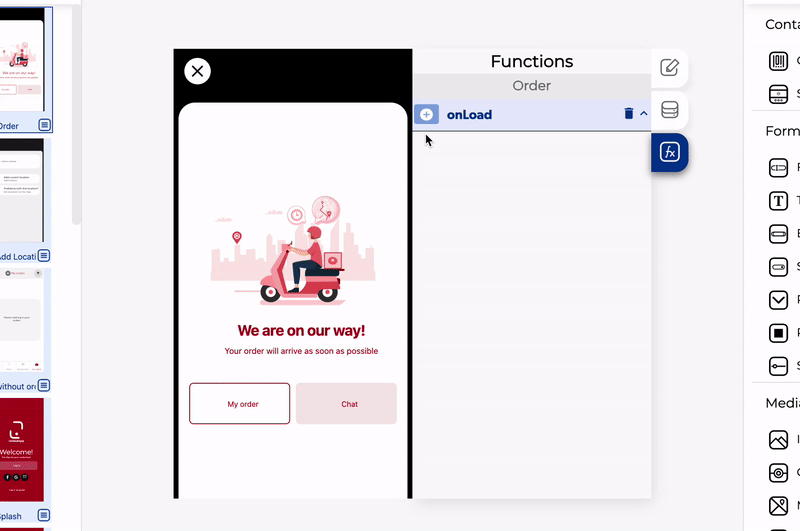

# Delete Database Data

The Delete database data is a function on the [Cloud Database](./) group, this function allows you to delete specific records on the database or the hole collection

### 📥 Entry vars

* **Database path to delete.** Te permite abrir el [editor de la base datos](../database-editor/) para seleccionar la colección o el dato a eliminar
* **Should update db cache.** Si en alguna consulta de la base de datos de cloud se agregó caché, a activar está opción tambien actualizará ese caché


If you don't set any specific data index all the data in the collection will be deleted


### ↗ Callbacks

* **Error deleting data.** This callback is called when for some reason it is not possible to delete the data from the database
  * La variable de salida será la razon por la cual no se pudo eliminar los datos
* **Data deleted.** This is called once the database record \(s\) have been deleted successfully.

### 👉 Examples.

#### Deleting a full collection

In this example we deleted all the products in the database when the page loads

#### Deleting a single record

To delete a single record you must have the id of the record you want to delete, in this example we have a product detail and you have the product id as a "Page context data"

