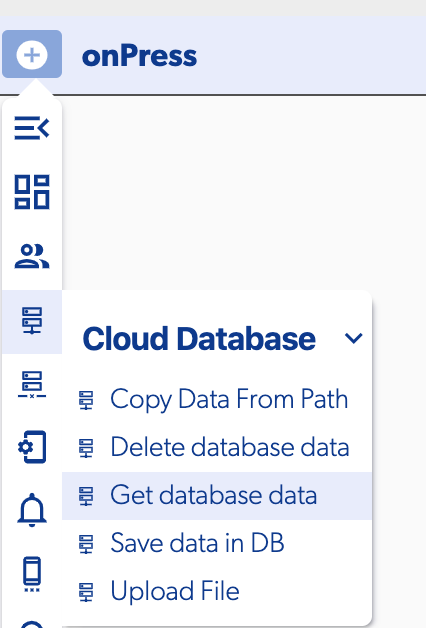
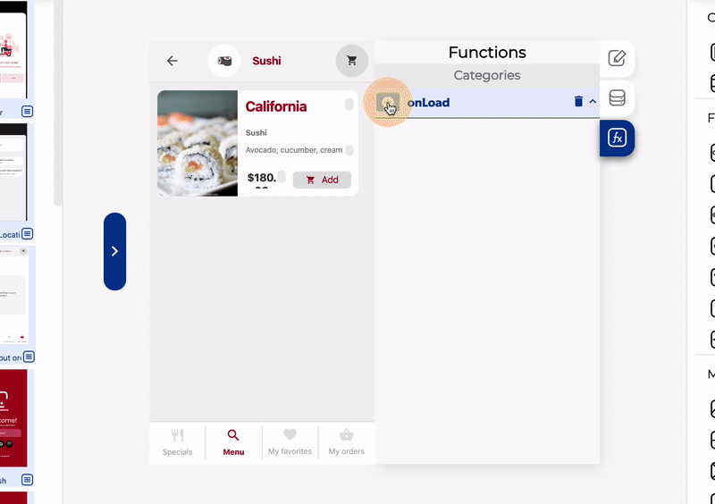
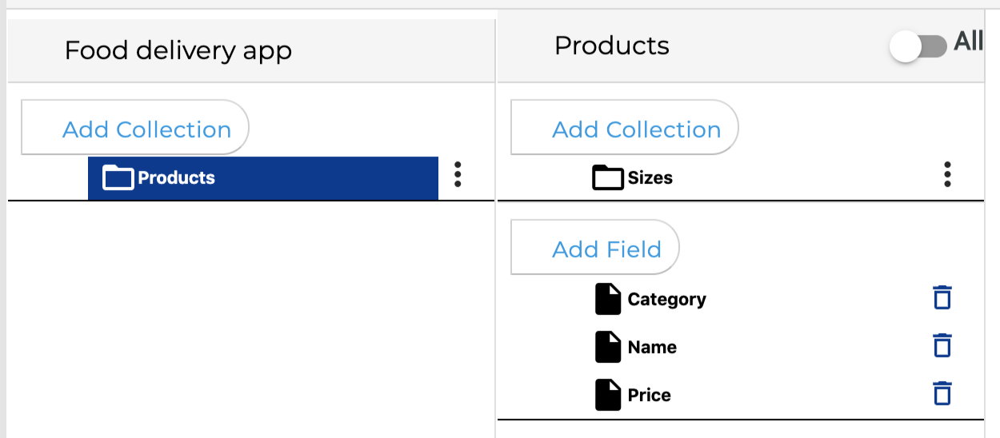
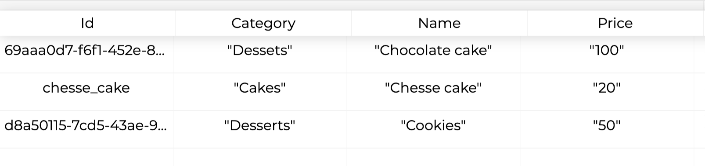
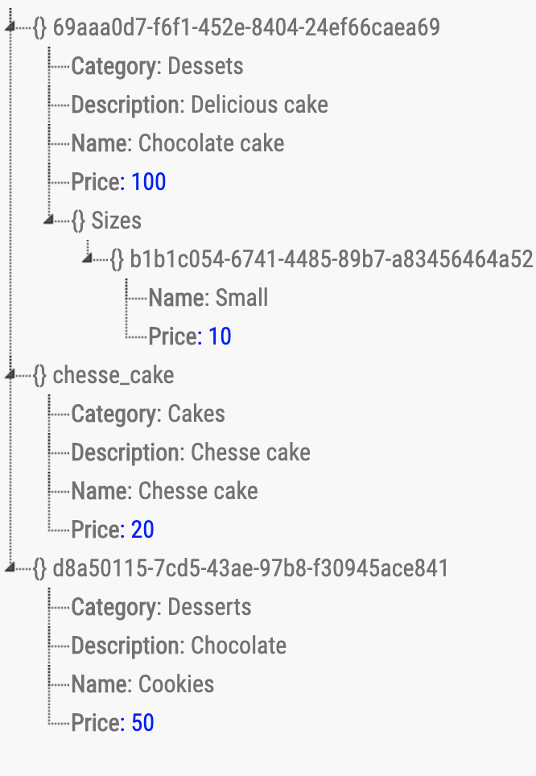
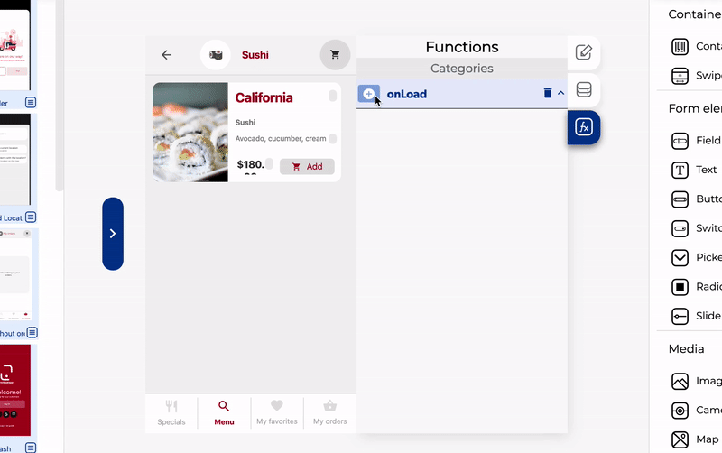
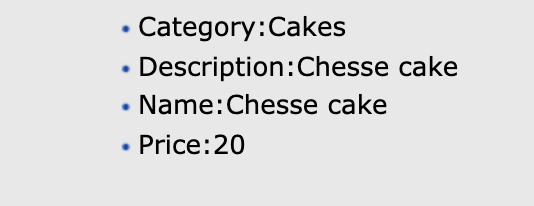

# Read Database Data

Get database data is a function on the [Cloud Database](./) group, this function allows you to get data from the cloud database

###  ​​ 📥 Entry vars 

* **Database path to get data from.** This is the path to specify the collection, sub-collection or data you want to get from the DB
* **Order by.** Here you can enter a text to specify the property witch will be used to order the data and the same property will be used to filter the data if you add a Filter
* **Filter.** Specify a value to be compared with the property specified in the **Order by** entry var
* **Limit to First.** Set the number of elements to be returned starting from the beginning ****
* **Limit to Last.** Set the number of elements to be returned starting from the end ****
* **Time to refresh.** It's a number of seconds to save the data get from the query in cache, if another query was made before end this time the data will be obtained from the cache instead of the server, it is very useful to improve the app performance.
* **Is real time**. If it is tun on each time a data change on the selected path the callbacks will be called.


If you don't specify an Index to get data from you will get all the collection data



When you get data from the database you also get all the child collections


### ​​ ↗ Callbacks‌ 

* **Permission denied.** This callback is called when the database permissions doesn't allow to read the specified path
* **Empty data.** This is called if the specified path and filters doesn't return any data
* **Data obtained.** This is called once the server returns at least one result with the specified parameters
* End.

### 📤 Out vars

* **Data**. You can access to this Out var from the **Data obtained** Callback, after the successful query you can get the data in two posible structures:
  * **If you set an index.** You will get all the fields and the collection for the specified index
  * **If you don't set an index.** You will get an object with all the index and all the fields and collections for each index

### ​​ 👉 Examples. 

#### Get all the products from the database 

In this example we get all the products from the collection "products"

From the previous example, the database structure is the following:

And we have this data on the database:

Then the result structure after getting the database data will be:

#### Get a single product from the database

With the same data of the previous example, if we get just a simple index, for example "**chesse\_cake**" you need to add the function as show on the image:

In this case we set an Index, then the result data will be:

