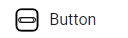

# Button

Un botón es un control caracterizado por ser un elemento clickeable dentro de nuestra app, permitiendo a los usuarios interactuar ejecutando un conjunto de funciones con un objetivo específico. Generalmente, cuenta con una etiqueta que describe una acción en una palabra, como por ejemplo: "Presióname", "Guardar".

<figure><figcaption></figcaption></figure>















**style.background** : Modifica el color de fondo de nuestro boton.

**label** : Modifica la etiqueta de nuestro control.

**name** : Modifica el nombre asignado a nuestro botton.

**style.height.value** : Modifica la altura de nuestro botton.

**style.width.value :** Modifica el ancho de nuestro botton.





```json
{
        "id": "76Q7pNm9HjCJk4qPd268vB",
        "isDynamicLoadingEnabled": false,
        "label": "Click Me",
        "name": "Button",
        "style": {
            "background": {
                "type": "palette",
                "value": {
                    "base": "secondary",
                    "shade": "900"
                }
            },
            "borderBottomLeftRadius": 10,
            "borderBottomRightRadius": 10,
            "borderTopLeftRadius": 10,
            "borderTopRightRadius": 10,
            "color": {
                "type": "palette",
                "value": {
                    "base": "secondary",
                    "shade": "100"
                }
            },
            "fontSize": {
                "type": "global"
            },
            "height": {
                "unit": "px",
                "value": 42
            },
            "marginBottom": 2,
            "marginLeft": 2,
            "marginRight": 2,
            "marginTop": 2,
            "overflow": "hidden",
            "paddingBottom": 0,
            "paddingLeft": 0,
            "paddingRight": 0,
            "paddingTop": 0,
            "width": {
                "unit": "px",
                "value": 100
            }
        },
        "tag": "button"
    }
```



