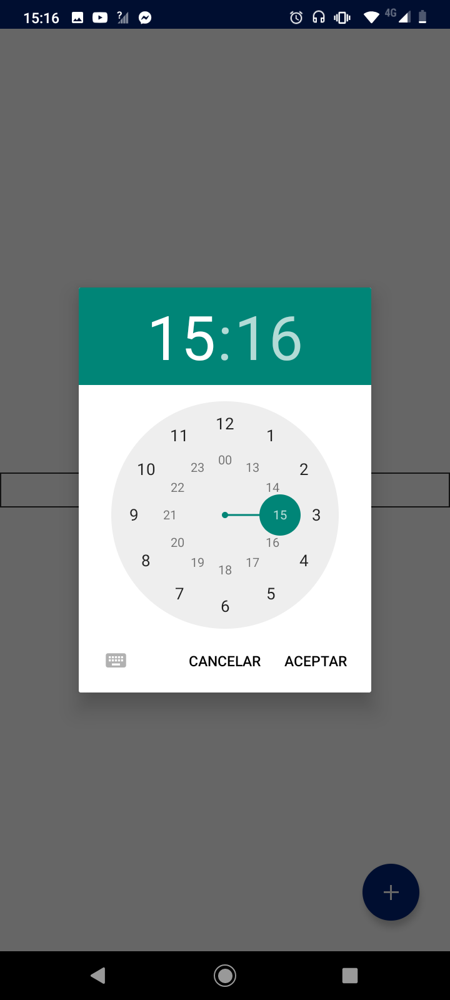

# Data

## Text field basic data

Al habilitar esta función se abre una nueva tap de Data llamada **Data Picker Option**


Cuando se activa esta función el control **Field** no tendrá eventos para seleccionar


### **Data Picker Option**

#### **Control name**

Permite cambiar el nombre del control [ver más](https://docs.apphive.io/global-functions/data/control-name)

#### Disable date picker

Funciona para activar o desactivar la tap **Data Picker Option**

#### **Mode date**

Esta función se maneja en conjunto con la función **Date format** ya que al elegir un modo de fecha, la tipografía de **Date format** cambia con respecto al modo elegido.

Se pueden elegir 3 tipos de modos de fecha

1. Date \(Fecha\)
2. Date Time \(Fecha y Hora\)
3. Time \(Hora\)

#### Enable dynamic loading

Funciona para dar apariencia de cargado al elemento [ver más](https://docs.apphive.io/global-functions/data/enable-dynamic-loading)

#### Date format

Muestra el tipo de formato de fecha, dependiendo este mismo del elegido por el **Mode date** 

| Mode Date | Date Format |
| :---: | :---: |
| Date |   |
| Date Time |   |
| Time |   |

Eventualmente este tipo de formato puede ser editado por el que el usuario prefiera o necesite

Al presionar el field \(ya renderizado\) mostrará unas ventanas emergentes para mostrar y editar la fecha o la hora, dependiendo del **Mode Date**

| **Mode Date** | Ventaja emergente |
| :---: | :---: |
| Date / Date Time |   |
| Time |   |

### Control name

Sirve para cambiar el nombre al control [ver más](https://docs.apphive.io/global-functions/data/control-name)

### Control placeholder

 El atributo placeholder funciona para representar una indicación que ayude al usuario a completar estos campos

### Keyboard type

 Permite seleccionar el tipo de teclado que se mostrará en el Panel de control. 

### Keyboard return key type

Cambia la tipografía de la tecla intro

### Enable blur on submit

### Control is hidden

Oculta los controles cuando se activa [ver más](https://docs.apphive.io/global-functions/data/control-is-hidden)

### Disabled

Cuando se activa deshabilita la capacidad de editar el field

## Text field advanced data

