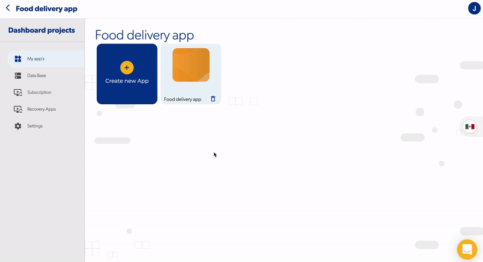
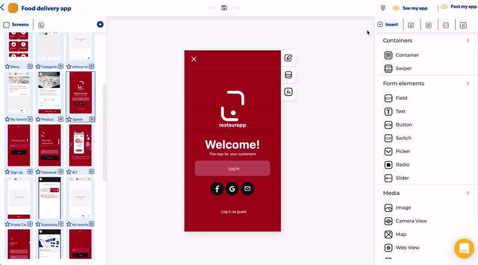
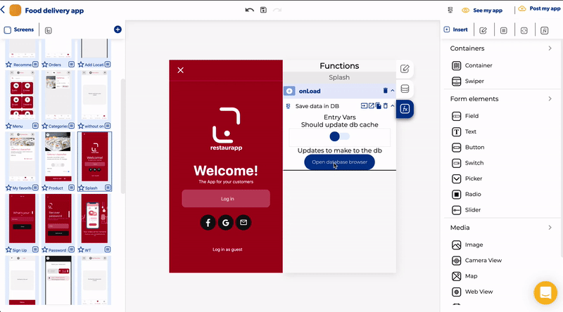

# Database 𝌏

Many applications require having a database to perform a series of essential tasks, you have a database embedded in your project since you created it.

The database is shared among all applications within a project, making it one of the best ways to connect the functionality of your applications.

### Open database editor

You can open the database editor from different places in the editor:

* Open the database editor from the project dashboard

* Open the database from the App editor

* Open the database from a function

