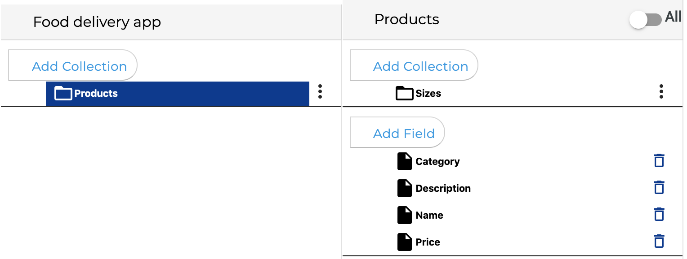

# Database 𝌏

Many applications require having a database to perform a series of essential tasks, you have a database embedded in your project since you created it.

The database is shared among all applications within a project, making it one of the best ways to connect the functionality of your applications.

You can use two kinds of a database:

* **Local database.** Provide local data storage, the data you store can be read only with the same device, read and write speed is extremely fast 
* **Cloud database.** Your data is stored in the cloud and could be shared between devices. You can show the stored data from your project dashboard, the reading and writing speed depends on your Internet connection.





## Data model

The unit of storage is the collection. A collection is a record that can contains other collections and fields, which map to values. Each collection is identified by a name.

A collection representing a list of products might look like this:


You can add collections inside other collections to organize your data


