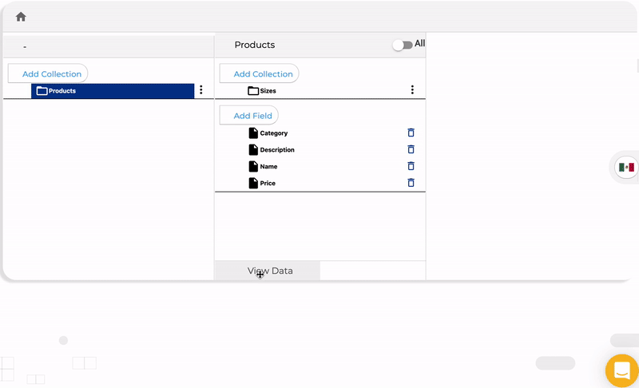
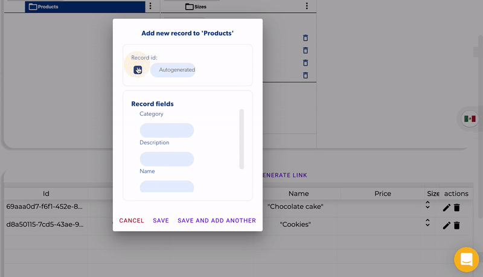

# Add data

You can add data manually to any collection by clicking on the Add button on the data View table:

### Custom ID

By default the data you add to the database is stored with a unique id generated automatically, but you can customize the record id by adding it when you add or edit new record

