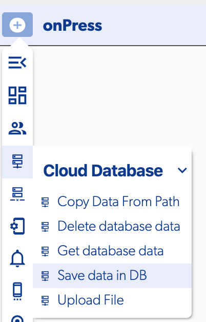
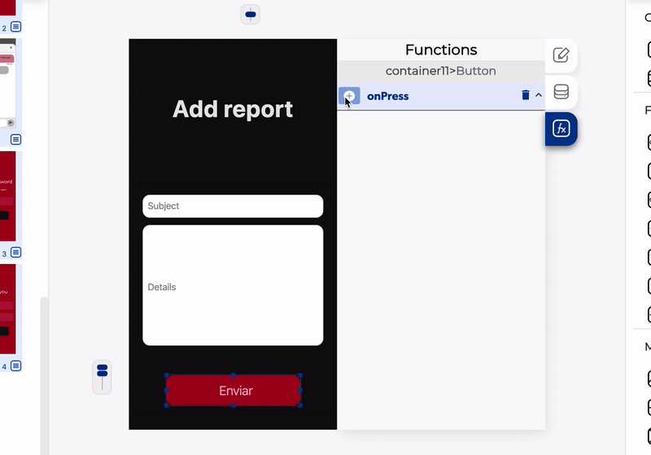

# Save Database Data

The Save data in DB data is a function on the [Cloud Database](./) group, this function allows you to save data on the database from any source

### 📥 Entry vars

* **Database path to save**


If you don't specify an Index when you set the path to save a unique id is automatically generated


### ↗ Callbacks

* **Error saving data.** This callback is called when for some reason it is not possible to save the data on the database
* **Data saved.** This is called once the database record \(s\) have been saved successfully.

### 👉 Examples.

#### Save a form to the database

In this example we have a form with two Fields, one for the subject and other for the details, once we click on the button we want to save these fields values into the database.

#### Save data to an specific Index

Save data to a specific Index can be useful is the data is associated with a specific id or the user id. In this example we save some user data into the database using the user id as Index.


To access to any user data like user id you need to be sure the user is already login in


