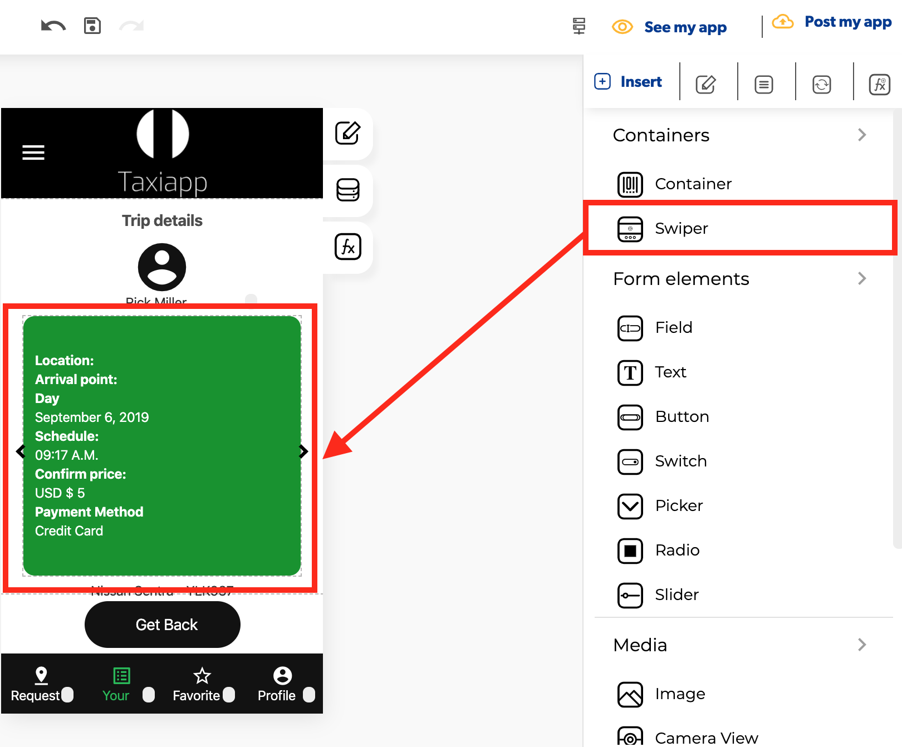

# Swiper

### 🎨 Styles 

* **Appearance**
  * **Background color:** select the background color using the [color picker](../../estilos/color-picker.md).
* **Dimensions**
  * **Width:** set how wide the swiper element is using.
  * **Height:** set how tall the swiper element is using.

### ⚙ Properties

* **Generic properties**
  * **Control name:** you can add a name to the swipe element this could be the way to identify this element about another elements.
  * **Enable** [**skeleton loaders**](../../estilos/skeleton-loader.md)**:** this tool provides an indication to the user that something is coming but not yet available on the swipe element.
  * **Control is hidden:** hide the swipe element from the screen. 
* **Specific Properties**
  * **Show arrow buttons:** add arrows for the swiper directions
  * **Loop infinite:** An infinite loop, as the name suggests, is a loop that will keep running forever in the swiper.
  * **Views of swipe:** add or minus screens to the swiper elements

### 👆 Events

* **On press:** the on press event provide the capability to capture tapping gestures and display feedback when this gesture is recognized.  
* **On end reached:** called when all rows have been rendered and the list has been scrolled until the end of the element content.
* **Focus**
* **Value**

### 📝 Writable Properties

* **Current index** 
* **Style align item**
* **Style background**

