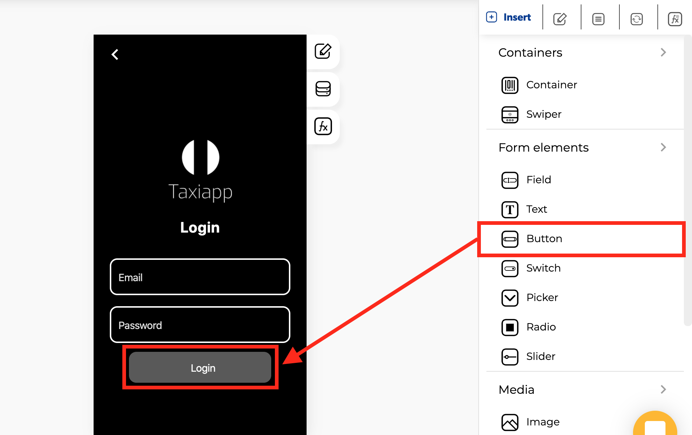

# Button

### 🎨 Styles

* **Appearance**

  * **Background color:** select the background color using the [color picker](../../estilos/color-picker.md).
  * **Text color**: select text color in the button element using the [color picker](../../estilos/color-picker.md).

* **Typography**
  * **Font size:** size of the text that appears on the button element.
  * **Style**

    * **Normal:** default text display.
    * **Italic:** display the text in italics.
    * **Underlined:** display the text underlined.
* **Dimensions**

  * **Width:** set how wide the button element is using.
  * **Height:** set how tall the button element is using.

* **Margins**
  * **Margin**: you can specify how much space you want between the edges of the button element with the screen or another elements.
* **Borders**
  * **Border width:** enter how wide you want the border outline of the button element to be.
  * **Border radius:** enter how round you want the edges of the border for the button element to be.
  * **Border color:** pick a color for the border of the button element.
  * **Border style:** select if you want the border of the button element to be a dotted, dashed or solid line.

### ⚙ Properties

* **Generic properties**
  * **Control name:** you can add a name to the button element this could be the way to identify this element about another elements.
  * **Enable** [**skeleton loaders**](../../estilos/skeleton-loader.md)**:** this tool provides an indication to the user that something is coming but not yet available on the button element.
  * **Control is hidden:** hide the button element from the screen.


The [**skeleton loader**](../../estilos/skeleton-loader.md) component provides a user with a visual indicator that content is coming/loading. This is better received than traditional full-screen loaders.


* **Specific Properties**
  * **Control Label**: text to display inside the button
  * **Button icon**: a custom icon for the button
  * **Direction**: specifies the directional flow of the button and the icon. 

### 👆 Events

* **On press:** the on press event provide the capability to capture tapping gestures and display feedback when this gesture is recognized. 

