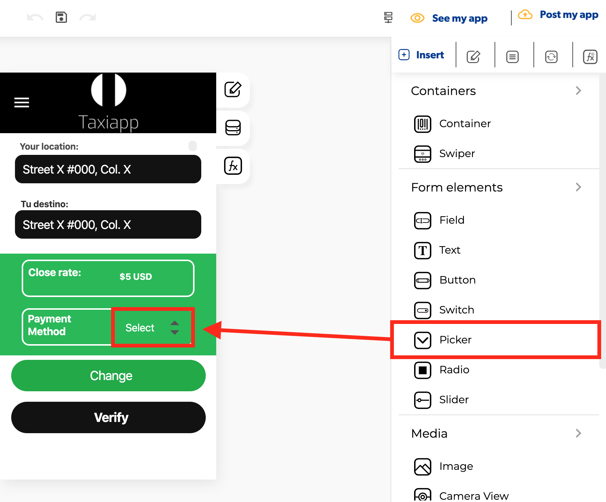

# Picker

### ​🎨 Styles  

* **Appearance**

  * **Background color:** select the background color using the [color picker](../../estilos/color-picker.md).
  * **Text color**: select text color in the picker element using the [color picker](../../estilos/color-picker.md).

* **Dimensions**

  * **Width:** set how wide the picker element is using.
  * **Height:** set how tall the picker element is using.

* **Margins**

  * **Padding:** you can specify how much space you want between the border and contents of the picker element.
  * **Margin**: you can specify how much space you want between the edges of the picker element with the screen or another elements.

* **Borders**
  * **Border width:** enter how wide you want the border outline of the picker element to be.
  * **Border radius:** enter how round you want the edges of the border for the picker element to be.
  * **Border color:** pick a color for the border of the picker element.
  * **Border style:** select if you want the border of the picker element to be a dotted, dashed or solid line.

### ​​⚙ Properties 

* **Generic properties**
  * **Control name:** you can add a name to the picker element this could be the way to identify this element about another elements.
  * **Enable** [**skeleton loaders**](../../estilos/skeleton-loader.md)**:** this tool provides an indication to the user that something is coming but not yet available on the picker element.
  * **Control is hidden:** hide the picker element from the screen.


The [**skeleton loader**](../../estilos/skeleton-loader.md) component provides a user with a visual indicator that content is coming/loading. This is better received than traditional full-screen loaders.


* **Specific Properties**
  * **Control placeholder**: text that will be displayed before picker input has been entered. 
  * **Arrow enabled:** add a down direction arrow at the right of the picker element.
  * **Option value**: add the options to choice as a dropdown.
  * **Default value**: when the picker is shown it offers the first value to select.

### ​​👆 Events 

* **On charge:** the on charge ****event detects when the value of a picker element changes.

### 📝 Writable Properties

* **Items**

