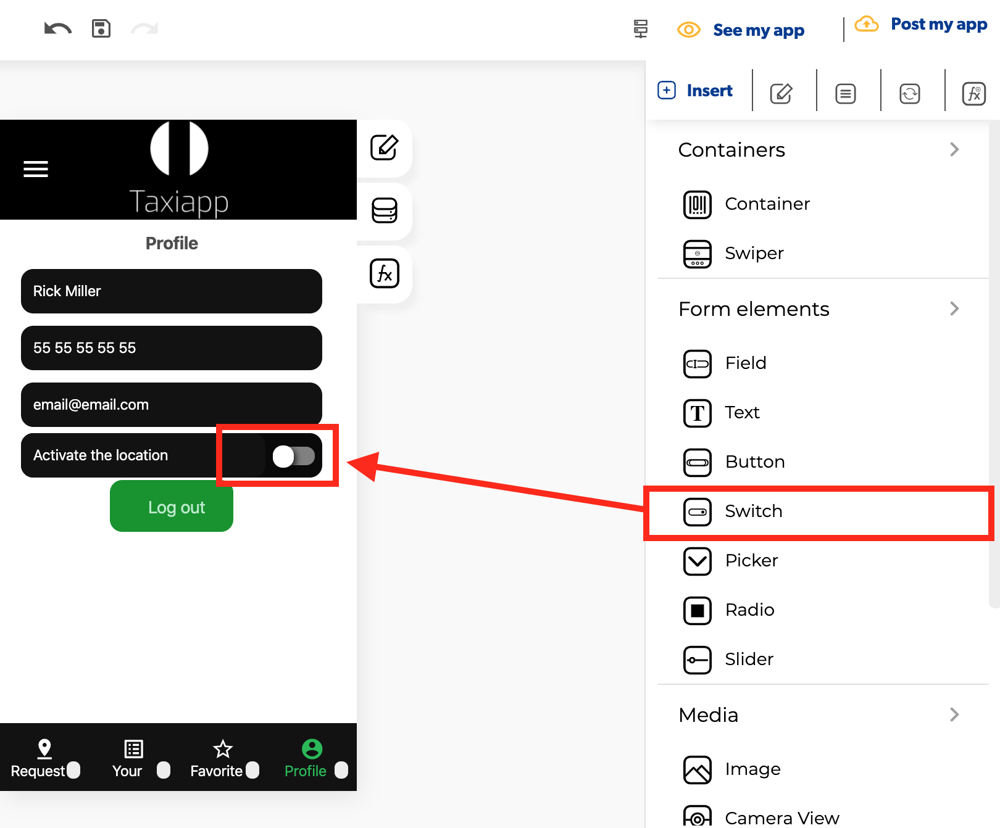

# Switch

### ​​​⚙ Properties 

* **Generic properties**
  * **Enable** [**skeleton loaders**](../../estilos/skeleton-loader.md)**:** this tool provides an indication to the user that something is coming but not yet available on the switch element.
  * **Control is hidden:** hide the switch element from the screen.


The [**skeleton loader**](../../estilos/skeleton-loader.md) component provides a user with a visual indicator that content is coming/loading. This is better received than traditional full-screen loaders.


### ​​👆 Events 

* **On value change:** called ****with a new value when the value changes. 

