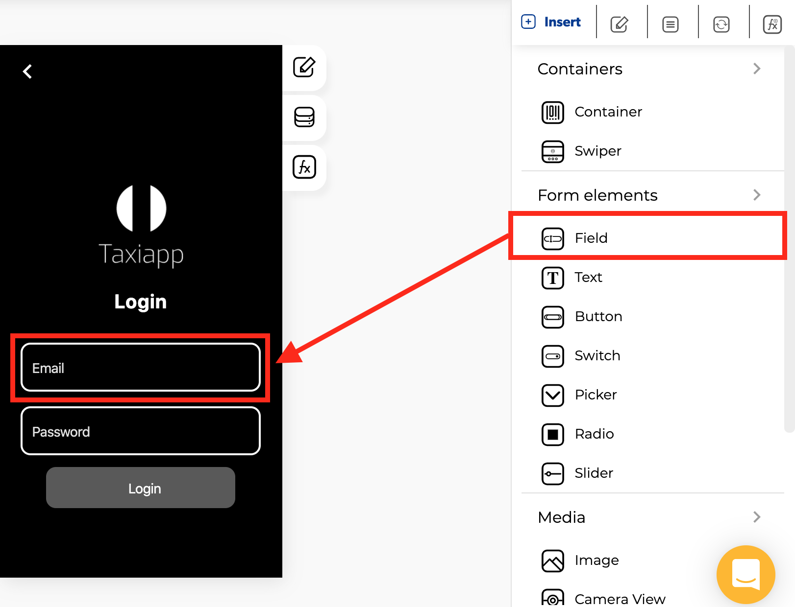

# Text Field

### 🎨 Styles 

**Typography**

* **Font size:** size of the text that appears on the text field element.
* **Appearance**
  * **Background color:** select the background color using the [color picker](../../estilos/color-picker.md).
  * **Text color**: select text color in the text field element using the [color picker](../../estilos/color-picker.md).
  * **Placeholder color:** select text input color using the [color picker](../../estilos/color-picker.md) that will be modified before text input has been entered.
* **Dimensions**
  * **Width:** set how wide the text field element is using.
  * **Height:** set how tall the text field element is using.
* **Margins**
  * **Padding:** you can specify how much space you want between the border and contents of the text field element.
  * **Margin**: you can specify how much space you want between the edges of the text field element with the screen or another elements.

    \*\*\*\*
* **Borders**
  * **Border width:** enter how wide you want the border outline of the text field element to be.
  * **Border radius:** enter how round you want the edges of the border for the text field element to be.
  * **Border color:** pick a color for the border of the text field element.
  * **Border style:** select if you want the border of the text field element to be a dotted, dashed or solid line.

### ⚙ Properties

* **Generic properties**
  * **Control name:** you can add a name to the text field this could be the way to identify this element about another elements.
  * **Enable** [**skeleton loaders**](../../estilos/skeleton-loader.md)**:** this tool provides an indication to the user that something is coming but not yet available on the text field element.
  * **Control is hidden:** hide the text field element from the screen.


The [**skeleton loader**](../../estilos/skeleton-loader.md) component provides a user with a visual indicator that content is coming/loading. This is better received than traditional full-screen loaders.


* **Specific Properties**
  * **Enable data picker**: opens the standard date, time and date with time picker input.
  * **Control placeholder**: text that will be displayed before text input has been entered. 
  * **Keyboard type**: determines which keyboard to open \(Default, Number pad, Decimal pad, Numeric, Email address\).
  * **Keyboard return key type**: Determines how the return key should look \(Done, Go, Next, Search, Send\).
  * **Enable blur on submit**: the text field element will blur when submitted.
  * **Password masking**: text field input for passwords, this switch will replace text with \* as users type.
  * **Multi line**: the text field input can be multiple lines. 
  * **Input mask**: Is a set of simple rules that specifies the format in which data can be entered into a field. 
  * **Enable places autocomplete**: specifies autocomplete hints for the app, so it can provide autofill \(Geocode, Address, Regions, Cities, Establishment\)
  * **Button icon**: A custom icon for the text field. 
  * **Direction**: specifies the directional flow of the text field and the icon. 


It is important to note than **Multi line** that this aligns the text to the top on iOS, and centers it on Android



**Input mask examples:**  
9 - Accept digit.   
A - Accept alpha.   
S - Accept alphanumeric.  
\* - Accept all, except white space


### 👆 Events

* **On blur:** the on blur event that is called when the text field input is blurred.
* **On charge:** the on charge event that is called when the text field input's text changes.
* **On focus:** the on focus event ****that is called when the text field input is focused.
* **On submit editing:** the on submit editing event ****that is called when the text input's submit button is pressed.

\*\*\*\*📝 **Writable Properties**

### 📝 Writable Properties

* Value 
* Focus
* **Focus** 
* **Value**

