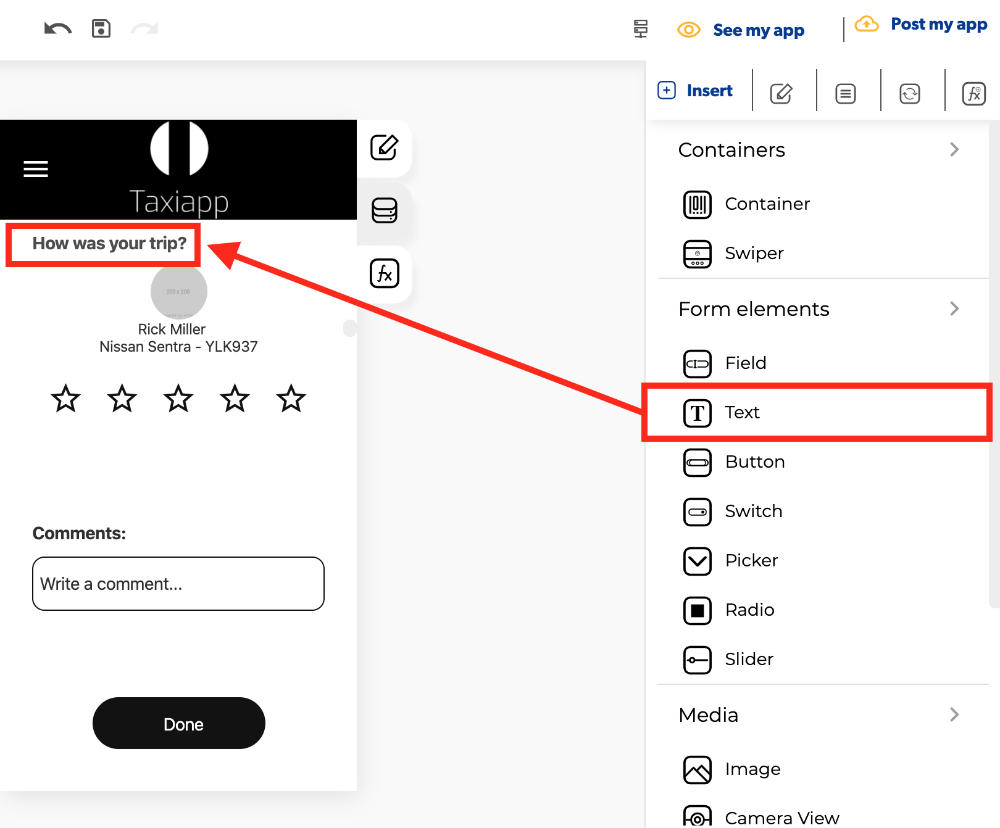

# Text

### 🎨 Styles 

#### **Typography**

* **Font size:** size of the text that appears on the element.
* **Style** 

  * **Normal:** default text display.
  * **Italic:** display the text in italics.
  * **Underlined:** display the text underlined.

* **Text align**

  * **Left:** displays the text starting from the left of the text element.
  * **Right:** displays the text starting from the right of the text element.
  * **Center:** displays the text starting from the middle of the text element.
  * **Justify:** aligns both the right and left side of the text equally

* **Appearance**

  * **Background color:** select the background color using the [color picker](../../estilos/color-picker.md).
  * **Text color**: select text color using the [color picker](../../estilos/color-picker.md).

* **Dimensions**

  * **Width:** set how wide the text element is using.
  * **Height:** set how tall the text element is using.

* **Margins**
  * **Padding:** you can specify how much space you want between the border and contents of the text element.
  * **Margin**: you can specify how much space you want between the edges of the text element with the screen or another elements.

    \*\*\*\*
* **Borders**
  * **Border width:** enter how wide you want the border outline of the text element to be.
  * **Border radius:** enter how round you want the edges of the border for the text element to be.
  * **Border color:** pick a color for the border of the text element.
  * **Border style:** select if you want the border of the text element to be a dotted, dashed or solid line.

### ⚙ Properties

* **Generic properties**
  * **Control name:** you can add a name to the text element this could be the way to identify this element about another elements.
  * **Enable** [**skeleton loaders**](../../estilos/skeleton-loader.md)**:** this tool provides an indication to the user that something is coming but not yet available on the text element.
  * **Control is hidden:** hide the text element from the screen.


The [**skeleton loader**](../../estilos/skeleton-loader.md) component provides a user with a visual indicator that content is coming/loading. This is better received than traditional full-screen loaders.


* **Specific Properties**
  * **Height auto:** aligns the dimensions of the text element  content automatically to the text element.
  * **Control value:** you can add a text inside the text element.

### 👆 Events

* **On press:** the on press event provide the capability to capture tapping gestures and display feedback when this gesture is recognized.

### 📝 Writable Properties

* **Value** 
* **Focus**

