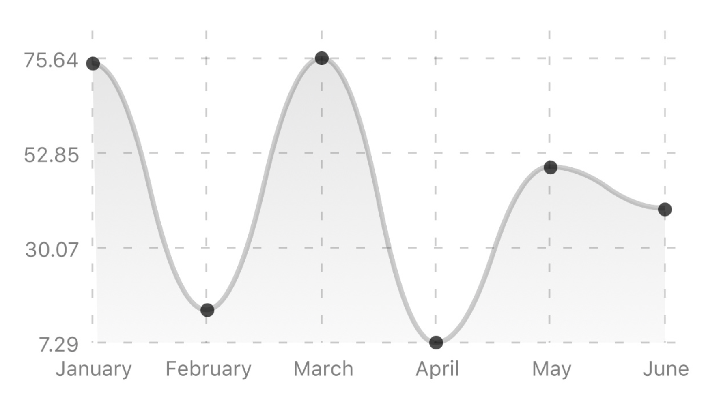
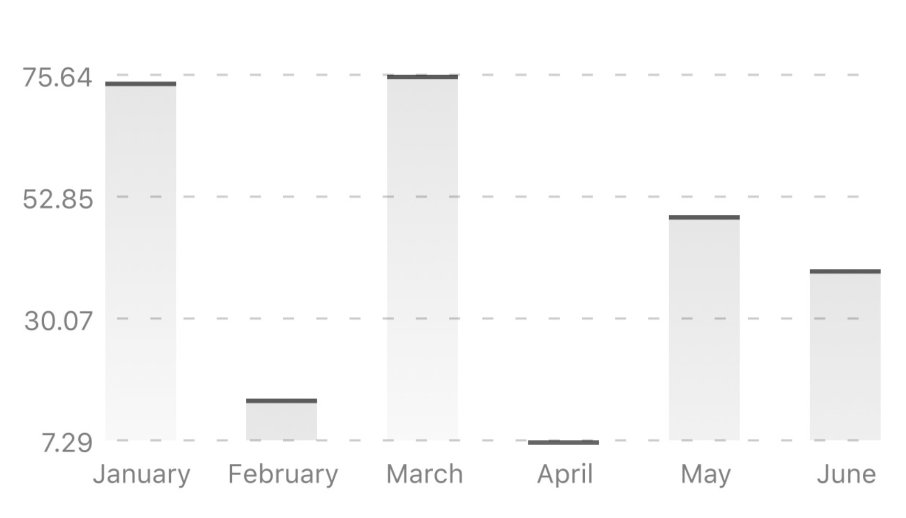
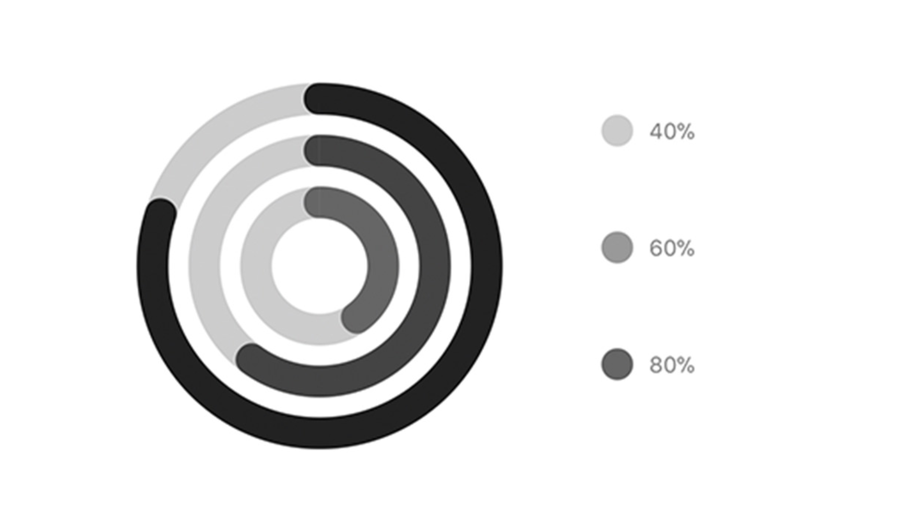
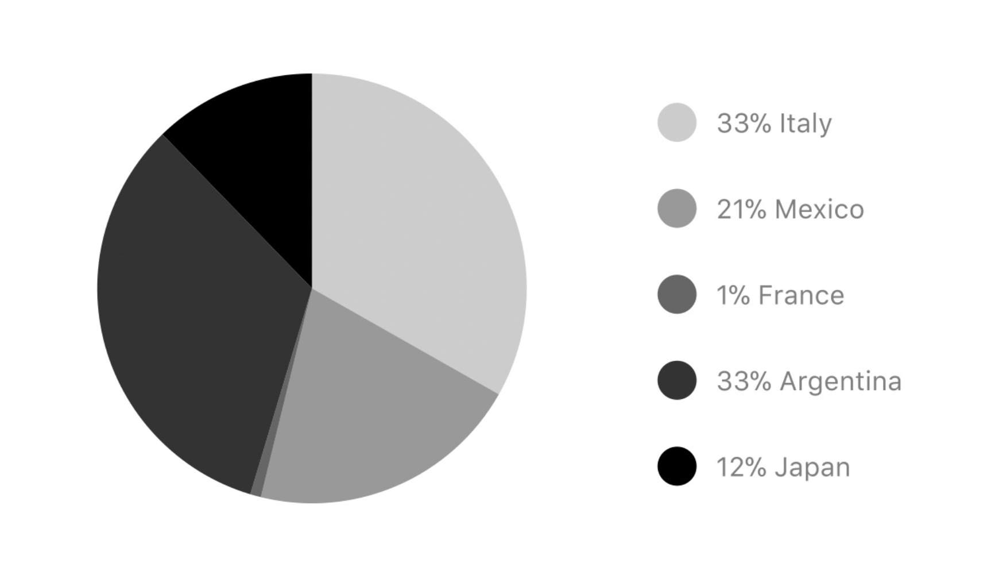

# Chart

### 🎨 Styles 

* **Appearance**
  * **Background color:** select the background color using the [color picker](../../estilos/color-picker.md).
  * **Text color**: select text color in the chart element using the [color picker](../../estilos/color-picker.md).
  * **Color lines**: select line color in the chart element using the [color picker](../../estilos/color-picker.md).

### ⚙ Properties

* 
* **Specific Properties**
  * Type graphic

    * **Line charts**: represent and visualize the time-dependent data to show the trends at equal intervals.
    * **Bezier chart:** Bézier curves are widely used in computer graphics to model smooth curves. As the curve is completely contained in the convex hull of its control points, the points can be graphically displayed and used to manipulate the curve intuitively.
    * **Bar charts**: are among the most common chart types that are used to compare frequency, count, total, or average of data in different categories with a horizontal bar.
    * **Progress Chart**: are among the most common chart types that are used to compare frequency, count, total, or average of data in different categories with a vertical bar.
    * **Pie chart**: is a circular statistical graphic, which is divided into slices to illustrate numerical proportion.
* **Labels:** add any combination of letters, numbers, and symbols to modify the name of each label.
* **Data:** add ****any combination of numbers to modify the data in the label.
* **Pie chart colors:** add color names or hexadecimal number for each label

